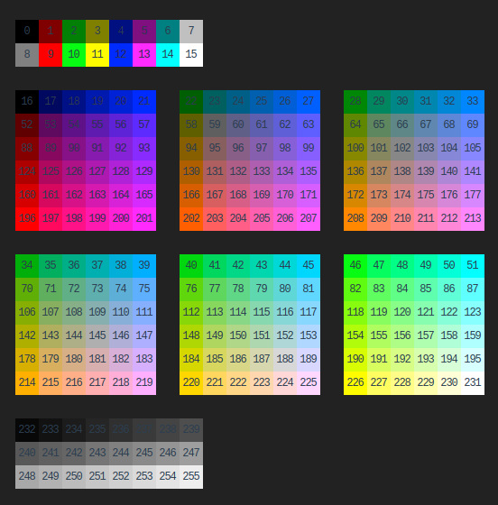
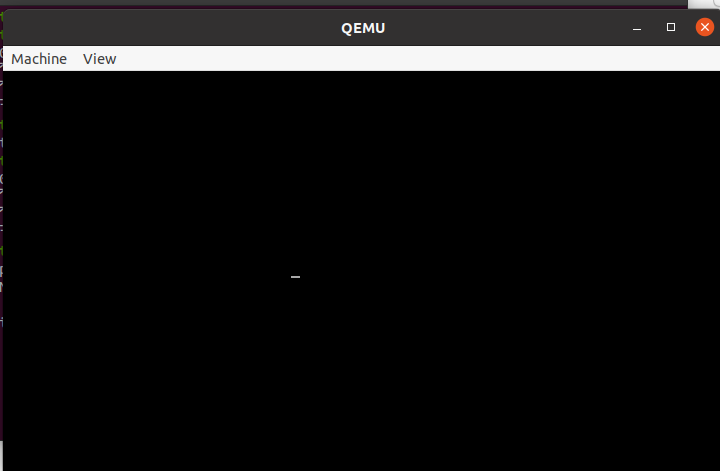
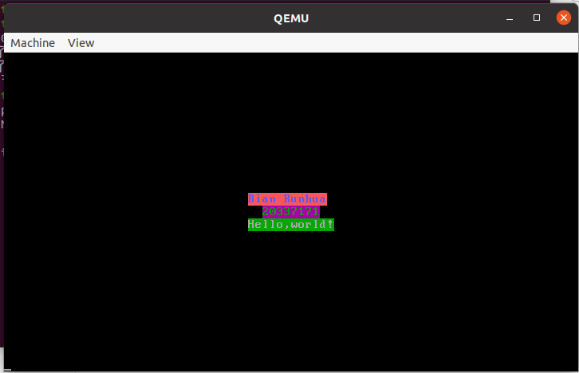

# 实验二：汇编语言程序设计

## 一、实验要求

* 了解16位汇编（MASM）和32位汇编（NASM）的基本用法
* 编写简单的汇编程序，并在Linux下运行
* 用GDB调试汇编语言程序
* 混合使用C语言和汇编语言完成磁盘操作等一些系统调用
* 初步了解如何在实模式启动操作系统，并在QEMU中进行一些汇编语言操作

## 二、实验器材

* 笔记本电脑一台，性能足够强大
* VMware Workstation Pro 16
* Ubuntu 20.04安装于虚拟机中

## 三、实验过程

### 1、求最大值

* 本题的目标是求出20个元素的最大值并输出
* 数据就事先放在数据段里面，进行操作
* 大量使用串操作指令，简化操作
* 刚写的时候遇到了一些问题，为了排查问题，用GDB进行调试。

#### 用GDB调试汇编程序

* 在代码写好以后，输入以下命令进行编译、链接
  * 记得一定要加`-g`,这样才会生成debug用的符号表。

```shell
truestar@truestar-virtual-machine:~/lab2$ nasm -felf32 -g  A1.s -o A1.o
truestar@truestar-virtual-machine:~/lab2$ ld -g -melf_i386 A1.o -o A1
```

* 输入如下命令，就进入了GDB

```shell
truestar@truestar-virtual-machine:~/lab2$ gdb A1
```

* 以下展示GDB的一些操作
* 汇编语言默认显示为AT&T模式，这种模式源寄存器在前，目标寄存器在后，不符合我们日常的习惯。我们将其设置为嘤特尔模式

```shell
(gdb) set disassembly-flavor intel
```

* 设置断点

```shell
(gdb) break 11
Breakpoint 1 at 0x8049011: file A1.s, line 12.
```

* 走起~在断点停下来

```shell
(gdb) run
Starting program: /home/truestar/lab2/A1 

Breakpoint 1, 0x08049011 in label ()
```

* 显示就近的汇编语句

```assembly
(gdb) disas
Dump of assembler code for function label:
=> 0x08049011 <+0>:	lods   eax,DWORD PTR ds:[esi]
   0x08049012 <+1>:	cmp    eax,ebx
   0x08049014 <+3>:	jle    0x8049018 <small>
   0x08049016 <+5>:	mov    ebx,eax
End of assembler dump.
```

* 单步执行

```shell
(gdb) ni
0x08049012 in label ()
(gdb) ni
0x08049014 in label ()
```

* 显示寄存器信息

```shell\
(gdb) info r
eax            0xa4a1              42145
ecx            0x14                20
edx            0x0                 0
ebx            0x0                 0
esp            0xffffd1e0          0xffffd1e0
ebp            0x0                 0x0
esi            0x804a004           134520836
edi            0x0                 0
eip            0x8049014           0x8049014 <label+3>
eflags         0x202               [ IF ]
cs             0x23                35
ss             0x2b                43
ds             0x2b                43
es             0x2b                43
fs             0x0                 0
gs
```

### 2、斐波那契数列

* 也使用串操作指令简化操作
* 输出时要输出多次，所以涉及两层循环。两层循环有两个思路，一是用两个变量（可以是寄存器也可以用内存），二是利用栈保护ecx寄存器（直接压栈和用函数都属于此类）。我选择了第二种方法。
  * 输出时DF状态位控制比较复杂，需要频繁STD/CLD
* 编译运行指令与上一个实验类似。所以不再赘述

### 3、清屏与光标定位

* 本题与上面两题不一样，是使用8086汇编，借助实模式启动操作系统
* 输出0x100个换行符把屏幕清干净
* 用0x10中断的0x02功能定位光标。此功能下， DH,DL寄存器分别存储行和列。
  * 默认的命令行，有25行80列文字。我们选择中间偏左的地方，DH=0x0C，DL=0x20
* 从实模式启动操作系统需要注意两个问题。一是扇区大小要凑够512Bytes，二是结尾需要加入一个“魔数”0xaa55
* 写完以后需要刻录虚拟硬盘并启动，首先编译为`.bin`文件


```shell
truestar@truestar-virtual-machine:~/lab2$ nasm -f bin A5.asm -o A5.bin
```

  * 创建虚拟硬盘

```shell
truestar@truestar-virtual-machine:~/lab2$ qemu-img create hd.img 10m
```

  * 将`.bin`文件写入虚拟硬盘

```
truestar@truestar-virtual-machine:~/lab2$ dd if=A3.bin of=hd.img bs=512 count=1 seek=0 conv=notrunc
```

  * 用QEMU载入虚拟硬盘里面的迷你操作系统

```shell
truestar@truestar-virtual-machine:~/lab2$ qemu-system-i386 -hda hd.img -serial null -parallel stdio
```

* 就可以看到最终的效果了

### 4、文件操作

* 本部分体现C和汇编的互相调用。我选择C调汇编
* 本程序有两种使用方法.第一行是适用于所有文件，仅仅复制。第二种只适用于纯文本，可以复制并显示

```shell
./A4 sourceFileName targetFileName
./A4 sourceFileName targetFileName -p
```

* 复制文件直接使用纯C语言，就是一个二进制文件操作。
  * 需要排除文件打不开的情形。
* 显示文件需要调用汇编。我们仍然选择32位汇编。这里就涉及一个汇编程序段的输入问题。我们要把指定的数据输入到指定寄存器里面。格式是：在汇编程序段的末尾,添加如下字段：

```c
::"x"(var1),"y"(var2)
```

* x,y根据你使用的寄存器替换为a，b，c，d等。
* 注意，本程序是32位汇编，所以编译的时候要加入`-m32`参数，否则编译器会抽风如下.这是由于32位与64位汇编指令不匹配造成的。、

```
/tmp/ccRIAufR.s: Assembler messages:
/tmp/ccRIAufR.s:155: 错误： bad register name `%rbp)'
/tmp/ccRIAufR.s:156: 错误： bad register name `%rax'
/tmp/ccRIAufR.s:158: 错误： bad register name `%rip)'
/tmp/ccRIAufR.s:161: 错误： bad register name `%rax'
```


### 5、显示彩色字符串

* 这一题和第三题类似，要用8086汇编+实模式启动
* 还是先清理屏幕（和第三题一样）
* 我们用直接写显存的方式来显示不同颜色的字符串。显存是什么样一个原理呢？在80*25文本模式下，显存从0xb8000开始，每2Bytes代表一个位置。每个位置第一个Byte是字符，第二个Byte是颜色（256色）
  * 其实显存有8页，但是默认使用第1页
  * 色图一份，拿走不谢(好色的色图啊，有256色呢！)



* 我们希望在第11,12,13行（从0开始）中间显示以下三行

```
Bian Runhua(11字符)		起始位置2*(11*80+(80-11)/2)=1828
20337171(8字符)			起始位置2*(12*80+(80-8)/2)=1992
Hello,world!(12字符)		起始位置2*(13*80+(80-12)/2)=2148
```

* 数据段默认起始于0x7c00.根据前面两点给es和ds赋值。然后用串操作指令就可以了。

## 四、实验代码

### 1、求最大值

```assembly
section .data
		number  dd 42145,647,634562,356326,8568,523,252,5685,6745,353,53253,252,2352,325325,3532535,35353,534534,353,359,44,0
		output  db 0,0,0,0,0,0,0,0,0,0,' '

section .text
global main
main:   lea     esi,[number]		;数据字符串
        mov     ecx,0x14			;20个数字
        mov     ebx,0				;ebx存储最大值，初始化为0
        cld							;设置DF=0
label:  
        lodsd						;读取一个数据
        cmp     eax,ebx				;与当前最大值比较
        jng     small				;如果不大于就跳过下一步
        mov     ebx,eax				;改变最大值
small:  loop    label
        
        mov     ecx,9				;最多9位数
        lea     edi,[output]		;加载edi位置
        add     edi,8				;修正edi位置
        std							;设置DF=1
        mov     edx,ebx				;将最大值放到edx里面，把ebx空出来
        mov     ebx,10				;在生成输出字符串的时候要频繁除以10
make:   mov     eax,edx				;构造被除数
        mov     edx,0
        div     ebx					;edx:eax/ebx,商在eax，余数在edx
        xchg    eax,edx				;交换eax和edx，准备写入字符串
        add     eax,0x30			;将数字转换为字符
        stosb						;写入字符
        cmp     edx,0				;如果转换完成了，就可以退出了
        jz      break
        loop    make
break:  
        mov     edx,11
        sub     edx,ecx				;计算输出字符的数量
        mov     ecx,edi				
        inc     ecx					;载入输出字符串的位置
        mov     ebx,1				;输出到stdout
        mov     eax,4				;输出功能
        int     0x80				;系统调用
        
        mov     ebx,0				;结束程序
        mov     eax,1
        int     0x80
```

### 2、斐波那契数列

```assembly
section .data
		number  dw 1,1,0,0,0,0,0,0,0,0,0,0,0,0,0,0,0,0,0,0,0
		output  db 0,0,0,0,0,0,0,0,0,0,' '

section .text
global main
main:   lea     edi,[number]
        add     edi,4				;从第三个数开始计算
        mov     ecx,0x12
        mov     ebx,0
        cld							;设置DF=0
label:  mov     eax,0				;初始化eax
        add     eax,[edi-4]			;加上前一个和前两个数
        add     eax,[edi-2]
        stosw						;写入
        loop    label
        
        mov     ecx,20
        lea     esi,[number]		;准备打印

print:  lodsw						;读入准备打印的数
        mov     edx,eax				;将数字移入edx以适应后面的输出
        push    ecx					;将ecx压栈保护起来，写双层循环
        mov     ecx,9				;从此处开始的内容上一个程序已经介绍过
        lea     edi,[output]		;此处不再赘述
        add     edi,8
        std
        mov     ebx,10
make:   mov     eax,edx
        mov     edx,0
        div     ebx
        xchg    eax,edx
        add     eax,0x30
        stosb
        cmp     edx,0
        jz      break
        loop    make
break:  
        mov     edx,12
        sub     edx,ecx
        mov     ecx,edi
        inc     ecx
        mov     ebx,1
        mov     eax,4
        int     0x80
        pop     ecx				;把保护起来的ecx恢复
        cld						;读取数字要求DF=0
        loop    print	

        mov     ebx,0			;退出程序
        mov     eax,1
        int     0x80
```

### 3、清屏与光标定位

```assembly
[bits 16]
        mov     ah,0x0e			;设置模式为打印字符
        mov     cx,0x100		;执行0x100次
repeat: mov     al,0x0d			;输出回车
        int     0x10			;系统调用
        mov     al,0x0a			;输出换行符
        int     0x10			;系统调用
        loop    repeat

        mov     dh,0x0c			;设置行坐标
        mov     dl,0x20			;设置列坐标
        mov     ah,0x02			;设置模式为光标定位
        int     0x10			;系统调用
    	
here:   jmp     here			;制造死循环

times   510-($-$$)  db  0		;填充到510Bytes
        dw      0xaa55			;一个2Bytes的魔数
```

### 4、文件操作

```c
#include<stdio.h>
#include<stdlib.h>
#include<string.h>
char buf[4096]; 
int i;
int main(int argc,char ** argv)				//用命令行参数
{   if(argc<3)								//排除异常输入
    {   puts("Too few arguments!");
        exit(1);
    }
    FILE * fin=fopen(argv[1],"rb");			//打开源文件（二进制模式）
    if(fin==NULL)							//排除打开失败
    {   puts("Cannot find the file!");
        exit(1);
    }
    FILE * fout=fopen(argv[2],"wb");    	//打开目标文件（二进制模式）
    while(i=fread(buf,1,4096,fin))			//复制文件。注意记录每次复制的块大小
        fwrite(buf,1,i,fout);				//不要填写一些奇怪的东西进去
    fclose(fin);							//关掉文件
    fclose(fout);
    if(argc>=4&&!strcmp(argv[3],"-p"))		//如果要复制文件
    {   fin=fopen(argv[1],"r");				//重新用文本模式打开文件
        while(fgets(buf,4096,fin))			//读取一行
        {   i=strlen(buf);					//求出长度
            __asm__ __volatile__ (		
                    ".code32\n\t"			//32位汇编
                    "pusha\n\t"				//保护寄存器
                    "mov  $4,%%eax\n\t"		//这里就是输出字符串的方法
                    "mov  $1,%%ebx\n\t"		//只不过是AT&T格式的
                    "int $0x80\n\t"			//系统调用
                    "popa"
                    ::"c"(buf),"d"(i)		//ecx和edx用C的变量输入
                    );
        }
    }
    return 0;
}
```

### 5、显示彩色字符串

```assembly
[bits 16]

        mov     ah,0x0e			;清屏阶段上面已经介绍
        mov     cx,0x100		;此处不再赘述
repeat: mov     al,0x0d
        int     0x10
        mov     al,0x0a
        int     0x10
        loop    repeat

        push    ds
        mov     ax,0x07c0		;设置数据段为0x07c0
        mov     ds,ax			;move到ds和es都必须间接进行
        push    es
        mov     ax,0xb800		;设置附加段为0xb800
        mov     es,ax

        mov     di,1828			;设置写入到屏幕的位置
        mov     si,string1		
        mov     cx,11
        
rep1:   lodsb
        stosb
        mov     al,201
        stosb
        loop    rep1

        mov     di,1992			;第二个和第三个字符串显示过程
        mov     si,string2		;和上面类似的
        mov     cx,8

rep2:   lodsb
        stosb
        mov     al,82
        stosb
        loop    rep2

        mov     di,2148
        mov     si,string3
        mov     cx,12

rep3:   lodsb
        stosb
        mov     al,39
        stosb
        loop    rep3

        pop     ax
        mov     es,ax
        pop		ax
        mov		ds,ax

        string1 db      "Bian Runhua"
        string2 db      "20337171"
        string3 db      "Hello,world!"        
    
here:   jmp     here
times   510-($-$$)  db  0
        dw      0xaa55
```

## 五、实验结果

* 成功发现最大值

```shell
truestar@truestar-virtual-machine:~/lab2$ ./A1
3532535
```

* 成功显示了斐波那契数列的前20项

```shell
truestar@truestar-virtual-machine:~/lab2$ ./A2
1 1 2 3 5 8 13 21 34 55 89 144 233 377 610 987 1597 2584 4181 6765 
```

* 成功清理的屏幕并定位了光标



* 成功复制了pdf文件,复制并显示了txt文件

```shell
truestar@truestar-virtual-machine:~/lab2$ gcc -m32 A4.c  -g -o A4
truestar@truestar-virtual-machine:~/lab2$ ls
A1    A1.s  A2.o  A3      A3.bin  A4    A5.asm  hd.img   t.txt
A1.o  A2    A2.s  A3.asm  A3.o    A4.c  A5.bin  old.pdf
truestar@truestar-virtual-machine:~/lab2$ cat t.txt
Hello world!
Bian Runhua
20337171
truestar@truestar-virtual-machine:~/lab2$ ./A4 old.pdf new.pdf
truestar@truestar-virtual-machine:~/lab2$ ./A4 t.txt t2.txt -p
Hello world!
Bian Runhua
20337171
truestar@truestar-virtual-machine:~/lab2$ ls
A1    A1.s  A2.o  A3      A3.bin  A4    A5.asm  hd.img   old.pdf  t.txt
A1.o  A2    A2.s  A3.asm  A3.o    A4.c  A5.bin  new.pdf  t2.txt
truestar@truestar-virtual-machine:~/lab2$ cat t2.txt
Hello world!
Bian Runhua
20337171
```

* 成功在屏幕中央显示了彩色字符串



### 六、总结和启发

* 本次实验涉及不同形式，不同写法的汇编语言在多个场景下的应用。包括了8086和80386汇编作为应用程序、简易操作系统和内嵌于C语言三种场景。
* 本实验前两题几乎没有难度，3、5两题需要提前看第三个实验的内容。第四题需要比较系统地学习内嵌汇编的知识，相对比较反人类。确实很不好写。
* 汇编语言的一大特点就是麻烦，它几乎没有抽象的过程，可以说非常反人类的。几乎所有的事情都需要程序员自己操心。而且Debug难度也是极大的，只能一步一步看寄存器。这也是后来发明高级语言的意义所在。而且高级语言的抽象程度越来越高，从C到C++再到后来的Java、Python，可以很明显地体现这个趋势。Python长得和伪代码已经没啥区别了，且编程语言有向着自然语言模式过渡的趋势。这主要是降低编程门槛，降低程序设计的难度。
* 但是反过来，抽象程度过高会导致灵活性下降。抽象程度越低的语言通常可以实现越多的功能。C语言的各种指针操作可以实现各种奇葩功能，但是到了更抽象的语言就难以实现了。汇编语言可以视为最终的核武器，也即，汇编不能实现的功能，其他任何语言是一定不可实现的。
