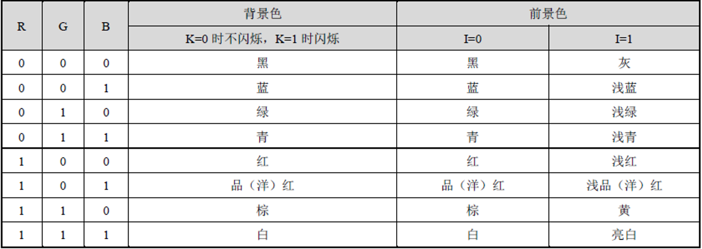
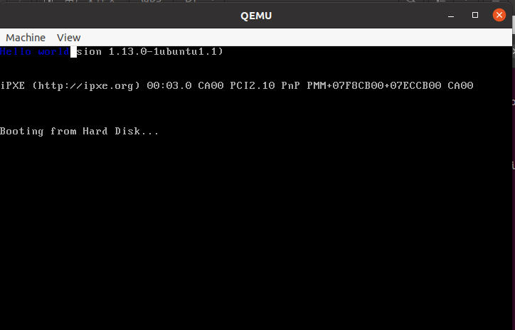
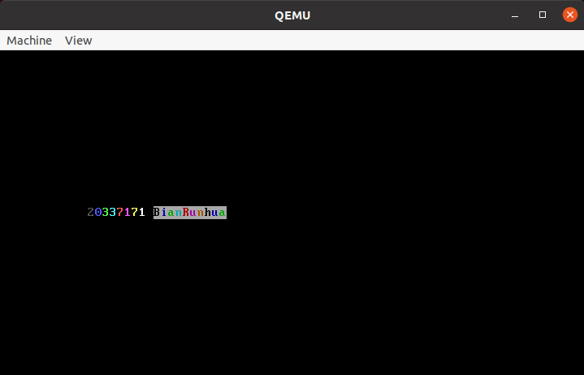
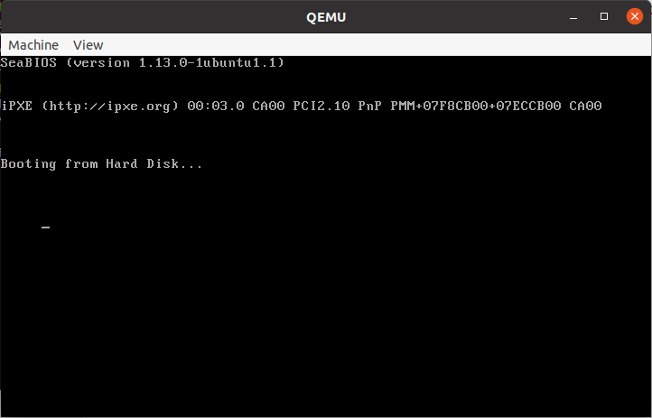
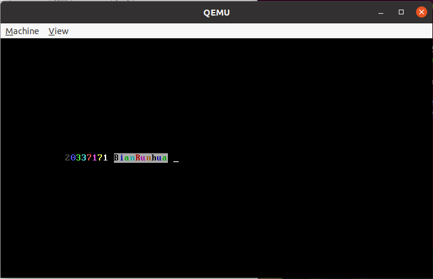
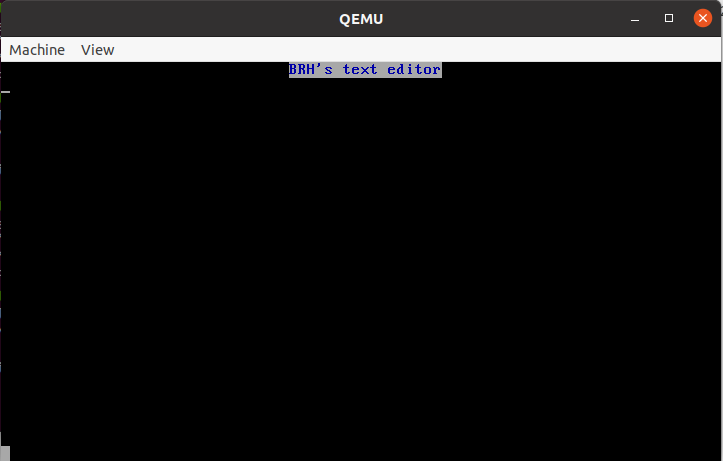
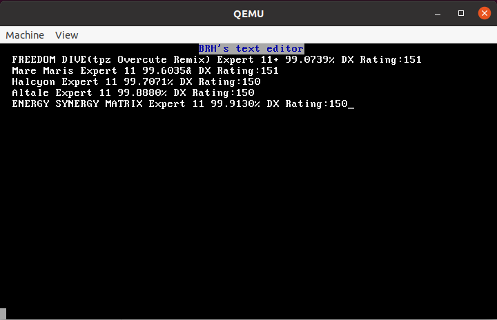
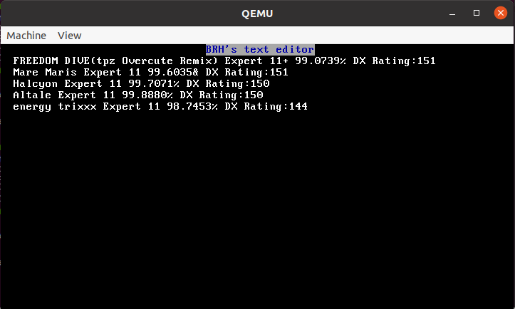
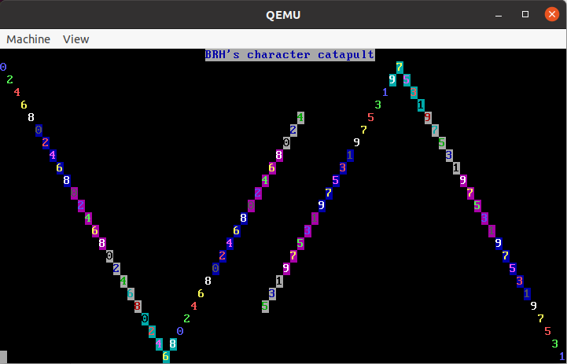
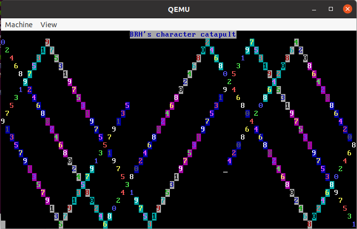

# 实验三：汇编语言程序设计II

## 一、实验要求

* 进一步了解16位汇编（MASM）和32位汇编（NASM）的用法
* 了解C调用汇编函数的基本方法。
* 初步了解如何利用汇编在实模式启动操作系统，并在QEMU中进行实践
* 编写较为复杂的汇编语言程序，熟悉调用中断的方法。

## 二、实验器材

* 笔记本电脑一台，性能足够强大
* VMware Workstation Pro 16
* Ubuntu 20.04安装于虚拟机中

## 三、实验过程

### Assignment 1 MBR的制作

#### 1-1 Example 1

* 复现例1.例1原来那个方法太煞笔了，一个一个输出不嫌累啊？改为使用串操作指令实现完全一样的效果
* 颜色显示效果如下。是背景16位*前景16位色而不是256位色。背景色是高4位，前景色是低四位。分别为KRGBIRGB。其中R-红，G-绿，B-蓝，K-闪烁，I-亮度



* 后来显示了蓝色字符串。不过颜色选择0x01的黑背景深蓝色真的很难看清，眼睛都快目害了才看见。
* 而且因为没有清屏，一堆启动信息都还在屏幕上留着，别提有多丑

#### 1-2 七彩字符串

* 我们显示一个彩色的字符串。我们构造一个“颜色字符串”，对应每个字符的颜色。这个字符串用BX指示。
* 这个问题也不是很难，结合串操作指令就可以完成。但是BX不支持串操作指令，需要每次人为地进行移动。
* 不要忘了先清理屏幕

###  Assignment 2 实模式中断

* 先看看后面两个问要用的0x10功能号的几个功能

| 功能                       | 功能号 | 参数                                         | 返回值                                           |
| -------------------------- | ------ | -------------------------------------------- | ------------------------------------------------ |
| 设置光标位置               | AH=02H | BH=页码，DH=行，DL=列                        | 无                                               |
| 获取光标位置和形状         | AH=03H | BX=页码                                      | AX=0，CH=行扫描开始，CL=行扫描结束，DH=行，DL=列 |
| 在当前光标位置写字符和属性 | AH=09H | AL=字符，BH=页码，BL=颜色，CX=输出字符的个数 | 无                                               |

#### 2-1 光标的获取和移动

* 为了表现实验效果，我们把光标向下移动3格，向右移动5格
* 直接调用`0x10`中断的`0x03`功能号获取目前光标位置，然后改变DH,DL的值，用`0x02`功能调整。
* 本来光标是在“Booting from hard disk”的B下面，现在可以看到发生了移动。

#### 2-2 七彩字符串（中断版）

* 相对于直接写显存，用中断输出字符串显然更安全。
  * 至少中断调用失败不会有什么大事，写显存写歪了可能操作系统就寄了。

* 读取字符串仍然是使用串操作指令。写入用功能号`0x09`.

#### 2-3 迷你文本编辑器

* 先按2-2在第一行输出一行白底蓝字字符串作为标题，从下一行作为起始位置
* 借助键盘中断0x16的0x00功能号读取输入，然后须判断输入的是否是退格键(0x08)。
* 如果不是,那就先判断光标位置是否已经到结尾了，到结尾则不能输出。如果没有，输出字符并移动光标（需要考虑是否需要换行的问题）
* 如果是，那么先检查是不是第一个位置。是的话没有动作，否则将光标前一一位（需考虑是否要回到上一行）并清除该位置的内容。

### Assignment 3 C调用汇编

* 题目本身不难，但是实验指导有一定的问题。让我们一起看一看究竟有什么问题呢
* 首先，每进入一个汇编过程，一定要把即将用到的寄存器push一下，结束时要pop出来（32位可以直接用`pusha`和`popa`,16和64位必须一个一个压一个一个弹）
  * 这里有一个小细节，就是`your_if`和`your_while`其实是`student_function`过程里面的，属于一个过程，而且`head.include`和`end.include`已经有`pusha`和`popa`了，就没必要自己写了。

* 为了减少访存次数，一定要善于使用寄存器。比如3-2的a2就可以先放在寄存器里面。
* 对于3-2，a2的输入必须大于12.如果小于12，一定会段错误（因为没有申请空间）。如果等于12，那么一定会失败（因为这样字符串长度是1，还要存储'\0'，会导致`strcmp`函数越界比较到后面的位置）
* 3-3就很坑了。首先字符串不是`string`而是`your_string`,其次pusha和popa压根不应该放在那个地方。
* 可以把测试函数改为每次获取输入

```c++
void student_setting() {
    
    std::cout<<"Enter a1 and a2:";
    std::cin>>a1>>a2;
    
}
```

### Assignment 4字符弹射

* 第一行还是用来显示标题，下面24行用来皮
* 预置25种颜色组合，放在数组里面
* 需要使用BIOS延时中断：`int 0x15,AH=0x86`可以延时`(CX:DX)μs`,我们每次在两边各显示一个新的字符以后，可以等待一定时间再进行下一步操作。我们选择CX=6，DX=0，也即约0.4秒执行一步。
* 启动位置分别记为(1,0)(24,79),起始方向分别为右下和左上。可以很容易地发现，这两个点具有对称性，且行坐标和为25，列坐标和为79，也即二者的行列坐标(即dx寄存器)之和为0x194f。可以利用这个规律，只存储一个坐标和状态就行了。
* 此时要考虑寄存器的使用问题。首先AX、BX、CX频繁用于中断调用，DX要存坐标。因为CX在中断调用里面不是很重要，也可以用于对称坐标的计算。SI用来指向颜色数组，也被占用了。SP和BP不能乱用，也就剩一个DI了，用来存方向。
  * 这里巧妙地利用位操作存储两个方向。DI的最低位存储列的状态，次低位存储行的状态。0代表增，1代表减。要提取的时候，可以用`test di,0x1`或者`test di,0x2`，看ZF标志位就可以了。涉及换向的时候也直接用`xor`指令就可以了。

## 四、实验代码

* 一些在上次作业多次提到的地方这里就不写注释了

### Assignment 1 MBR的制作

#### 1-1、Example 1

```assembly
[bits 16]

        mov     ax,0x07c0       ;数据段起始位置
        mov     ds,ax
        mov     ax,0xb800		;显存起始地址
        mov     es,ax

        mov		ah,0x01			;颜色：黑底蓝字
        mov     cx,11			;11个字符
        mov     si,string		;装载字符串
        mov     di,0
label:  lodsb					;读字符
        stosw					;写显存
        loop	label

		string	db	"Hello world"

here:   jmp     here			

times 	510-($-$$) db 0
		dw		0xaa55
```

#### 1-2、七彩字符串

```assembly
[bits 16]

        mov     ah,0x0e		;清屏，不再赘述	
        mov     cx,0x100		
repeat: mov     al,0x0d
        int     0x10
        mov     al,0x0a
        int     0x10
        loop    repeat

        mov     ax,0x07c0
        mov     ds,ax
        mov     ax,0xb800
        mov     es,ax

        mov     cx,20
        mov     si,string
        mov     di,1944
        mov     bx,color	;BX指向颜色数组，每个字符颜色单独设计
label:  lodsb
        mov     ah,[bx]		;读取BX指向的数据
        inc     bx			;BX没有串操作指令，需要自己写自增
        stosw				;同时写入字符和颜色
        loop	label

		string	db		"20337171 BianRunhua"
        color   db      0x08,0x09,0x0a,0x0b,0x0c
        		db		0x0d,0x0e,0x0f,0x00,0x70
                db      0x71,0x72,0x73,0x74,0x75
                db		0x76,0x70,0x71,0x72,0x00
here:   jmp     here

times 	510-($-$$) db 0
		dw	0xaa55
```

### Assignment 2 实模式中断

#### 2-1 光标的获取和移动

```assembly
[bits 16]

        mov     bx,0		;获取光标位置
        mov     ah,3
        int     0x10
        add     dh,3		;设置行坐标
        add     dl,5		;设置变列坐标
        mov     ah,2
        int     0x10		;修改光标位置
       
here:   jmp     here

times 	510-($-$$) db 0
		dw	0xaa55
```

#### 2-2 七彩字符串（中断版）

```assembly
[bits 16]

        mov     ah,0x0e			
        mov     cx,0x100		
repeat: mov     al,0x0d			;清屏
        int     0x10
        mov     al,0x0a
        int     0x10
        loop    repeat

        mov     ax,0x07c0
        mov     ds,ax

        mov     bx,0			;设置光标
        mov     ah,2
        mov     dl,12
        mov     dh,12
        int     0x10

        mov     cx,20			
        mov     si,string		;载入字符串数组
        mov     bx,color		;载入颜色数组
label:  lodsb					;载入字符
        mov     dh,[bx]			;载入数字
        inc     bx
        push    bx
        push    cx
        mov     ah,9			;打印一个字符
        mov     cx,1
        mov     bh,0
        mov     bl,dh
        int     0x10	
        inc     dl				;设置列坐标
        mov     dh,12			
        mov     ah,2
        mov     bh,0
        int     0x10			;移动光标
        pop     cx
        pop     bx
        loop    label
        
		string	db		"20337171 BianRunhua"
        color   db      0x08,0x09,0x0a,0x0b,0x0c
        		db		0x0d,0x0e,0x0f,0x00,0x70
                db      0x71,0x72,0x73,0x74,0x75
                db		0x76,0x70,0x71,0x72,0x00
       
here:   jmp     here

times 	510-($-$$) db 0
		dw	0xaa55
```

#### 2-3 迷你文本编辑器

```assembly
[bits 16]

        mov     ah,0x0e			
        mov     cx,0x100		
repeat: mov     al,0x0d			;清屏	
        int     0x10
        mov     al,0x0a
        int     0x10
        loop    repeat

        mov     ax,0x07c0
        mov     ds,ax
        mov     cx,18

        lea     si,[string]
        mov     dx,31
label:  lodsb					;显示一行标题
        push    cx
        mov     ah,0x09
        mov     cx,1
        mov     bx,0x0071
        int     0x10
        inc     dl
        mov     ah,2
        mov     bh,0
        int     0x10
        pop     cx
        loop    label

        mov     bx,0x000f		;调整光标位置
        mov     cx,1
        mov     ah,2
        mov     dx,0x0100
        int     0x10

here:   mov     ah,0
        int     0x16    		;从键盘读入一个字符
        cmp     al,8			;查看是否是退格键
        jz      back        	;如果是，单独处理
        inc     dl				;设置光标
        cmp     dl,80			;判断是否出界
        jnz     ctn
        cmp     dh,24			;判断是否到达结尾
        jz      fence
        inc     dh				;设置坐标：换行
        xor     dl,dl			;设置坐标：回车
ctn:    mov     ah,0x09			;打印字符
        int     0x10
        mov     ah,0x02			;改变坐标
        int     0x10
        jmp     here			;死循环

fence:  dec     dl				;到达屏幕右下角的单独处理
        jmp     here

back:   cmp     dl,0			;判断是不是在一行的头部
        jnz     ctn2
        cmp     dh,1			;判断是不是在第一行了
        jz      here			;在第一行就不用处理了
        add     dl,80
        dec     dh				;回到上一行
ctn2:   dec     dl				;纵坐标-1
        mov     ah,0x02			
        int     0x10
        mov     ax,0x0920		;打印一个空格
        int     0x10
        jmp     here

        string  db      " BRH's text editor"

times 	510-($-$$) db 0
		dw	0xaa55
```

### Assignment 3 C调用汇编

```assembly
%include "head.include"				;里面有pusha，我们不需要自己pusha

your_if:							;用类似于switch-case的结构写
		mov		eax,[a1]			;寄存器优化手段
		cmp 	eax,12				;判断情况1
		jge		label1
		shr		eax,1
		inc 	eax
		jmp		exits
label1:	cmp		eax,24				;判断情况2
		jge		label2
		mov		bx,24				;注意：32位乘法，操作数是16位寄存器
		sub		bx,ax
		mul 	bx
		jmp		exits
label2:	shl		eax,4
exits:	mov		[if_flag],eax		;把数字移到需要的地方

your_while:
		mov 	ebx,[while_flag]	;载入while_flag（是指针）
		mov		ecx,[a2]			;寄存器优化小技巧
label3: cmp		ecx,12
		jl		break
		call	my_random			;调用函数
		mov		edi,ecx
		sub		edi,12
		mov		[edi+ebx],eax		;写字符串
		dec		ecx
		jmp		label3
break:	mov		[a2],ecx

%include "end.include"				;里面有popa，我们不需要自己popa

your_function:
		pusha						;这里必须自己pusha
		mov		esi,[your_string]	;载入your_string（指针）
label4:	
 		lodsb						;串操作指令
		cmp		al,0				;判断字符串是否结束
		jz		stop
		push	ax					;压入参数
		call	print_a_char		;调用函数
		pop		ax					;弹出参数（是不是他ret忘了写操作数？）
		jmp		label4	
stop:	popa						;自己popa一下
		ret							;返回
```

### Assignment 4 字符弹射

```assembly
[bits 16]

        mov     ah,0x0e			
        mov     cx,0x100			;清屏
repeat: mov     al,0x0d
        int     0x10
        mov     al,0x0a
        int     0x10
        loop    repeat

        mov     ax,0x07c0
        mov     ds,ax
        mov     cx,24

        lea     si,[string]
        mov     dx,29
label:  lodsb						;显示标题
        push    cx
        mov     ah,0x09
        mov     cx,1
        mov     bx,0x0071
        int     0x10
        inc     dl
        mov     ah,2
        mov     bh,0
        int     0x10
        pop     cx
        loop    label

        mov     bx,0x000f			;初始光标(1,0)
        mov     cx,1
        mov     ah,2
        mov     dx,0x0100
        int     0x10

        mov     si,colors			;载入颜色数组
        mov     bh,0
        mov     al,0x30				;0的ASCII码
        mov     di,0

here:   cmp     byte [si],0			;在颜色数组末尾有个0作为结尾标志
        jnz     label2
        mov     si,colors
label2: mov     bl,[si]				;载入颜色
        inc     si
        mov     ah,9
        mov     cx,1				
        int     0x10				;打印字符（偶数）
        inc     al
        mov     cx,0x194f			;算对称点
        sub     cx,dx
        mov     dx,cx
        mov     ah,2
        int     0x10				;转换坐标到对称点
        mov     ah,9				
        mov     cx,1
        int     0x10    			;打印字符（奇数）
        inc     al
        cmp     al,0x3a				;输出9以后，就回到0
        jl      label3
        mov     al,0x30
label3: mov     cx,0x194f
        sub     cx,dx
        mov     dx,cx				;算对称坐标回来
        test    di,0x1				;查看列状态(+/-)
        jnz     csub				
        inc     dl					;递增模式
        jmp     cend
csub:   dec     dl					;递减模式
cend:   test    di,0x2				;查看行状态(+/-)
        jnz     rsub				;操作类似
        inc     dh
        jmp     rend
rsub:   dec     dh
rend:   cmp     dh,1				;查看行坐标有没有到最上面
        jz      rrev				;如果到了，要反转状态。下面同理
        cmp     dh,24				;查看行坐标有没有到最下面
        jz      rrev
rfin:   cmp     dl,0				;查看列坐标有没有到最左面
        jz      crev
        cmp     dl,79				;查看列坐标有没有到最右面
        jz      crev
cfin:   mov     ah,2
        int     0x10				;移动坐标
        push    dx
        mov     ah,0x86				;延时中断
        mov     cx,6				;大约是0.4秒
        mov     dx,0
        int     0x15
        pop     dx
        jmp     here				;死循环

rrev:   xor     di,0x2				;行状态反转
        jmp     rfin
crev:   xor     di,0x1				;列状态反转
        jmp     cfin

        string  db      " BRH's character catapult"
        colors  db      0x09,0x0a,0x0c,0x0e,0x0f
                db      0x18,0x1c,0x1d,0x1e,0x1f
                db      0x58,0x59,0x5a,0x5e,0x5f 
                db      0x70,0x71,0x72,0x73,0x74
                db      0x30,0x3c,0x3d,0x3e,0x3f,0x00

times 	510-($-$$) db 0
		dw	0xaa55
```

## 五、实验结果

* 成功复现了Example1，好丑
  * 字颜色和背景反差太小，需要仔细看，




* 成功用直接改显存的方式显示彩色字符串



* 成功将光标下移3格并右移5格



* 成功用系统中断显示彩色字符串。
  * 可以发现有一个小细节不一样：用直接写显存的方法做，屏幕上没有光标用中断的方法写，屏幕上有光标。
  * 这是因为用直接写显存的方法，光标在写显存的时候是无用处的。所以就看不到光标。在用光标显示的时候，光标是肯定需要的。



* 成功实现了文本输入功能。支持输入和删除。支持自动换行。支持输入/删除到边界时的防止越界。
  * 三张图分别是初始画面，输入了部分文字，在上面的基础上修改部分文字







* 成功针对a1=10，20，30的情况进行了测试。对a2必须大于12才可以成功，原因上面已经提及了。
  * 等于和小于的后果下面有展示


```shell
truestar@truestar-virtual-machine:~/lab3/B3$ ./test
Enter a1 and a2(a2<12 to exit):10 30
>>> begin test
>>> if test pass!
>>> while test pass!
Mr.Chen, students and TAs are the best!
truestar@truestar-virtual-machine:~/lab3/B3$ ./test
Enter a1 and a2(a2<12 to exit):20 20
>>> begin test
>>> if test pass!
>>> while test pass!
Mr.Chen, students and TAs are the best!
truestar@truestar-virtual-machine:~/lab3/B3$ ./test
Enter a1 and a2(a2<12 to exit):30 12
>>> begin test
>>> if test pass!
>>> test failed
truestar@truestar-virtual-machine:~/lab3/B3$ ./test
Enter a1 and a2(a2<12 to exit)20 10
>>> begin test
>>> if test pass!
make: *** [makefile:17: run] 段错误 (核心已转储)
```

* 成功进行了字符弹射.事实上，由于区域是24行80列，很容易就可以证明有一半的点永远不会遍历到。也即行列坐标之和为偶数的点。
* 事实上，同样很容易证明，起始于左上角的点最终会到达右下角。起始于右下角的点最终会到达左上角。两者同时启动时，最终会在中间相遇。





## 六、总结和启发

* 本次实验进一步练习了汇编。和上一次相比，增加了利用中断移动光标和C调用汇编（上一次是C内嵌汇编）、较为复杂的汇编程序的寄存器调用问题。
* 第一题加上第二题的第一问是比较简单的，第二题的二三两问也是利用一下以前的方法，结合一些新知识，即可完成。
  * 但是键盘的一个麻烦的点就是回车和换行的问题。解决方法之一是开一个数组，记录每一行有没有回车和换行。这就很麻烦了。
* 第三题主要就是考虑一个寄存器保护和寄存器优化问题，没什么难度。
* 第四题要考虑寄存器分配问题。寄存器只能说勉强够用。本次使用了位操作可以体现因为寄存器空间实在捉襟见肘，一个寄存器可能要存储超过一个信息。寄存器的分配是编译器需要考虑的事情，这也能体现编译器的优化技巧。
* 至此汇编语言专项练习就告一段落了，但是我至今不能理解学校为什么不开汇编语言专业课呢?
  * 上学期有汇编语言公选课，不过选课人数不多。虽然受到公选学时限制，能教授的东西有限，但是还是有很大帮助的，至少写的时候不抓瞎。
