# 实验四：从实模式到保护模式

## 一、实验要求

* 学习如何在操作系统的启动过程中，由16位的实模式切换到32位的保护模式
* 学习如何在32位保护模式下运行程序
* 初步了解如何利用I/O端口与硬件交互
* 尝试用C内嵌汇编读取磁盘、进入内核
* 体验玄学在实验中的作用（划掉）

## 二、实验器材

* 笔记本电脑一台，性能足够强大
* VMware Workstation Pro 16
* Ubuntu 20.04安装于虚拟机中

## 三、实验过程

* 为了体现实验顺序性，我们把选做题放到最后。

### Assignment 1 Bootloader的加载

#### 1-1 Example 1

* MBR只有512Bytes，这个空间真的是几乎啥都不够干的。所以实践中，我们只会用MBR定义一些基本信息如磁盘大小、扇区大小等。其他信息需要另寻他法。
* 我们可以通过MBR将硬盘中的程序装载到内存中。我们有特定的一段程序，我们称它为Bootloader，可以从实模式跳转到保护模式、加载操作系统内核等。
* 在启动的时候，只会自动载入MBR，其他内容需要手动从硬盘读入。读入有两种方法，分别是LBA模式和CHS模式
  * 本例中我们使用LBA28模式读取。下一道题使用CHS模式读取。

##### (a)、端口读写指令

* 由于8086 /80386汇编语言中，内存和外设是独立编址的。所以`mov`指令不能用于端口读写，需要使用专用指令`in`、`out`
* in、out可以使用的命令如下
  * \<con8>或者dx是端口号，al/ax是写入或读取的数据
  * 端口号在8位以内的，可以直接使用，否则需要存储在dx里面
  * 因为端口宽度为8位，所以在使用ax的时候，指的是al对应该端口，ah对应下一个端口（想到小端存储就明白了）

```assembly
in al/ax <con8>
in al/ax dx
out <con8> al/ax
out dx al/ax
```

##### (b)、LBA28模式读取方法

LBA模式最突出的特点，就是可以仅仅用扇区的编号来定位读写位置。LBA28模式，指的就是有28位表示扇区编号。这样的读写过程涉及八个端口，如下：

* 0x1F0~0x1F1:硬盘数据端口
* 0x1F2：读取扇区数量(至多255个)
* 0x1F3~0x1F6[0:3]:起始扇区号
* 0x1F6:[4]:硬盘选择位，0为主硬盘、1为从硬盘.[6]:读取模式位，0为CHS，1为LBA
* 0x1F7:写入0x20请求读。请求处理后，[7]为BSY位,[3]为DRQ位,[0]位ERR位。三位分别是010为请求成功了。

以下是读盘的流程：

* 设置起始扇区号和选择位，读取模式位
* 写入待读取的扇区数量
* 请求读
* 等待其他读写操作完成，就可以分批读取数据。每次可读2字节，读取一次以后，下一次的数据自动被送到端口。

##### (c)、载入Bootloader的具体操作

* 在本例中，我们将Bootloader设置为五个扇区大小（2.5KBytes）
* 本实验的任务是将输出hello world的内容转移到Bootloader里面
* 我们需要安排内存地址。我们令0x7c00\~0x7e00为MBR，0x7e00\~0x8800为Bootloader
* 据此，就已经可以编写程序实现功能了。

##### (4)、虚拟磁盘的构建和程序的运行

* 在`mbr.asm`和`bootloader.asm`编写完毕以后，运行如下指令编译、装盘、运行
* 编译指令大家一定很熟悉了

```shell
nasm -f bin mbr.asm -o mbr.bin
nasm -f bin bootloader.asm -o bootloader.bin
```

* 然后将mbr装入第0扇区、bootloader装入第1~5扇区

```shell
dd if=mbr.bin of=hd.img bs=512 count=1 seek=0 conv=notrunc
dd if=bootloader.bin of=hd.img bs=512 count=5 seek=1 conv=notrunc
```

* 最后qemu跑起来

```shell
qemu-system-i386 -hda hd.img -serial null -parallel stdio
```

#### 1-2 CHS模式

* 此处要修改的仅仅是mbr中读磁盘的方式，所以仅仅对该部分展开说明

##### (a)、磁盘结构与CHS方法简介

* 先解释以下CHS的意思。C是柱面的意思，H是磁头，S是扇区。如下图
  * 按照一些人的理解，不是应该是HCS的层次（也就是分盘片读取）吗，为什么安排成CHS呢？当然是为了同时使用不同磁头来加快读写速度了


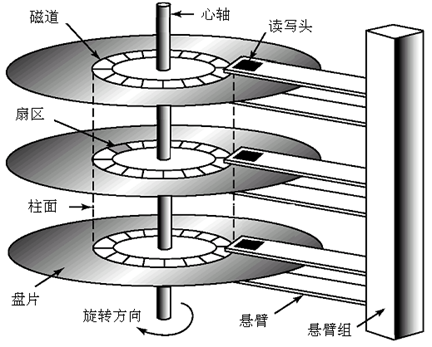

* 现在用LBA方法读写的情况是很多的，但是在数据恢复等一些特定场合，CHS模式仍有必要存在。这样就要学习如何在LBA和CHS之间进行转换。

  * s下标代表起始编号（不一定是0），p下标代表每组的数量

  $$
  N_{LBA}=(C-C_s)*H_p*S_p+(H-H_s)*S_p+(S-S_s)\\
  S=N_{LBA}\%S_p+S_s\\
  H=(N_{LBA}/S_p)\%H_p+H_s\\
  C=(N_{LBA}/(H_P*S_P))+C_s
  $$

* 例：经常有C~s~=0,H~s~=0,S~s~=1,H~p~=63,S~p~=255，那么LBA扇区号为1对应的CHS值分别是0/0/2.
  * 记住这组数据，下面有用

##### (b)、CHS方法读写

CHS方法主要利用0x13号中断（直接磁盘服务）读盘。这也是我们编写程序的依据。

* 我们发现：AH=0x02功能号是读盘的，各个参数如下：
  * AH=0x02（这不显然吗）
  * AL=5(要传输的扇区数)
  * CH=0(柱面号)
  * CL=2(扇区号,扇区从1开始标号)
  * DH=0(磁头)
  * DL=0x80(0x00\~0x79是软盘,0x80\~0xFF是硬盘)
  * ES:BX=[0x07c0:0x0200]:缓冲区地址
* 后面就很简单了。很快就写出了程序


### Assignment 2 进入保护模式

* 我们现在要想办法进入保护模式。当然是要在bootloader里面搞

#### 1、保护模式与段描述符简述

* 保护模式的本质是什么？保护模式的本质特征有两点，一是支持32位寻址(也即4GB的内存)，二是让所有程序都运行在自己的“段”里面，以防程序访问不属于自己的内存。
* 对于每个段，有一个8Byte的描述符，包含段的信息如下：

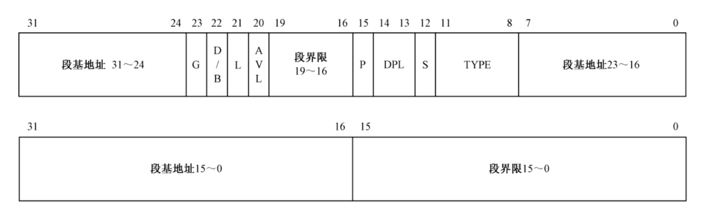

* 这些段描述符存储于“段描述符表”（GDT）中，而GDT的首地址等信息存储于寄存器GDTR中。GDTR是48位的，高32位存储首地址，低16位存储界限。最多可以有8192个段。

* 各个位的信息如下：

  * **段基地址**。段基地址共32位，是段的起始地址，被拆分成三部分放置。

  * **G位**。G表示粒度， G=0表示段界限以字节为单位， G=1表示段界限以4KB为单位。

  * **D/B位**。D/B位是默认操作数的大小或默认堆栈指针的大小，在保护模式下，该位置为1，表示32位。

  * **L位**。L位是 64 位代码段标志，由于这里我们使用的是32位的代码，所以L置0。

  * **AVL**。AVL位是保留位。

  * **段界限**。段界限表示段的偏移地址范围，后面会详细讨论这个问题。

  * **P位**。P位是段存在位， P=1表示段存在， P=0表示段不存在。

  * **DPL**。DPL指明访问该段必须有的最低优先级，优先级从0-3依次降低，即0拥有最高优先级，3拥有最低优先级。

  * **S位**。S位是描述符类型。S=0表示该段是系统段，S=1表示该段位代码段或数据段。

  * **TYPE**。TYPE指示代码段或数据段的类型，如下所示。

    * A位表示是否被使用过，A=1表示使用，A=0表示未被使用，由CPU负责设置，因此无需不关心。一致代码段和非一致代码段的问题比较复杂，后面讲到特权级时再讨论，这里统一将E位置为0。

    | 第11位(X) | 第10位(E) | 第9位(W) | 第8位(A) | 含义                     |
    | --------- | --------- | -------- | -------- | ------------------------ |
    | 0         | 0         | 0        | *        | 只读，向上扩展           |
    | 0         | 0         | 1        | *        | 读写，向上扩展           |
    | 0         | 1         | 0        | *        | 只读，向下扩展           |
    | 0         | 1         | 1        | *        | 读写，向下扩展           |
    | 1         | 0         | 0        | *        | 只执行，非一致代码段     |
    | 1         | 0         | 1        | *        | 执行、可读，非一致代码段 |
    | 1         | 1         | 0        | *        | 只执行，一致代码段       |
    | 1         | 1         | 1        | *        | 执行、可读、一致代码段   |

#### 2、保护模式的寻址

* 向上扩展和向下扩展指的是段的线性基地址和段的线性尾地址的大小关系。

  * 例对于数据段，尾地址是大于基地址的，因此是向上扩展
  * 对于栈段，栈是从高地址向低地址增长的，因此尾地址是小于基地址的，是向下扩展。
  


* 那么CPU具体怎么寻址呢？在保护模式下，满足

  * 如果段使向下扩展的，偏移量是负数,用补码表示。

  $$
  linear\_address=base+offset
  $$

* 一般来讲，除了段描述符中的地址是段基地址外，其他地址都是在对应段中的偏移地址。

* 由于我们还没有分页，所以线性地址就是物理地址。


#### 3、保护模式作用方法

* CPU通过段描述符中的段线性基地址和段界限来执行段保护如下所示，假设寻址的地址是offset，读出或写入的长度为length。 

* 对于一个向上扩展的段，如代码段和数据段，段界限给出的是最大的偏移量，寻址时满足

$$
0≤offset+length≤(segment\ boundary+1)∗granularity
$$

*  对于一个向下扩展的段，如栈段，段界限给出的是最小的偏移量，寻址时满足以下关系’
   *  注意偏移量用补码表示，这个“最小”也即绝对值最大


$$
(segment\ boundary+1)∗granularity≤offset−length≤0xFFFFFFFF
$$

#### 4、段选择子

* 继续看有关段的种种知识。到了保护模式下，段寄存器仍然是16位，但是不再直接保存段的地址（这个在GDT里面），而是保存“段选择子”.结构如下

| 位   | 名称         | 作用                                 |
| ---- | ------------ | ------------------------------------ |
| 15~3 | 描述符索引   | 段描述符在GDT对应的索引              |
| 2    | 描述符表选择 | 0表示用GDT，1表示用LDT（本次不使用） |
| 1~0  | 特权级       | 0为最高，3为最低                     |

* 保护模式下的寻址依然通过段地址和偏移地址的方式来寻址，此时线性地址 = 段地址 + 偏移地址，表示为“选择子:偏移地址”。在保护模式下，CPU先通过选择子在描述符表中找到段描述符，然后得到段线性基地址，最后将段线性基地址加上偏移地址便得到线性地址。

#### 5、进入保护模式

* 首先看一下进入保护模式的方法，接下来会一步一步分析

  * 准备GDT，用`lgdt`指令加载GDTR信息
  * 打开第21根地址线
  * 开启cr0的保护模式标志（PE）位
  * 远跳转，进入保护模式

* 首先是准备GDT所需要的内存。选择在bootloader后面再申请0x80Bytes的空间用以存放

* 需要准备一个48位的变量表示GDTR，可以用一个16位和一个32位变量拼接。然后用`lgdt`指令载入

  * GDT的第0位置要装一个空描述符，所以一共要装5个段描述符。界限是5*8-1=39

* 写GDT和段选择子需要精心设计。先看数据段、代码段、堆栈段和视频段（便于操作显存）的段描述符

  | 段   | 描述符                | 说明                                   |
  | ---- | --------------------- | -------------------------------------- |
  | 数据 | 0x00cf9200 0x0000ffff | 粒度4KB，段界限0xfffff                 |
  | 堆栈 | 0x00409600 0x00000000 | 粒度为字节，段界限为0                  |
  | 显存 | 0x0040920b 0x80007fff | 基地址0xB8000，界限0x07FFF，粒度为字节 |
  | 代码 | 0x00cf9800 0x0000ffff | 粒度4KB，段界限0xfffff                 |

* 有关于各个位的信息：
  * 基地址：显存段是0xB8000，其他都是0
  * G位:粒度位在上表有所说明
  * D/B 位：都是1，因为默认操作数大小是32位。
  * L位：都是0，因为是32位模式（如果是64位模式就是1）
  * AVL位：0就完事了
  * 段界限：除了显存段都开到最大了（向上增长是全F，向下增长是全0）看一下显存段，总的大小是0x8000(2^15^=32768)Byte.我们知道，如果是文字模式，每一页大小是25\*80\*2=4000Byte,八页就是32000Byte，差不多。
  * P：存在位为1（废话，段当然存在了）
  * DPL：为0（最NB的优先级）
  * S位：如果是代码段或者数据段，该位为1
  * TYPE：数据段和显存段为2（读写+向上扩展），堆栈段为6（读写+向下扩展），代码段为8（只执行，非一致代码段）
  
* 接下来开第21根地址线。这就是为了使得地址空间突破1MB的限制。注意，第21根地址线位于南(S)桥(B)的端口A20(编号0x92)的第二低位。知道了这个，就可以用in，out指令和or指令做这件事情。

  * 从下面一步开始，就要用32位寄存器了。

* 进入保护模式时中断体系还没有建立，所以要关中断。

* 然后开始处理CR0的最低位，也即保护模式开关（PE）。CR0是不能直接改的，和前面一样需要间接修改。

* cs寄存器是不能直接修改的，但是直接远跳转就解决了问题。这个时候相当于正式进入保护模式。

* 然后间接给ds，es（这两个一样的），gs，ss写入段选择子的值

* 最后，用写显存的方式再打印一行字，实验完成。

**这里要注意的问题**

* 对于习惯16位汇编的人，更加倾向于直接往`ds`和`es`寄存器里面写入数据段的段值而不是使用org伪指令。但是如果选择前者，那么在跳转到保护模式的时候会出现奇怪的问题(屏幕狂闪)，如图所示：
  * 具体来说就是屏幕Bling Bling的闪，但是就是显示不全。推测是屏幕频繁刷新导致。
  * 推测的原因是在实模式向保护模式跳转的时候，其进行远跳转的步骤出现了问题。且出现了混乱所致。
  * 所以这里还是要使用org伪指令，并且要相应地将所有段寄存器置0，一开始写磁盘的di要直接设置为0x7e00

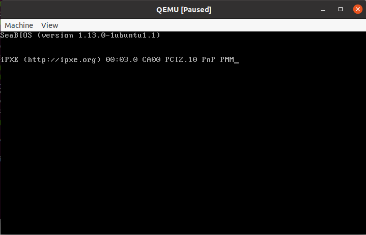

#### 6、GDB调试方法

* 我们尝试用GDB来调试这个程序
* 如果要用GDB调试，那么就需要准备相对应的符号表。如此，就不能一步到位生成`.bin`文件。
* 注意。Ubuntu 20.x默认可以安装的nasm是2.14的，没有在gdb中显示源代码的功能。我们要安装一个2.15的，安装包已经提供了。这里学习用手动编译的方式安装软件。
* 先把压缩包复制到我们想要的文件夹（我们选择`~/OS/lab4`）中并执行如下命令：
  * 分别是解压缩，进入文件夹，编译准备（检查并生成Makefile）和编译

```shell
tar -xvf nasm-2.15.05.tar.xz
cd nasm-2.15.05
./configure
make
```

* 然后就是安装和检查版本,显示安装成功。

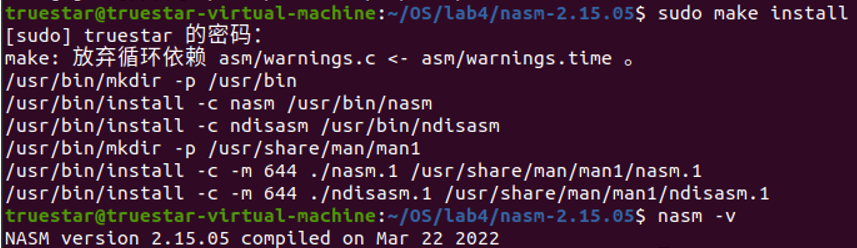

* 然后开始符号表的生成。由于我们生成的是“可重定位”的文件，其起始地址是需要后续指定的，org伪指令就可以不要了。
* 下面讲解编译的流程
* 首先编译生成可重定位文件。`-f`说明这是一个可重定位文件。

```shell
nasm -o mbr.o -g -f elf32 mbr.asm 
```

* 链接并指定起始位置。需要生成符号表和二进制文件

```shell
ld -o mbr.symbol -melf_i386 -N mbr.o -Ttext 0x7c00
ld -o mbr.bin -melf_i386 -N mbr.o -Ttext 0x7c00 --oformat binary
```

* 对bootloader进行同样的操作

```shell
nasm -o bootloader.o -g -f elf32 bootloader.asm 
ld -o bootloader.symbol -melf_i386 -N bootloader.o -Ttext 0x7e00
ld -o bootloader.bin -melf_i386 -N bootloader.o -Ttext 0x7e00 --oformat binary
```

* 装盘，类似的操作

```shell
dd if=mbr.bin of=hd.img bs=512 count=1 seek=0 conv=notrunc
dd if=bootloader.bin of=hd.img bs=512 count=5 seek=1 conv=notrunc
qemu-system-i386 -s -S -hda hd.img -serial null -parallel stdio
```

* 当然也可以写一个Makefile一站式完成所有步骤

```makefile
run:
	@qemu-system-i386 -hda hd.img -serial null -parallel stdio 
debug:
	@qemu-system-i386 -s -S -hda hd.img -serial null -parallel stdio &
	@sleep 1
	@gnome-terminal -e "gdb -q -x gdbinit"
build:
	@nasm -g -f elf32 mbr.asm -o mbr.o
	@ld -o mbr.symbol -melf_i386 -N mbr.o -Ttext 0x7c00
	@ld -o mbr.bin -melf_i386 -N mbr.o -Ttext 0x7c00 --oformat binary
	@nasm -g -f elf32 bootloader.asm -o bootloader.o
	@ld -o bootloader.symbol -melf_i386 -N bootloader.o -Ttext 0x7e00
	@ld -o bootloader.bin -melf_i386 -N bootloader.o -Ttext 0x7e00 --oformat binary
	@dd if=mbr.bin of=hd.img bs=512 count=1 seek=0 conv=notrunc
	@dd if=bootloader.bin of=hd.img bs=512 count=5 seek=1 conv=notrunc
clean:
	@rm -fr *.bin *.o
```

* 然后通过`make build`编译，`make`或者`make run`直接运行，`make debug`在gdb下运行，`make clean`清理上一次的编译信息。
* 这里注意一个小细节。如果第一次远跳转的时候选择`jmp 0x07e0:0x0000`而非`jmp 0x0000:0x7e00`,那么在debug的时候会出现`SIGTRAP`,（但是非调试模式是可以正常运行的）这又是为什么呢？
  * 这很可能是因为跳转的时候修改CS寄存器出现了问题。在使用org伪指令的情况下，实模式中cs，ds等是不应该随便自己改的。

* 接下来正式开始进行调试。

* 连接远程端口，并在三个关键点（mbr，bootloader，protect mode）设置断点
  * 这个时候会发现设置第三个断点的时候有警告。别管他，虽然暂时他找不到这个函数，后来加载bootloader的符号表的时候，会找到这个函数。

```shell
target remote:1234
b *0x7c00
b *0x7e00
b protect_mode_tag
```

* 执行c(continue)命令运行到第一个断点，QEMU窗口如图所示

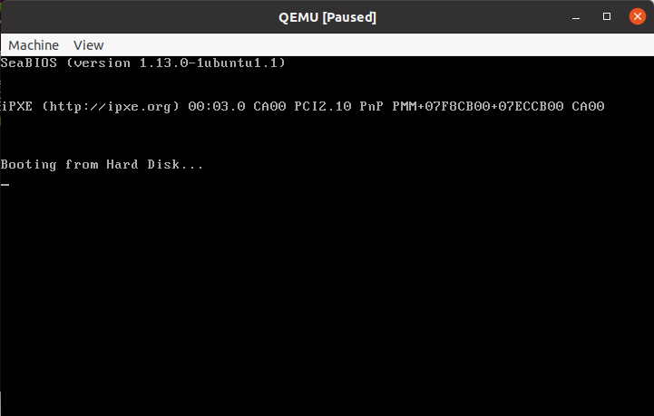

* 此时可以进入src窗口查看源代码如下图所示

```shell
layout src
```

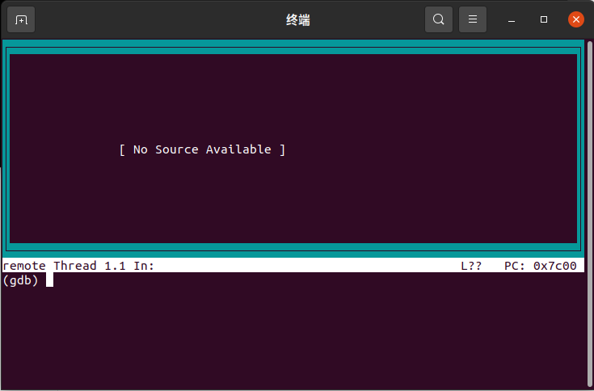

* 此时没有载入符号表。我们载入mbr的符号表

```shell
add-symbol-file mbr.symbol 0x7c00
```

* 效果如下图

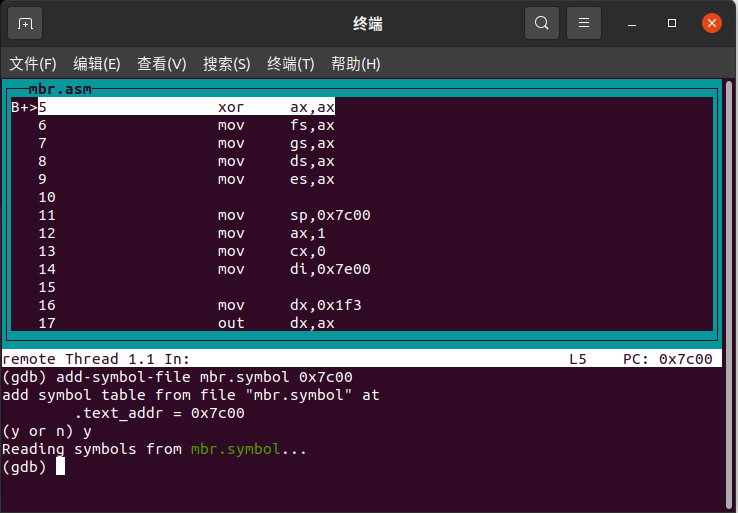

* 执行若干次`ni指令`，可以执行`info r`看寄存器如下图
  * 为了保证几个重要的都能看到，我把窗口加大了一点
  * 后面一页所有段寄存器都是0，这就是org伪指令的效果

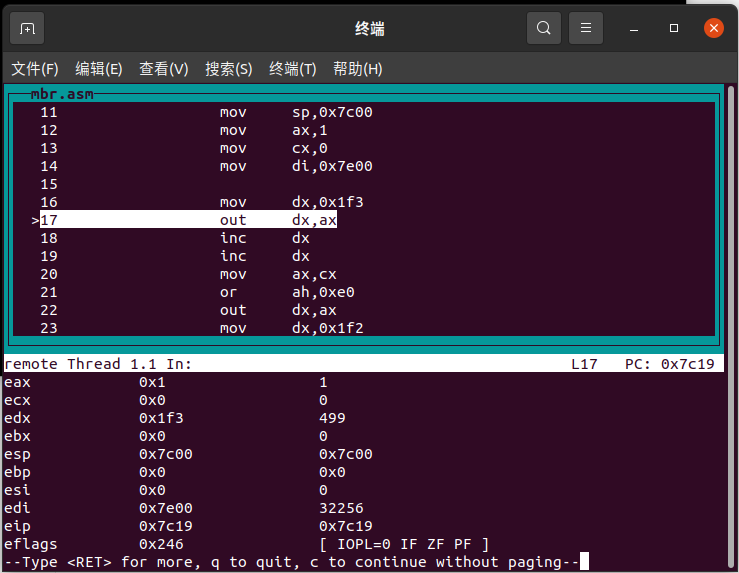

* 执行c(continue)命令运行到第二个断点，QEMU窗口没有什么变化

* 同样载入bootloader的符号表

```shell
add-symbol-file bootloader.symbol 0x7e00
```

* 效果如下

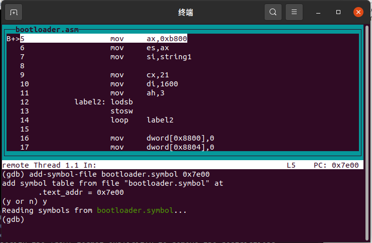

* 继续执行c命令，执行效果如下

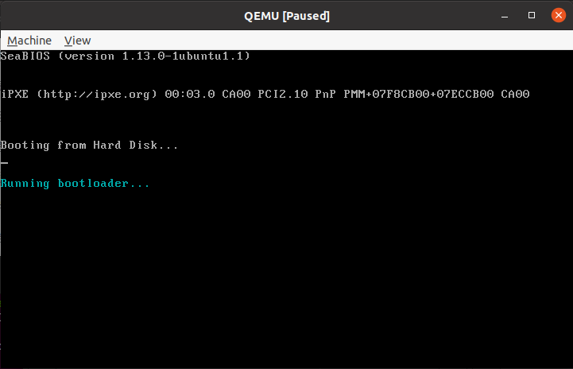

* 执行c命令执行到尾，结果同不使用Debug模式
* 按`Ctrl+C`结束运行，并执行如下命令查看段描述符的内容

```shell
Program received signal SIGINT, Interrupt.
label3 () at bootloader.asm:63
(gdb) x/5xg 0x8800
0x8800: 0x0000000000000000      0x00cf93000000ffff
0x8810: 0x0040970000000000      0x0040930b80007fff
0x8820: 0x00cf98000000ffff
```

### Assignment 3字符弹射(保护模式下)

* 第一行还是用来显示标题，下面24行用来皮。
  * 本次升级了，标题也是变色的。
* 预置25种颜色组合，放在数组里面
* 这里非常生草的一点就是，上次实模式下的延时中断没了！这里需要用循环做一个粗略的延时。这种延时方式受到系统性能的影响。我设置的延时是执行0x3fffff次循环（约为2^22^次）。
* 为了提高模块的可复用性，和上次相比，大量使用函数来实现功能。这样还有个好处就是可以在一些模块有更好的解决方法的时候很容易地修改。
* 启动位置分别记为(1,0)(24,79),起始方向分别为右下和左上。可以很容易地发现，这两个点具有对称性，且行坐标和为25，列坐标和为79，也即二者的行列坐标(即dx寄存器)之和为0x194f。可以利用这个规律，只存储一个坐标和状态就行了。
  * 然后定义一个函数，用来计算坐标到显存地址的映射，就行了
* 此时要考虑寄存器的使用问题。首先AX、BX、CX频繁用于中断调用，DX要存坐标。因为CX在中断调用里面不是很重要，也可以用于对称坐标的计算。SI用来指向颜色数组，也被占用了。SP和BP不能乱用，也就剩一个DI了，用来存方向。
  * 这里巧妙地利用位操作存储两个方向。DI的最低位存储列的状态，次低位存储行的状态。0代表增，1代表减。要提取的时候，可以用`test edi,0x1`或者`test edi,0x2`，看ZF标志位就可以了。涉及换向的时候也直接用`xor`指令就可以了。

### Assignment 4 保护模式中利用C读取磁盘、进入内核

* 进入保护模式以后，我们就可以加载内核。这里需要再一次磁盘读取。我们尝试使用assembly+C混合编程。源代码参考`MIT xv6`的读盘方式。
* 我们将“字符弹射”程序移动到内核中。此时有了“内核”，我们又需要规划它所处的内存。我们决定将其放置于0x20000处（反正肯定够大）
* 我们假设内核的大小一共是2个扇区（其实都感觉真浪费），在完成了读盘以后，直接一个远跳转就进去了。

 #### 1、用C函数内嵌汇编读取磁盘

* 操作系统并不一定永远在同一个平台运行。譬如，Macintosh系统就需要分别在x86平台（Intel处理器）和ARM平台（Apple M1系列）运行。汇编指令和平台严格对应，可移植性很成问题。所以如果希望在不同平台运行操作系统，我们应当尽可能少使用汇编语言，多使用高级语言。这样当我们希望移植操作系统时，只需要重写汇编部分，然后重新编译即可
* 本质上，仍然是LBA方式，只是把各个汇编语句用C内嵌汇编进行封装。涉及的命令有`in`，`out`和`insw`指令。
* 仍然注意C内嵌汇编的格式。譬如，`"a"(var)`是将var的值给ax，`"=a"(var)`是指将ax的值给var。第一个冒号后面是输出，第二个冒号后面是输入。百分号是占位符，后面的数字代表是第几个输入输出（从0开始）。
  * 在后面的代码部分会进行详细讲解。
* 此处为了使得各个步骤更明显，我在各个步骤之间加入了延时。

#### 2、编译、链接和运行

* 首先编译生成可重定位文件。
  * `-f`说明这是一个可重定位文件。
  * `-g`说明生成debug程序


```shell
nasm -o mbr.o -g -f elf32 mbr.asm 
```

* 链接并指定。需要生成符号表和二进制文件
  * `-melf_i386`指的是生成供i386处理器的文件
  * `-N`参数告诉链接器不要进行页对齐。
  * `-Ttext`指定程序运行的起始地址。
  * `--oformat`指定输出文件格式。如果选择`binary`模式，那么就不要生成elf文件而是二进制文件。


```shell
ld -o mbr.symbol -melf_i386 -N mbr.o -Ttext 0x7c00
ld -o mbr.bin -melf_i386 -N mbr.o -Ttext 0x7c00 --oformat binary
```

* 再编译bootloader

```shell
nasm -o bootloader.o -g -f elf32 bootloader.asm 
```

* 编译`read.c`。以下是gcc的参数含义
  * `-Wall`告诉编译器显示所有编译器警告信息
  * `-march=i386`告诉编译器生成i386处理器下的`.o`文件格式。
  * `-m32`告诉编译器生成32位的二进制文件。
  * `-nostdlib -fno-builtin -ffreestanding -fno-pic`是告诉编译器不要包含C的任何标准库。
  * `-g`表示向生成的文件中加入debug信息供gdb使用。
  * `-c`表示生成可重定位文件。

```shell
gcc -g -Wall -march=i386 -m32 -nostdlib -fno-builtin -ffreestanding -fno-pic  -c read.c
```

* 链接两个文件。这里要注意链接的顺序。
  * `-e`参数指定程序进入点。为此我们加入了一个tag

```shell
ld -o boot.o -melf_i386 -N bootloader.o read.o -e start_tag -Ttext 0x00007e00
ld -o boot.bin -melf_i386 -N bootloader.o read.o -e start_tag -Ttext 0x00007e00 --oformat binary
```

* 类似地，编译链接`kernel.asm`

```shell
nasm -o kernel.o -g -f elf32 kernel.asm 
ld -o kernel.symbol -melf_i386 -N kernel.o -Ttext 0x20000
ld -o kernel.bin -melf_i386 -N kernel.o -Ttext 0x20000 --oformat binary
```

* 最后装进虚拟磁盘

```shell
dd if=mbr.bin of=hd.img bs=512 count=1 seek=0 conv=notrunc
dd if=boot.bin of=hd.img bs=512 count=5 seek=1 conv=notrunc
dd if=kernel.bin of=hd.img bs=512 count=2 seek=6 conv=notrunc
```

* 同样可以运行和调试.当然写个Makefile更爽。操作方法与上面类似

```makefile
run:
	@qemu-system-i386 -hda hd.img -serial null -parallel stdio 
debug:
	@qemu-system-i386 -s -S -hda hd.img -serial null -parallel stdio &
	@sleep 1
	@gnome-terminal -e "gdb -q -x gdbinit"
build:
	@nasm -g -f elf32 mbr.asm -o mbr.o
	@ld -o mbr.symbol -melf_i386 -N mbr.o -Ttext 0x7c00
	@ld -o mbr.bin -melf_i386 -N mbr.o -Ttext 0x7c00 --oformat binary
	@nasm -g -f elf32 bootloader.asm -o bootloader.o
	@gcc -g -Wall -march=i386 -m32 -nostdlib -fno-builtin -ffreestanding -fno-pic  -c read.c
	@ld -o boot.o -melf_i386 -N bootloader.o read.o -e start_tag -Ttext 0x00007e00
	@ld -o boot.bin -melf_i386 -N bootloader.o read.o -e start_tag -Ttext 0x00007e00 --oformat binary
	@nasm -o kernel.o -g -f elf32 kernel.asm 
	@ld -o kernel.symbol -melf_i386 -N kernel.o -Ttext 0x20000
	@ld -o kernel.bin -melf_i386 -N kernel.o -Ttext 0x20000 --oformat binary
	@dd if=mbr.bin of=hd.img bs=512 count=1 seek=0 conv=notrunc
	@dd if=boot.bin of=hd.img bs=512 count=5 seek=1 conv=notrunc
	@dd if=kernel.bin of=hd.img bs=512 count=2 seek=6 conv=notrunc
clean:
	@rm -fr *.bin *.o
```

#### 3、各种玄学

* 如果两次都使用LBA模式访问，第二次给我读出来都是0？当我GDB看到这个结果的时候，给我造成的惊吓还是可想而知的。（酒这东西卡了我一天）
* 更加玄学的是，每次有一定几率卡进去内核？我人已经傻掉了。没想通为什么。
* 然后尝试第一把CHS第二把LBA，然后就过掉了，过掉了，掉了，了......
* 原来因为本人有强迫症，把bootloader强行填充到2560字节。在前面的实验没有问题。但是在这里就会把read.c编译生成的可执行文件挤出去，就不能读盘了。

## 四、实验代码

* 以前已经讲解过的部分，这里不再讲解

### Assignment 1 Bootloader的加载

#### 1-1 Example 1

* `mbr.asm`

```assembly
[bits 16]

        mov     ax,0x07c0
        mov     ds,ax
        mov     es,ax
        xor     ax,ax
        mov     fs,ax
        mov     gs,ax

        mov     sp,0x7c00
        mov     ax,1
        mov     cx,0
        mov     di,0x0200		;目标读取地址

        mov     dx,0x1f3		;LBA扇区号的低16位
        out     dx,ax			;输出到0x1f3和0x1f4
        inc     dx
        inc     dx
        mov     ax,cx			;LBA扇区号的高12位
        or      ah,0xe0			;以及选择位和模式位
        out     dx,ax			;输出到0x1f5和0x1f6
        mov     dx,0x1f2
        mov     al,5			;要输出的扇区数
        out     dx,al			;输出到0x1f2
        mov     dx,0x01f7		;向0x1f7位置
        mov     al,0x20			;输出0x20
        out     dx,al			;开始读取

check:  in      al,dx			;检查0x1f7返回的值
        and     al,0x89			;检查BSY位,DRQ位,ERR位
        xor     al,0x08			;是否为010
        jnz     check			;是就对了，不是就继续检查

        mov     cx,1280			;每次2字节，一共2560字节，所以1280次
        mov     dx,0x1f0		;从0x1f0读取
label:  in      ax,dx			;读取2字节数据
        stosw					;写到指定位置
        loop    label

        jmp     0x07e0:0x0000	;进入bootloader。这里没问题

here:   jmp     here

        times   510 - ($ - $$) db 0
        dw      0xaa55
```

* `bootloader.asm`

```assembly
[bits 16]

        mov     ax,0xb800
        mov     es,ax		;显存段在这里放es
        mov     ax,0x07e0
        mov     ds,ax
        mov     si,string

        mov     cx,21		;写显存显示字符串
        mov     di,1600
        mov     ah,3
label2: lodsb
        stosw
        loop    label2

here2:  jmp     here2
    
    	string db   "Running bootloader..."
    	times 2560-($-$$) db 0
```

#### 1-2 CHS模式

* `mbr.asm`

```assembly
[bits 16]

        mov     ax,0x07c0
        mov     ds,ax
        mov     es,ax		
        xor     ax,ax
        mov     fs,ax
        mov     gs,ax

        mov     sp,0x7c00
        mov     ax,1
        mov     cx,0
        mov     bx,0x0200	;[ES:BX]是缓冲区

        mov     ax,0x0205	;AH是功能号AL是扇区数
        mov     cx,0x0002	;CH是柱面号CL是扇区号
        mov     dx,0x0080	;DH为磁头号DL=0x80代表硬盘
        int     0x13		;开始CHS读取 

        jmp     0x07e0:0x0000

here:   jmp     here

        times   510 - ($ - $$) db 0
        dw      0xaa55
```

### Assignment 2 进入保护模式

* `mbr.asm`

```assembly
		org		0x7c00		;这里必须使用org伪指令

[bits 16]

        xor     ax,ax
        mov     fs,ax
        mov     gs,ax
        mov     ds,ax
        mov     es,ax

        mov     sp,0x7c00
        mov     ax,1
        mov     cx,0
        mov     di,0x7e00

        mov     dx,0x1f3
        out     dx,ax
        inc     dx
        inc     dx
        mov     ax,cx
        or      ah,0xe0
        out     dx,ax
        mov     dx,0x1f2
        mov     al,5
        out     dx,al
        mov     dx,0x01f7
        mov     al,0x20
        out     dx,al

check:  in      al,dx
        and     al,0x89
        xor     al,0x08
        jnz     check

        mov     cx,1280
        mov     dx,0x1f0
label:  in      ax,dx
        stosw
        loop    label

        jmp     0x0000:0x7e00	;这里必须修改
								;否则debug会出问题
here:   jmp     here

        times   510 - ($ - $$) db 0
        dw      0xaa55
```

* `bootloader.asm`

```assembly
		org		0x7e00
		
[bits 16]
	    
        mov     ax,0xb800
        mov     es,ax
        mov     si,string1

        mov     cx,21
        mov     di,1600
        mov     ah,3
label2: lodsb
        stosw
        loop    label2

        mov     dword[0x8800],0				;写GDT，含义在上文有
        mov     dword[0x8804],0
        mov     dword[0x8808],0x0000ffff
        mov     dword[0x880c],0x00cf9200
        mov     dword[0x8810],0x00000000
        mov     dword[0x8814],0x00409600
        mov     dword[0x8818],0x80007fff
        mov     dword[0x881c],0x0040920b
        mov     dword[0x8820],0x0000ffff
        mov     dword[0x8824],0x00cf9800

        mov     word[pgdt],39
        lgdt    [pgdt]						;装载GDTR

        in      al,0x92						;打开第21根地址线
        or      al,2
        out     0x92,al

        cli									;关中断
        mov     eax,cr0						;开PE位
        or      eax,1
        mov     cr0,eax
											;远跳转进入保护模式
        jmp     dword 0x0020:protect_mode_tag

[bits 32]

protect_mode_tag:
        mov     ax,0x8						;写段选择子
        mov     ds,ax
        mov     es,ax
        mov     ax,0x10
        mov     ss,ax
        mov     ax,0x18
        mov     gs,ax

        mov     ah,0xe						;写显存，打印文字
        mov     ebx,1920
        mov     ecx,26
        mov     esi,string2

label3: lodsb
        mov     [gs:ebx],ax
        inc     ebx
        inc     ebx
        loop    label3

	    jmp     $
    
    	string1 db      "Running bootloader..."
        string2 db      "Running in protect mode..."

        pgdt    dw      0
                dd      0x00008800			;GDT起始位置

    	times 2560-($-$$) db 0
```

### Assignment 3字符弹射(保护模式下)

* `bootloader.asm`

```assembly
		org		0x7e00
		
[bits 16]
	    
        mov     ax,0xb800
        mov     es,ax
        mov     si,string1

        mov     cx,21
        mov     di,1600
        mov     ah,3
label2: lodsb
        stosw
        loop    label2

        mov     dword[0x8800],0
        mov     dword[0x8804],0
        mov     dword[0x8808],0x0000ffff
        mov     dword[0x880c],0x00cf9200
        mov     dword[0x8810],0x00000000
        mov     dword[0x8814],0x00409600
        mov     dword[0x8818],0x80007fff
        mov     dword[0x881c],0x0040920b
        mov     dword[0x8820],0x0000ffff
        mov     dword[0x8824],0x00cf9800

        mov     word[pgdt],39
        lgdt    [pgdt]

        in      al,0x92
        or      al,2
        out     0x92,al

        cli
        mov     eax,cr0
        or      eax,1
        mov     cr0,eax

        jmp     dword 0x0020:protect_mode_tag

[bits 32]

protect_mode_tag:
        mov     ax,0x8
        mov     ds,ax
        mov     es,ax
        mov     ax,0x10
        mov     ss,ax
        mov     ax,0x18
        mov     gs,ax
        
        mov	    cx,1000			;直接清屏
        mov	    ax,0
 	    mov	    bx,0
label3:	mov	    [gs:ebx],ax
	    inc	    ebx
	    inc	    ebx
	    loop	label3

        mov     dx,0x0100		;载入颜色字符串
        mov     esi,colors
        mov     al,0x30
        mov     edi,0

here:   cmp     byte[esi],0			
        jnz     label5
        mov     esi,colors
label5: mov     ah,[esi]		;载入颜色
        inc     esi
        call    print_title		;打印标题
        call    get_index		;计算显存位置
        mov     [gs:ebx],ax		;显示字符
        inc     al
        mov     cx,0x194f		;对称操作
        sub     cx,dx
        mov     dx,cx
        call    get_index		;计算显存位置
        mov     [gs:ebx],ax		;显示字符
        inc     al
        cmp     al,0x3a
        jnz     label6
        mov     al,0x30
label6: mov     cx,0x194f		;对称操作
        sub     cx,dx
        mov     dx,cx
        call    move_point		;移动光标
        call    delay			;延时操作
        jmp     here

print_title:					;和实验3-4类似，不再赘述
        push    esi				;必要的寄存器保护
        push    ax
        mov     ebx,52
        mov     ecx,28
        mov     esi,string2
        
label4: lodsb					
        mov     [gs:ebx],ax
        inc     ebx
        inc     ebx
        loop    label4
        
        pop     ax
        pop     esi
        ret						;返回

get_index:						;行*160+列*2=相对位置
        push    ax
        mov     al,160
        mul     dh
        xor     ebx,ebx
        add     bl,dl
        add     bl,dl
        add     bx,ax
        pop     ax  
        ret
        
move_point:						;与实验3-4类似，不再赘述
        test    edi,0x1
        jnz     csub
        inc     dl
        jmp     cend
csub:   dec     dl
cend:   test    edi,0x2
        jnz     rsub
        inc     dh
        jmp     rend
rsub:   dec     dh
rend:   cmp     dh,1
        jz      rrev
        cmp     dh,24
        jz      rrev
rfin:   cmp     dl,0
        jz      crev
        cmp     dl,79
        jz      crev
cfin:   ret

rrev:   xor     edi,0x2
        jmp     rfin
crev:   xor     edi,0x1
        jmp     cfin

delay:							
        push    ecx
        mov     ecx,0x3fffff	;利用循环来延时
label7: loop    label7			;延时效果随电脑性能有所不同
        pop     ecx
        ret
    
    	string1 db      "Running bootloader..."
    	string2 db      "BRH's character catapult 2.0"
        colors  db      0x09,0x0a,0x0c,0x0e,0x0f
                db      0x18,0x1c,0x1d,0x1e,0x1f
                db      0x58,0x59,0x5a,0x5e,0x5f 
                db      0x70,0x71,0x72,0x73,0x74
                db      0x30,0x3c,0x3d,0x3e,0x3f,0x00

        pgdt    dw      0
                dd      0x00008800

    	times 2560-($-$$) db 0
```

### Assignment 4 保护模式中利用C读取磁盘、进入内核

* `mbr.asm`

```assembly
		org		0x7c00

[bits 16]

        xor     ax,ax
        mov     fs,ax
        mov     gs,ax
        mov     ds,ax
        mov     es,ax

        mov     sp,0x7c00
        mov     bx,0x7e00

        mov     ax,0x0205
        mov     cx,0x0002
        mov     dx,0x0080
        int     0x13
        
        jmp		0x0000:0x7e00
here:	jmp 	here


        times   510 - ($ - $$) db 0
        dw      0xaa55
```

* `bootloader.asm`

```assembly
		org		0x7e00

extern 	read_disk
		
[bits 16]

start_tag:
	    
        mov     ax,0xb800
        mov     es,ax
        mov     si,string1

        mov     cx,21
        mov     di,1600
        mov     ah,3
label2: lodsb
        stosw
        loop    label2
        
        mov     ah,0x86			;延时
        mov     cx,15
        mov     dx,0
        int     0x15

        mov     dword[0x8800],0
        mov     dword[0x8804],0
        mov     dword[0x8808],0x0000ffff
        mov     dword[0x880c],0x00cf9200
        mov     dword[0x8810],0x00000000
        mov     dword[0x8814],0x00409600
        mov     dword[0x8818],0x80007fff
        mov     dword[0x881c],0x0040920b
        mov     dword[0x8820],0x0000ffff
        mov     dword[0x8824],0x00cf9800

        mov     word[pgdt],39
        lgdt    [pgdt]

        in      al,0x92
        or      al,2
        out     0x92,al

        cli
        mov     eax,cr0
        or      eax,1
        mov     cr0,eax

        jmp     dword 0x0020:protect_mode_tag

[bits 32]

protect_mode_tag:
        mov     ax,0x8
        mov     ds,ax
        mov     es,ax
        mov     ax,0x10
        mov     ss,ax
        mov     ax,0x18
        mov     gs,ax
        
        mov     ah,0xe
        mov     ebx,1920
        mov     ecx,26
        mov     esi,string2

label3: lodsb
        mov     [gs:ebx],ax
        inc     ebx
        inc     ebx
        loop    label3

        mov     ecx,0xffffff	;延时
label4: loop    label4

        call    read_disk		;读盘
								;进入内核
        jmp     dword 0x0020:0x20000

here2:  jmp     here2
    
    	string1 db      "Running bootloader..."
        string2 db      "Running in protect mode..."

        pgdt    dw      0
                dd      0x00008800
```

* `x86.h`

```C
typedef unsigned int   uint;
typedef unsigned short ushort;
typedef unsigned char  uchar;

//mov	dx,port
//out	al,dx
//mov	data,al

static inline uchar inb(ushort port)
{
  uchar data;
  asm volatile("in %1,%0" : "=a" (data) : "d" (port));
  return data;
}

//cld
//mov	di,addr
//mov	cx,cnt
//mov	dx,port
//rep 	insw

static inline void insw(uint port, void *addr, uint cnt)
{
  asm volatile("cld; rep insw" :
               "=D" (addr), "=c" (cnt) :
               "d" (port), "0" (addr), "1" (cnt) :
               "memory", "cc");
}

//mov	al,data
//mov	dx,port
//out	dx,al

static inline void outb(ushort port, uchar data)
{
  asm volatile("out %0,%1" : : "a" (data), "d" (port));
}
```

* `read.c`

```c
#include "x86.h"
void read_disk(void)
{   
	while((inb(0x1f7)&0xc0)!=0x40)
        continue;
    
    outb(0x1f2,2);
    outb(0x1f3,6);
    outb(0x1f4,0);
    outb(0x1f5,0);
    outb(0x1f6,0xe0);
    outb(0x1f7,0x20);

    while((inb(0x1f7)&0xc0)!=0x40)
        continue;

    insw(0x1f0,(void *)(0x20000),512);
}
```

* `kernel.asm`

```assembly
;这个程序应该就不用加注释了吧:)
[bits 32]

        mov	    ecx,1000
        mov	    ax,0
        mov     ebx,0
label5:	mov	    [gs:ebx],ax
	    inc	    ebx
	    inc	    ebx
	    loop	label5

        mov     dx,0x0100
        mov     esi,colors
        mov     al,0x30
        mov     edi,0

here3:  cmp     byte[esi],0
        jnz     label6
        mov     esi,colors
label6: mov     ah,[esi]
        inc     esi
        call    print_title
        call    get_index
        mov     [gs:ebx],ax
        inc     al
        mov     cx,0x194f
        sub     cx,dx
        mov     dx,cx
        call    get_index
        mov     [gs:ebx],ax
        inc     al
        cmp     al,0x3a
        jnz     label7
        mov     al,0x30
label7: mov     cx,0x194f
        sub     cx,dx
        mov     dx,cx
        call    move_point
        call    delay
        jmp     here3

print_title:
        push    esi
        push    ax
        mov     ebx,52
        mov     ecx,28
        mov     esi,string3
        
label8: lodsb
        mov     [gs:ebx],ax
        inc     ebx
        inc     ebx
        loop    label8
        
        pop     ax
        pop     esi
        ret

get_index:
        push    ax
        mov     al,160
        mul     dh
        xor     ebx,ebx
        add     bl,dl
        add     bl,dl
        add     bx,ax
        pop     ax  
        ret
        
move_point:
        test    edi,0x1
        jnz     csub
        inc     dl
        jmp     cend
csub:   dec     dl
cend:   test    edi,0x2
        jnz     rsub
        inc     dh
        jmp     rend
rsub:   dec     dh
rend:   cmp     dh,1
        jz      rrev
        cmp     dh,24
        jz      rrev
rfin:   cmp     dl,0
        jz      crev
        cmp     dl,79
        jz      crev
cfin:   ret

rrev:   xor     edi,0x2
        jmp     rfin
crev:   xor     edi,0x1
        jmp     cfin

delay:
        push    ecx
        mov     ecx,0x3fffff
label9: loop    label9
        pop     ecx
        ret

        string3 db      "BRH's character catapult 3.0"
        colors  db      0x09,0x0a,0x0c,0x0e,0x0f
                db      0x18,0x1c,0x1d,0x1e,0x1f
                db      0x58,0x59,0x5a,0x5e,0x5f 
                db      0x70,0x71,0x72,0x73,0x74
                db      0x30,0x3c,0x3d,0x3e,0x3f,0x00
```

## 五、实验结果

* 用LBA和CHS模式都成功进入Bootloader

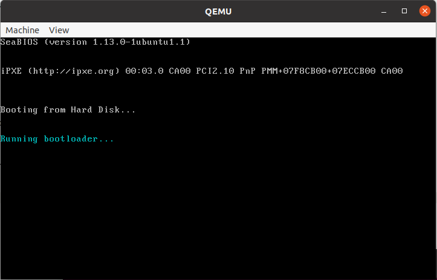

* 进入保护模式效果如下

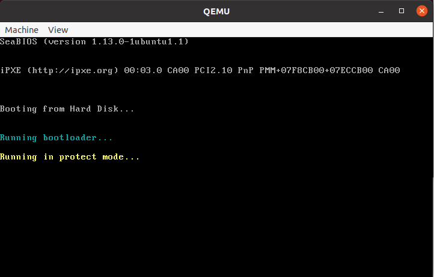

* 保护模式下字符弹射。本次由于没有准确的延时中断，所以速度会随电脑性能有很大的变化。我在将电脑性能设置的比较低时（2C2T+省电模式）
  * 可以发现标题也是可以变颜色的

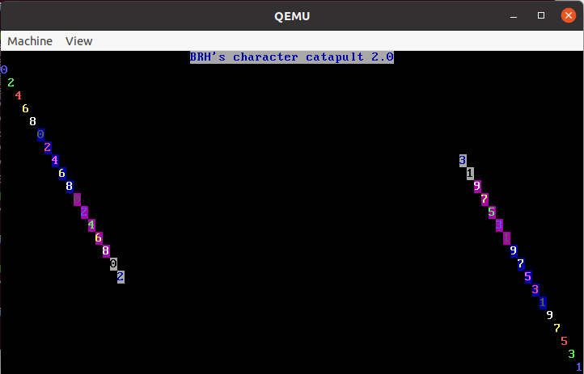

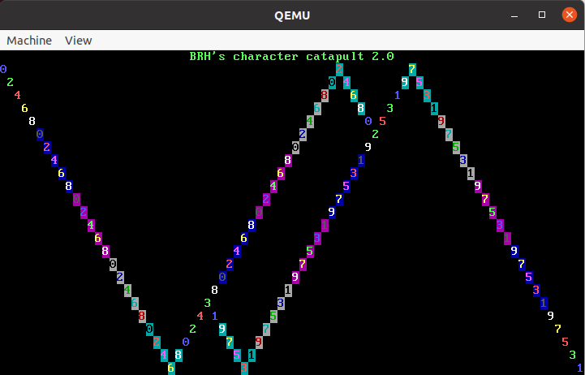

* 成功进入了内核

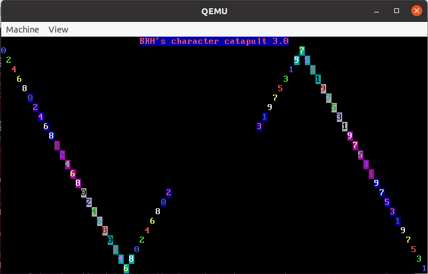

## 六、总结和启发

* 玄学害得我好苦啊……一个bug抓一天，人也是麻中麻。星期四一天毫无进展，这酸爽谁试谁知道啊
* 本次实验难度是比较大的，主要难点在于对汇编的把握和对于各种意外Bug的处理上。debug的能力在本次有着很大的重要性，因为很难一把过，而且汇编debug本身就比较反人类。
* 本次完全完成了从mbr到bootloader到内核，从实模式到保护模式的过程。也大大减轻了下一次实验的负担。下一次就不用再想办法进入内核了。
