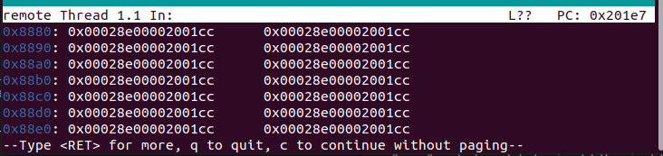

# 实验五：中断

## 一、实验要求

* 学习如何混合使用汇编语言、C语言和C++编程
* 运用混合编程的方法进入操作系统的内核
* 加载IDT，为使用保护模式中断做准备
* 使用8259A芯片，实现时钟中断

## 二、实验器材

* 笔记本电脑一台，性能足够强大
* VMware Workstation Pro 16
* Ubuntu 20.04安装于虚拟机中

## 三、实验过程

### Assignment 1 混合编程与Makefile的使用

* 现在已经是第五个实验了，大家写汇编都写麻了。再继续写汇编人就要被送走了。为了解救大家，我们要引入混合编程。

#### （1）汇编与C/C++之间的函数调用

* 要在汇编中使用C函数(例如`foo`),要在汇编中声明
  * 其作用是为了让链接器在其他目标文件找函数实现


```assembly
extern foo
```

* 声明完以后可以直接使用（其实上次仿xv6读盘已经用了）

```assembly
call foo
```

* 注意：由于C++支持函数重载，在编译的时候会对函数名进行修饰。这会导致汇编不能识别这个函数，所以要加上`extern "C"`修饰

```c++
extern "C" void foo(void); 
```

* 要在C或C++语言使用汇编函数`bar`,在汇编中要声明
  * 目的是为了让这个函数可以在链接时被其他目标文件使用。


```assembly
global bar
```

* 在C/C++中声明这个函数来自外部即可
  * 目的是让程序去外部寻找这个函数的实现


```c++
extern void bar(void);		//C
extern "C" void bar(void); 	//C++
```

* 函数调用过程如下：
  * 从后往前压入参数
  * 调用函数，压入返回地址
  * 保护原来的`ebp`
  * 更新`ebp`为目前的`esp`
  * 必要时压寄存器保护
  * 执行函数（`ebp`+4*(n+1)是第n个参数）
  * 弹出保护的寄存器
  * 将返回值放入`eax`
  * 恢复`ebp`
  * 函数返回
  * 清除参数


```assembly
	push	<argn>				;argn
	...							;...
	push	<arg1>				;arg1
	call	foo					;ret addr
	add		esp,<n*4>			;old ebp
	
foo:push	ebp
	mov		ebp,esp
	...
	pop		ebp
	ret	
```

* 在掌握了以上的知识以后，我们可以编写一个C++程序`main.cpp`,里面调用汇编函数（存放在`asm_func.asm`)。而汇编函数又调用C和C++函数(分别存放在`c_func.c`和`cpp_func.cpp`).
* 最后编写如下的Makefile
  * 里面所提到的编译参数以前都讲过了
  * 就是要记住在最后一步链接的时候主函数要放在第一个

```makefile
run:
	@./main.out
debug:
	@gdb main.out
build:
	@gcc -g -o c_func.o -m32 -c c_func.c
	@g++ -g -o cpp_func.o -m32 -c cpp_func.cpp
	@g++ -g -o main.o -m32 -c main.cpp
	@nasm -g -o asm_func.o -f elf32 asm_func.asm
	@g++ -g -o main.out main.o c_func.o cpp_func.o asm_func.o -m32
clean:
	@rm -fr *.bin *.o *.out
```


### Assignment 2 进入内核

* 其实上一次的Assignment4已经进入一次内核了。而且还进行了字符弹射.
* 上一次除了一段读盘都是纯汇编进的。
* 为了体现我们学习了相关知识，我们将程序做以下修改：
  * 可以将LBA读盘打包成一个函数(用纯汇编)，每次调用。
    * 类似于`void read_disk(void * pos,int start,int num)`
    * 其实还是要改，因为有16位的有32位的
  * 把进内核改成汇编调C再调汇编
* 上次的玄学问题终于得以解决：虽然可以一次读取多个扇区，但是每读取一个扇区，都要重新检查磁盘是否忙。
* 随着文件越来越多，如果还是全部放到一个文件夹中，那就显得太过于杂乱。我们用一定的方式组织这些文件.可以安装一个小工具`tree`显示文件夹内容

```shell
truestar@truestar-virtual-machine:~/OS/lab5/D2$ tree
.
├── build
│   └── Makefile
├── include
│   └── asm_utils.h
├── Makefile
├── run
│   └── hd.img
└── src
    ├── boot
    │   ├── bootloader.asm
    │   ├── entry.asm
    │   └── mbr.asm
    ├── kernel
    │   └── setup.cpp
    └── utils
        └── asm_utils.asm

7 directories, 9 files
```

* 以下是最后的Makefile.简单讲解一下这个很复杂的Makefile吧。它包含了自动找文件的功能。
  * 普通变量：是字符串。赋值以后就可以在后面多次使用。可以用+=来附加值
  * 相对路径：因为文件可能会被移动到不同的位置，我们可以使用相对路径.`./`代表当前目录，`../`代表父目录。
  * `wildcard`:在变量的定义和函数的引用时，通配符会默认失效。如果想让它们有效，就要使用`wildcard`.比如第12行就是去找所有的CPP文件。
  * 替换：譬如第13行，我们要找到就是CXX_SOURCE里面所有的内容将`.cpp`换成`.o`的文件
  * `-I`：当被include的文件和要编译的文件不在一个文件夹时，用此参数指定头文件位置
  * 过程：makefile可以定义过程。一般大的过程有`build`/`run`/`debug`/`clean`.里面还可以调用小的过程

```makefile
ASM_COMPILER = nasm
C_COMPLIER = gcc
CXX_COMPLIER = g++
CXX_COMPLIER_FLAGS = -g -Wall -march=i386 -m32 -nostdlib -fno-builtin -ffreestanding -fno-pic
LINKER = ld

SRCDIR = ../src
RUNDIR = ../run
BUILDDIR = build
INCLUDE_PATH = ../include

CXX_SOURCE += $(wildcard $(SRCDIR)/kernel/*.cpp)
CXX_OBJ += $(CXX_SOURCE:$(SRCDIR)/kernel/%.cpp=%.o)

ASM_SOURCE += $(wildcard $(SRCDIR)/utils/*.asm)
ASM_OBJ += $(ASM_SOURCE:$(SRCDIR)/utils/%.asm=%.o)

OBJ += $(CXX_OBJ)
OBJ += $(ASM_OBJ)

build : mbr.bin bootloader.bin kernel.bin kernel.o
	dd if=mbr.bin of=$(RUNDIR)/hd.img bs=512 count=1 seek=0 conv=notrunc
	dd if=bootloader.bin of=$(RUNDIR)/hd.img bs=512 count=5 seek=1 conv=notrunc
	dd if=kernel.bin of=$(RUNDIR)/hd.img bs=512 count=2 seek=6 conv=notrunc

mbr.bin : $(SRCDIR)/boot/mbr.asm
	$(ASM_COMPILER) -o mbr.bin -f bin -I$(INCLUDE_PATH)/ $(SRCDIR)/boot/mbr.asm
	
bootloader.bin : $(SRCDIR)/boot/bootloader.asm 
	$(ASM_COMPILER) -o bootloader.bin -f bin -I$(INCLUDE_PATH)/ $(SRCDIR)/boot/bootloader.asm
	
entry.obj : $(SRCDIR)/boot/entry.asm
	$(ASM_COMPILER) -o entry.obj -f elf32 $(SRCDIR)/boot/entry.asm
	
kernel.bin : entry.obj $(OBJ)
	$(LINKER) -o kernel.bin -melf_i386 -N entry.obj $(OBJ) -e enter_kernel -Ttext 0x00020000 --oformat binary
	
kernel.o : entry.obj $(OBJ)
	$(LINKER) -o kernel.o -melf_i386 -N entry.obj $(OBJ) -e enter_kernel -Ttext 0x00020000
	
$(CXX_OBJ):
	$(CXX_COMPLIER) $(CXX_COMPLIER_FLAGS) -I$(INCLUDE_PATH) -c $(CXX_SOURCE)
	
asm_utils.o : $(SRCDIR)/utils/asm_utils.asm
	$(ASM_COMPILER) -o asm_utils.o -f elf32 $(SRCDIR)/utils/asm_utils.asm
clean:
	rm -f *.o* *.bin 
	
run:
	qemu-system-i386 -hda $(RUNDIR)/hd.img -serial null -parallel stdio -no-reboot

debug: 
	qemu-system-i386 -S -s -parallel stdio -hda $(RUNDIR)/hd.img -serial null&
	@sleep 1
	gnome-terminal -e "gdb -q -tui -x $(RUNDIR)/gdbinit"
```


### Assignment 3 IDT的初始化

* 到了保护模式以后，BIOS里面的中断就不能用了。所有与中断有关的东西要从零开始

* 在进入保护模式的时候我们学习了“段描述符”。对于中断我们也有“中断描述符”。同样是每个64位长。格式如下：

  - 段选择子：中断程序所在段的选择子(此处为0x0020）。

  - 偏移量：中断程序的代码在中断程序所在段的偏移位置(作为参数输入）。

  - P位：段存在位。 0表示不存在，1表示存在。（此处为1）

  - DPL：特权级描述。 0-3 共4级特权，特权级从0到3依次降低。（此处为0）

  - D位： D=1表示32位代码，D=0表示16位代码。（此处为1）

  - 保留位：保留不使用。


* 和段描述符一样，中断描述符也需要一个地方集中放置，这个地方被称为中断描述符表 IDT(Interrupt Descriptor Table)。和GDT一样，IDT的位置可以任意放置。但是，为了让CPU能够找到IDT的位置，我们需要将IDT的位置信息等放在一个特殊的寄存器内，这个寄存器是IDTR。CPU则通过IDTR的内容找到中断描述符表的位置，IDTR的结构如下所示（和GDTR就是一个模子刻出来的）


* 理论上来说可以容纳8192个中断，但是CPU只能处理256个中断。
* 载入IDTR使用`lidt`指令。使用上与`lgdt`类似。但是因为那个时候我们已经进入内核，内核是用C++写的。所以需要使用一个汇编函数。
* 为了抽象地描述中断处理模块，我们可以定义一个`InterruptManager`类
  * 这下知道为什么要用C艹了吧？
  * 最早的时候Windows是用汇编写的。后来增加了C，再后来用C艹。到Vista的时候本来想用C井（划掉）C-sharp写的但是太慢了……
  * 目前里面设置了两个函数。initialize函数和加载中断描述符的函数。（需要initialize函数的理由是这个类是全局的所以不会调用默认构造函数）
* 暂时我们还不太会写中断处理程序。所以我们可以写一个默认的中断处理程序（就是关中断，打印一个字符串，然后直接死循环，`iret`都不要了）
* 本次的修改全部在include和kernel文件夹中。其他文件夹不动。
* 用`make debug`以调试模式运行。程序运行完毕以后，用`x/256gx 0x8880`查看IDT内容。可以看出来是成功的。



### Assignment 4 8259A与时钟中断

* 这是本次最难的实验。需要封装一个屏幕控制类来操作屏幕（而不是直接操作显存）。需要利用8259A实现时钟中断。还需要实现一个跑马灯。
* 上次那个默认的中断处理程序太简陋了，我们回顾一下处理中断的方法
  * CPU 检查是否有中断信号。
  * CPU根据中断向量号到IDT中取得处理这个向量的中断描述符。
  * CPU根据中断描述符中的段选择符到 GDT 中找到相应的段描述符。
  * CPU 根据特权级的判断设定即将运行程序的栈地址。
  * CPU保护现场。
  * CPU跳转到中断服务程序的第一条指令开始处执行。
  * 中断服务程序运行。
  * 中断服务程序处理完成，使用iret返回。

#### （1）8259A及其初始化

* 8259A芯片又被称为可编程中断控制器。每个CPU里面有两片，分别称作主片和从片。结构如下
  * 可以发现，主片直接和CPU的INTR引脚相连。从片连接到主片的IRQ2


* 在使用8259A芯片之前我们需要对8259A的两块芯片进行初始化。初始化过程是依次通过向8259A的特定端口发送4个ICW，ICW1~ICW4（初始化命令字，Initialization Command Words）来完成的。四个ICW必须严格按照顺序依次发送。

  下面是四个ICW的结构。

  - ICW1。发送到0x20端口（主片）和0xA0端口（从片端口）。

    

    - I位：若置1，表示ICW4会被发送。置0表示ICW4不会被发送。我们会发送ICW4，所以I位置1。
    - C位：若置0，表示8259A工作在级联环境下。8259A的主片和从片我们都会使用到，所以C位置0。
    - M位：指出中断请求的电平触发模式，在PC机中，M位应当被置0，表示采用“边沿触发模式”。

  - ICW2。发送到0x21（主片）和0xA1（从片）端口。

    

    对于主片和从片，ICW2都是用来表示当IRQ0的中断发生时，8259A会向CPU提供的中断向量号。此后，IRQ0，IRQ1，...，IRQ7的中断号为ICW2，ICW2+1，ICW2+2，...，ICW+7。其中，ICW2的低3位必须是0。这里，我们置主片的ICW2为0x20，从片的ICW2为0x28。

  - ICW3。发送到0x21（主片）和0xA1（从片）端口。

    ICW3只有在级联工作时才会被发送，它主要用来建立两处PIC之间的连接，对于主片和从片，其结构是不一样的，主片的结构如下所示。

    

    上面的相应位被置1，则相应的IRQ线就被用作于与从片相连，若置0则表示被连接到外围设备。前面已经提到，由于历史原因，从片被连接到主片的IRQ2位，所以，主片的ICW3=0x04，即只有第2位被置1。

    从片的结构如下。

    

    IRQ指出是主片的哪一个IRQ连接到了从片，这里，从片的ICW3=0x02，即IRQ=0x02，其他位置均为0。

  - ICW4。发送到0x21（主片）和0xA1（从片）端口。

    

    - EOI位：若置1表示自动结束，在PC位上这位需要被清零。
    - 80x86位：置1表示PC工作在80x86架构下，因此我们置1。

#### （2）中断处理程序的编写原则、EOI和OCW消息

* EOI(End if interrupt)信息代表一个中断已经结束。凡是使用8259A芯片产生的中断，其处理程序末尾都必须向8259A芯片发送一个EOI信息，否则其后的中断不会被响应。

* EOI是一种OCW(Operation Command Words)信息。OCW分为三种，我们有可能用到的是前两种。

  * OCW1。中断屏蔽，发送到0x21（主片）或0xA1（从片）端口。

    

    * 相应位置1表示屏蔽相应的IRQ请求。

  * OCW2。一般用于发送EOI消息，发送到0x20（主片）或0xA0（从片）端口。

    

    * EOI消息是发送`0x20`，即只有EOI位是1，其他位置为0。

* 中断处理程序的结构大体上如下：

```assembly
interrupr_handler:
	pusha
	
	...(中断处理程序)
	
	popa
	
	add 	esp,4 	;弹出错误码
	
	mov al, 0x20	;8259A中断
	out 0x20, al	;发送EOI
	out 0xa0, al

	iret
```

#### （3）8259A的使用

* 现在，我们的目的是编写一个能够处理时钟中断的函数。我们会在Assignment 3的基础上继续修改。
* 首先，我们在`InterruptManager`类里面添加初始化8259A的函数，开启/关闭时钟中断的函数。
* 初始化8259A需要用到读写端口的函数。但是万幸万幸，我们上次的附加题准备好了内联汇编函数。拿来用就行了。
  * 因为一开始还没有任何8259A中断，所以要通过发送OCW1指令字来屏蔽掉除了主片IRQ2之外的所有中断。
* 为了便于操作屏幕（每次写显存不累吗），我们编写一个Screen类（教程里面叫stdio是怎么想的……），支持移动光标，打印字符，获取光标，滚动屏幕，清空屏幕的功能.
  * 里面有一个base指针，初始化的时候就指向0xb8000
* 显示文字应该是个人都会。但是关于光标这里需要讲一讲。光标的位置是从0~1999.是一个16位数。与光标读写相关的端口为`0x3d4`和`0x3d5`，在对光标读写之前，我们需要向端口`0x3d4`写入数据，表明我们操作的是光标的低8位还是高8位。写入`0x0e`，表示操作的是高8位，写入`0x0f`表示操作的是低8位。如果我们需要需要读取光标，那么我们从`0x3d5`从读取数据；如果我们需要更改光标的位置，那么我们将光标的位置写入`0x3d5`。
* 因为时钟中断对应IRQ0，要开启时钟中断，就要通过OCW1将IRQ0位置0.禁用时钟中断同理。
* 在进入保护模式之前我们用`cli`关掉了中断.在准备使用时钟中断前，需要用内联汇编调用`sti`开中断。
* 需要自己写一个跑马灯。每行80个字符，我们可以开一个大小为100的数组，每次位移这个数组并将20~99位输出出来。因为每次时钟中断都移动一次已经有残影了，所以我们每两次时钟中断移动一次。
* 最终，我们要注意，C/C++是缺乏编写中断处理函数的完整支持的，所以我们还是要写一个汇编函数，在里面调用C函数才可以。

## 四、实验代码

* 以前已经讲解过的部分，这里不再讲解

### Assignment 1 混合编程与Makefile的使用

* `asm_func.asm`

```assembly
[bits 32]
global  func_from_asm			;使得外部可以链接该函数
extern  func_from_c				;从外界找该函数
extern  func_from_cpp  

func_from_asm:
    call    func_from_c			;调用C函数
    call    func_from_cpp		;调用C++函数
    ret
```

* `c_func.c`

```c
#include<stdio.h>
void func_from_c(void)
{	printf("This in a function from C\n");
}
```

* `cpp_func.cpp`

```c++
#include<iostream>
using namespace std;
extern "C" void func_from_cpp(void)
{    cout<<"This is a function from C++\n";
}
```

* `main.cpp`

```c++
#include<iostream>
using namespace std;

extern "C" void func_from_asm();

int main()
{   cout<<"Main function by C++\n";
    cout<<"I will call the function from assembly\n";
    func_from_asm();
    cout<<"Done!\n";
    return 0;
}
```

### Assignment 2 进入内核

* `mbr.asm`

```assembly
		org		0x7c00

[bits 16]

        xor     ax,ax
        mov     fs,ax
        mov     gs,ax
        mov     ds,ax
        mov     es,ax

        mov     sp,0x7c00
        mov     bx,0x7e00

        mov     ax,5
        push    ax
        mov     ax,1
        push    ax
        push    bx
        call    read_disk
        add     sp,6
        
        jmp	0x0000:0x7e00
here:	jmp 	here

read_disk:	;void read_disk(void * addr,int start,int size)
        push    bp
        mov     bp,sp
        push    ax
        push    di
        push    cx
        push    dx

        mov     ax,[bp+2*3]
        mov     dx,0x1f3
        out     dx,ax

        inc     dx
        inc     dx
        xor     ax,ax
        or      ax,0xe000
        out     dx,ax

        mov     dx,0x1f2
        mov     ax,[bp+2*4]
        mov     cx,ax
        out     dx,al
        
        mov		dx,0x1f7
        mov		al,0x20
        out		dx,al
        mov     di,[bp+2*2]

rd:     push    cx
		mov		dx,0x1f7
label:  in      al,dx		;每读一个扇区就要检查一次
        and     al,0x89
        cmp     al,0x08
        jnz     label
        mov     cx,256
        mov     dx,0x1f0  
rep     insw
        pop     cx
        loop    rd

        pop     dx
        pop     cx
        pop     di
        pop     ax
        pop     bp
        ret

        times   510 - ($ - $$) db 0
        dw      0xaa55
```

* `bootloader.asm`

```assembly
		org		0x7e00
		
[bits 16]
	    
        mov     ax,0xb800
        mov     es,ax
        mov     si,string1

        mov     cx,21
        mov     di,1600
        mov     ah,0xa
label2: lodsb
        stosw
        loop    label2
        
        mov     ah,0x86
        mov     cx,15
        mov     dx,0
        int     0x15

        mov     dword[0x8800],0
        mov     dword[0x8804],0
        mov     dword[0x8808],0x0000ffff
        mov     dword[0x880c],0x00cf9200
        mov     dword[0x8810],0x00000000
        mov     dword[0x8814],0x00409600
        mov     dword[0x8818],0x80007fff
        mov     dword[0x881c],0x0040920b
        mov     dword[0x8820],0x0000ffff
        mov     dword[0x8824],0x00cf9800

        mov     word[pgdt],39
        lgdt    [pgdt]

        in      al,0x92
        or      al,2
        out     0x92,al

        cli
        mov     eax,cr0
        or      eax,1
        mov     cr0,eax

        jmp     dword 0x0020:protect_mode_tag

[bits 32]

protect_mode_tag:
        mov     eax,0x8
        mov     ds,eax
        mov     es,eax
        mov     eax,0x10
        mov     ss,eax
        mov     eax,0x18
        mov     gs,eax
        
        mov     ah,0xe
        mov     ebx,1920
        mov     ecx,26
        mov     esi,string2

label3: lodsb
        mov     [gs:ebx],ax
        inc     ebx
        inc     ebx
        loop    label3

        mov     ecx,0xffffff
label4: loop    label4

        mov     eax,2
        push    eax
        mov     eax,6
        push    eax
        mov     edi,0x20000
        push    edi
        call    read_disk
        add     esp,12

        jmp     dword 0x0020:0x20000

here2:  jmp     here2

read_disk:				;上面已经讲过了
        push    ebp
        mov     ebp,esp
        push    eax
        push    edi
        push    ecx
        push    edx

        mov     eax,[bp+4*3]
        mov     edx,0x1f3
        out     dx,ax

        inc     edx
        inc     edx
        xor     eax,eax
        or      ax,0xe000
        out     dx,ax

        mov     edx,0x1f2
        mov     eax,[ebp+4*4]
        mov     ecx,eax
        out     dx,al

		mov		edx,0x1f7        
        mov     edi,[ebp+4*2]
        mov		al,0x20
        out		dx,al

rd2:	push	ecx
		mov		edx,0x1f7
label:  in      al,dx
        and     al,0x89
        cmp     al,0x08
        jnz     label
        mov		ecx,256
        mov     edx,0x1f0  
rep     insw
		pop		ecx
		loop	rd2
		
        pop     edx
        pop     ecx
        pop     edi
        pop     eax
        pop     ebp
        ret
    
    	string1 db      "Running bootloader..."
        string2 db      "Running in protect mode..."

        pgdt    dw      0
                dd      0x00008800
```

* `entry.asm`

```assembly
extern setup_kernel
enter_kernel:
    jmp setup_kernel
```

* `asm_utils.h`

```c++
#ifndef ASM_UTILS_H
#define ASM_UTILS_H
//声明汇编函数的原型
extern "C" void asm_hello_world();

#endif
```

* `setup.cpp`

```c++
#include "asm_utils.h"
extern "C" void setup_kernel()
{   asm_hello_world();
    while(1)
        continue;
}
```

* `asm_utils.asm`

```assembly
[bits 32]

global  asm_hello_world

asm_hello_world:
        push    eax
        push    ebx
        push    ecx
        mov     ah,0x0b
        mov     ebx,2240
        mov     ecx,21
        mov     esi,string3

rp1:    lodsb
        mov     [gs:ebx],ax
        inc     ebx
        inc     ebx
        loop    rp1

        mov     ebx,2400
        mov     ecx,19
        mov     esi,string4

rp2:    lodsb
        mov     [gs:ebx],ax
        inc     ebx
        inc     ebx
        loop    rp2

        pop     ecx
        pop     ebx
        pop     eax
        ret

        string3 db      "Hello world in kernel"
        string4 db      "20337171 BianRunhua"
```

### Assignment 3 IDT的初始化

* `mbr.asm`/`bootloader.asm`/`entry.asm`直接复用
* `os_type.h`

```c++
#ifndef OS_TYPE_H
#define OS_TYPE_H

typedef unsigned char byte;
typedef unsigned char uint8;

typedef unsigned short uint16;
typedef unsigned short word;

typedef unsigned int uint32;
typedef unsigned int uint;
typedef unsigned int dword;

#endif
```

* `interrupt.h`

```c++
#ifndef INTERRUPT_H_
#define INTERRUPT_H
#include "os_type.h"

class InterruptManager
{   private:
        uint32 * IDT;	//IDT起始位置
    public:
        InterruptManager();
        void initialize();
        void setInterruptDescriptor(uint32 index,uint32 addr,byte DPL);
};

#endif
```

* `asm_utils.h`

```c++
#ifndef ASM_UTILS_H
#define ASM_UTILS_H
#include "os_type.h"

extern "C" void asm_hello_world();
extern "C" void asm_lidt(uint32 start, uint16 limit);
extern "C" void default_interrupt_handler();

#endif
```

* `setup.cpp`

```c++
#include "asm_utils.h"
#include "interrupt.h"
#include "os_type.h"
InterruptManager irm;

extern "C" void setup_kernel()
{   irm.initialize();
    asm_hello_world();
    for(int x=0;x<2000000;x++)
        continue;	//延时
    int a=1/0;		//诱发中断
    while(1)
        continue;
}
```

* `interrupt.cpp`

```c++
#include "interrupt.h"
#include "os_type.h"
#include "asm_utils.h"

InterruptManager::InterruptManager(){initialize();}
void InterruptManager::initialize()
{   IDT = (uint32 *)0x8880;	//设置初始递增
    asm_lidt(0x8880,2047);	//写IDTR
    uint x;
    for (x=0;x<256;x++)		//写入默认的中断处理程序
        setInterruptDescriptor(x,(uint32)default_interrupt_handler,0);
}
void InterruptManager::setInterruptDescriptor(uint32 index,uint32 addr,byte DPL)	//上面已经写明了计算公式了
{   IDT[index<<1]=(0x0020<<16)|(addr&0xffff);
    IDT[index<<1|1]=(addr&0xffff0000)|(1<<15)|(DPL<<13)|(0xe<<8);
}
```

* `asm_utils.asm`

```assembly
[bits 32]

global  asm_hello_world
global  asm_lidt
global  default_interrupt_handler

asm_hello_world:
        push	ebp
        mov		ebp,esp
        push    eax
        push    ebx
        push    ecx
        mov     ah,0x0b
        mov     ebx,2240
        mov     ecx,21
        mov     esi,string3

rp1:    lodsb
        mov     [gs:ebx],ax
        inc     ebx
        inc     ebx
        loop    rp1

        mov     ebx,2400
        mov     ecx,19
        mov     esi,string4

rp2:    lodsb
        mov     [gs:ebx],ax
        inc     ebx
        inc     ebx
        loop    rp2

        pop     ecx
        pop     ebx
        pop     eax
        pop		ebp
        ret

asm_lidt:
        push    ebp
        mov     ebp,esp
        push    eax
        mov     eax,[ebp+4*3]
        mov     [idt_buf],ax
        mov     eax,[ebp+4*2]
        mov     [idt_buf+2],eax	;准备相应数据
        lidt    [idt_buf]		;写IDTR
        pop     eax
        pop 	ebp
        ret

default_interrupt_handler:
        cli						;关中断
        mov     esi,err_msg
        mov     ebx,2720
        mov     ah,12
        mov     ecx,33
rp3:    lodsb
        mov     [gs:ebx],ax
        inc     ebx
        inc     ebx
        loop    rp3
        jmp     $				;死循环
        ret

        string3 db      "Hello world in kernel"
        string4 db      "20337171 BianRunhua"

        err_msg db      "Default interrupt handler,halt..."

        idt_buf dw      0
                dd      0
```

### Assignment 4 8259A与时钟中断

* `mbr.asm`/`bootloader.asm`/`entry.asm`/`os_type.h`直接复用
* `asm_utils.h`

```c++
#ifndef ASM_UTILS_H
#define ASM_UTILS_H
#include "os_type.h"

extern "C" void asm_hello_world();
extern "C" void asm_lidt(uint32 start, uint16 limit);
extern "C" void default_interrupt_handler();
extern "C" void asm_time_interrupt_handler();

#endif
```

* `interrupt.h`

```c++
#ifndef INTERRUPT_H_
#define INTERRUPT_H
#include "os_type.h"

class InterruptManager
{   private:
        uint32 * IDT;
        void init8259A();
    public:
        InterruptManager();
        void initialize();
        void setInterruptDescriptor(uint32 index,uint32 addr,byte DPL);
        void enableTimeInterrupt();
        void disableTimeInterrupt();
        void setTimeInterrupt(void *handler);
};

#endif
```

* `screen.h`

```c++
#ifndef SCREEN_H_
#define SCREEN_H_
#include "os_type.h"

class Screen
{   private:
        uint8 * base;
    public:
        Screen();
        void initialize();	//在(x,y)处打印c，颜色为color
        void print(uint x,uint y,uint8 c,uint8 color);
        void print(uint8 c,uint8 color=0x07);	//在光标处打印
        void moveCursor(uint position);			//移动光标
        void moveCursor(uint x,uint y);
        uint getCursor();		//获取光标位置
        void rollUp();			//滚屏
        void clearScreen();		//清屏
};

#endif
```

* `x86.h`

```c++
#ifndef X86_H_
#define X86_H_
#include "os_type.h"
//这个应该不用讲解了
static inline uint8 inb(uint16 port)
{
  uint8 data;
  asm volatile("in %1,%0" : "=a" (data) : "d" (port));
  return data;
}

static inline void outb(uint16 port, uint8 data)
{
  asm volatile("out %0,%1" : : "a" (data), "d" (port));
}

#endif
```

* `interrupt.cpp`

```c++
#include "interrupt.h"
#include "os_type.h"
#include "asm_utils.h"
#include "x86.h"
#include "screen.h"

extern Screen screen;

InterruptManager::InterruptManager(){initialize();}
void InterruptManager::initialize()
{   IDT = (uint32 *)0x8880;
    asm_lidt(0x8880,2047);
    uint x;
    for (x=0;x<256;x++)
        setInterruptDescriptor(x,(uint32)default_interrupt_handler,0);
    init8259A();	//初始化8259A
}
void InterruptManager::setInterruptDescriptor(uint32 index,uint32 addr,byte DPL)
{   IDT[index<<1]=(0x0020<<16)|(addr&0xffff);
    IDT[index<<1|1]=(addr&0xffff0000)|(1<<15)|(DPL<<13)|(0xe<<8);
}
void InterruptManager::enableTimeInterrupt()
{	uint8 value=0xfe&inb(0x21);	//获取中断屏蔽字并修改
    outb(0x21,value);			//重写中断屏蔽字
}
void InterruptManager::disableTimeInterrupt()
{	uint8 value=0x01|inb(0x21);	//获取中断屏蔽字并修改
    outb(0x21,value);			//重写中断屏蔽字
}
void InterruptManager::setTimeInterrupt(void *handler)
{	//重写0x20位置的中断描述符
    setInterruptDescriptor(0x20,(uint32)handler,0);
}
void InterruptManager::init8259A()
{	outb(0x20,0x11);	//主片，ICW1
    outb(0xa0,0x11);	//从片，ICW1
    outb(0x21,0x20);	//主片，ICW2
    outb(0xa1,0x28);	//从片，ICW2
    outb(0x21,4);		//主片，ICW3
    outb(0xa1,2);		//从片，ICW3
    outb(0x21,1);		//主片，ICW4
    outb(0xa1,1);		//从片，ICW4
    outb(0x21,0xfb);	//主片，中断屏蔽字保留IRQ2
    outb(0xa1,0xff);	//从片，中断屏蔽字全部屏蔽
}

int times=0;
uint8 color=0x09;	//0x09~0x0f颜色比较亮，更好看
uint8 str[100]="20337171 BianRunhua";
bool flag;
extern "C" void c_time_interrupt_handler()
{   flag^=1;
    if(flag)	//每两个时钟中断进行一次
    {
        times++;
        if(times%100==0)
            color++;	//显示一遍以后变色一次
        if(color==0x10)
            color=0x09;
        uint8 tmp=str[0];
        uint x;
        for(x=0;x<99;x++)	//字符位移
            str[x]=str[x+1];
        str[99]=tmp;
        for(x=0;x<80;x++)	//打印第20~99个字符
            screen.print(0,x,str[x+20],color);
    }
}
```

* `screen.cpp`

```c++
#include "screen.h"
#include "asm_utils.h"
#include "os_type.h"
#include "x86.h"

Screen::Screen(){initialize();}
void Screen::initialize(){base=(uint8 *)0xb8000;}
void Screen::print(uint x,uint y,uint8 c,uint8 color)
{   if(x>=25||y>=80)
        return;
    uint pos=x*80+y;
    base[pos<<1]=c;
    base[pos<<1|1]=color;
}
void Screen::print(uint8 c,uint8 color)
{   uint pos=getCursor();
    base[pos<<1]=c;
    base[pos<<1|1]=color;
    pos++;
    if(pos==2000)
    {   rollUp();
        pos=1920;
    }
    moveCursor(pos);
}
void Screen::moveCursor(uint position)
{   if(position>=2000)
        return;
    uint8 temp;

    temp=(position>>8)&0xff;//高8位修改
    outb(0x3d4,0x0e);
    outb(0x3d5,temp);
	
    temp=position&0xff;		//低8位修改
    outb(0x3d4,0x0f);
    outb(0x3d5,temp);
}
void Screen::moveCursor(uint x,uint y)
{   if(x>=25||y>=80)
        return;
    moveCursor(x*80+y);
}
uint Screen::getCursor()
{
    uint pos=0;
    uint8 temp=0;
   
    outb(0x3d4,0x0e);	//获得高8位
    temp=inb(0x3d5);
    pos=((uint)temp)<<8;

    outb(0x3d4,0x0f);	//获得低8位
    temp=inb(0x3d5);
    pos=pos|(uint)temp;

    return pos;
}
void Screen::rollUp()
{   uint x;
    for(x=80;x<2000;x++)
    base[(x-80)<<1]=base[x<<1];		//第二行开始字符往上移动一行
    base[(x-80)<<1|1]=base[x<<1|1];
    for(x=1920;x<2000;x++)			//最下面一行清空
    {   base[x<<1]=' ';
        base[x<<1|1]=0x07;
    }

}
void Screen::clearScreen()
{   uint x;	
    for(x=0;x<2000;x++)		//清屏
    {   base[x<<1]=' ';
        base[x<<1|1]=0x07;
    }
    moveCursor(0);			//光标归位
}
```

* `setup.cpp`

```c++
#include "asm_utils.h"
#include "interrupt.h"
#include "os_type.h"
#include "screen.h"

InterruptManager irm;
Screen screen;

extern "C" void setup_kernel()
{   irm.initialize();
    screen.initialize();
    asm_hello_world();			//相当于“欢迎使用”
    for(int x=0;x<2000000;x++)
        continue;
    screen.clearScreen();		//清屏
    irm.enableTimeInterrupt();	//激活并设置时钟中断
    irm.setTimeInterrupt((void *)asm_time_interrupt_handler);
    asm volatile("sti");		//开中断
    while(1)					//死循环
        continue;
}
```

* `asm_utils.asm`

```assembly
[bits 32]

global  asm_hello_world
global  asm_lidt
global  default_interrupt_handler
global  asm_time_interrupt_handler

extern c_time_interrupt_handler

asm_hello_world:
        push	ebp
        mov	ebp,esp
        push    eax
        push    ebx
        push    ecx
        mov     ah,0x0b
        mov     ebx,2240
        mov     ecx,21
        mov     esi,string3

rp1:    lodsb
        mov     [gs:ebx],ax
        inc     ebx
        inc     ebx
        loop    rp1

        mov     ebx,2400
        mov     ecx,19
        mov     esi,string4

rp2:    lodsb
        mov     [gs:ebx],ax
        inc     ebx
        inc     ebx
        loop    rp2

        pop     ecx
        pop     ebx
        pop     eax
        pop		ebp
        ret

asm_lidt:
        push    ebp
        mov     ebp,esp
        push    eax
        mov     eax,[ebp+4*3]
        mov     [idt_buf],ax
        mov     eax,[ebp+4*2]
        mov     [idt_buf+2],eax
        lidt    [idt_buf]
        pop     eax
        pop 	ebp
        ret

default_interrupt_handler:
        cli
        mov     esi,err_msg
        mov     ebx,2720
        mov     ah,12
        mov     ecx,33
rp3:    lodsb
        mov     [gs:ebx],ax
        inc     ebx
        inc     ebx
        loop    rp3
        jmp     $
        ret

asm_time_interrupt_handler:	
        pusha			寄存器保护
    					调用C处理程序
        call c_time_interrupt_handler
        
        mov al, 0x20	发送EOI
        out 0x20, al
        out 0xa0, al

        popa			弹出保护的寄存器
        iret			中断返回

        string3 db      "Hello world in kernel"
        string4 db      "20337171 BianRunhua"

        err_msg db      "Default interrupt handler,halt..."

        idt_buf dw      0
                dd      0
```


## 五、实验结果

* 成功运行了混合编程的程序

```shell
truestar@truestar-virtual-machine:~/OS/lab5/D1$ make build
truestar@truestar-virtual-machine:~/OS/lab5/D1$ make run
Main function by C++
I will call the function from assembly
This in a function from C
This is a function from C++
Done!
```

* 成功进入了内核


* 成功调用了默认的中断处理程序


* 成功实现了跑马灯


## 六、总结和启发

* 我们要相信科学，不要被玄学迷惑。上一次的玄学问题已经于本次得到合理的解释。但是没有任何一本资料提及每读取一个扇区就要check一次，完全依赖于个人感觉。看来第六感还是十分重要的。
* 引入C和C++以后，我们的编程变得轻松很多。写汇编是让人怀疑人生的。汇编的debug是让人更怀疑人生的意义的。很可能为了调一个Bug，一天过去了（天为什么黑了？）。C和C++明显感觉到逻辑上更顺利了，debug也更迅速了。至少第六感更准确了。
* 用C是为了用熟悉的面向过程方式描述。用C++则是为了抽象化，用面向对象的思想完成任务。而且C函数和汇编天然的容易衔接。无论是用调用的方式还是内联的方式都很方便（事实上这次两种都用了）
* 在BIOS中断全部罢工以后，所有中断处理函数全部要重新来过，真的很搞人心态啊！但是借助于封装好的类，这件事情也就不那么可怕了。
