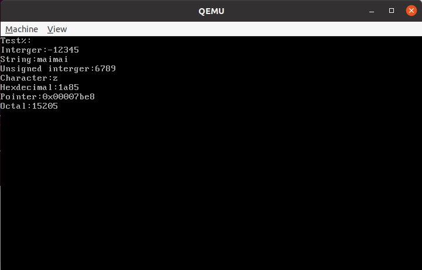

# 实验六：内核线程

## 一、实验要求

* 实现自己的printf函数，便于调试程序
* 仿照例子，实现时间片轮转算法调度线程。并利用GDB感受这个过程
* 自己选择一个其他的线程调度算法并实现

## 二、实验器材

* 笔记本电脑一台，性能足够强大
* VMware Workstation Pro 16
* Ubuntu 20.04安装于虚拟机中

## 三、实验过程

### Assignment 1 简易printf的实现

* 用GDP调试虽然十分有效，但是很不直观。还需要手动打断点慢慢调试。这就让人不由得怀疑在做程序设计和算法题的时候快乐的`printf`的生活。
* `printf`的作用是将一些内容输出到缓冲区，然后在一定的时机刷新缓冲区把内容输出到屏幕
* 回忆一下`printf`的函数原型
  * 参数是一个格式化字符串和一个可变长参数


```c
int printf(const char const * fmt,...)
```

* 结合C函数的参数处理方式，假如我们有以下的内容要输出

```c
printf("%d and %s,%c",x,str,v);
```

* 那么v，str，x，fmt依次入栈，地址递减。那么可以知道，&fmt+1就算第一个参数的地址。
* 考虑到我们的局限性(只是自己使用和便于debug，所以功能不需要很复杂)，我们的`myprintf`函数支持如下的功能
  * 也就是实现了大部分的整数功能。去除了说明符和前缀
  * 可以发现，以下几条大部分都是32位长度。对于唯一一个不是32位的%c，也会对齐为32位。


| 说明符 | 功能              | 示例       |
| ------ | ----------------- | ---------- |
| %d/%i  | 十进制整数        | 1919810    |
| %x     | 十六进制整数      | 1f1e33     |
| %o     | 八进制整数        | 114514     |
| %p     | 指针(8个16进制数) | 0x001f1e33 |
| %c     | 字符              | v          |
| %s     | 字符串            | maimaidx   |
| %%     | 输出一个百分号    | %          |

* 我们输出时，利用在上一个实验已经准备好了的Screen类，把字符都输出到光标。
* 我们需要增加对换行符的处理。当检测到换行符，就将光标移动到下一行。如果已经是最后一行，就要滚屏。
  * 这个内置在Screen库里面就行了

* 这里可以暂时把中断给关了，以免碍事。       
* 我们并不会一个字符一个字符输出到屏幕，而是创造一个”缓冲区“，每次把字符推到”缓冲区“考虑到缓冲区大小是有限的，当缓冲区满的时候，就要把缓冲区内容推到屏幕上。当整个printf结束的时候也需要这么做。
  * 当然也不一定要这么做。一个例子就是，当C++关掉同步的时候(`ios_base::sync_with_stdio(0)`),同时用`printf`和`cout`，就会出现混乱。所以刷新时机不一定是`printf`结束。                        


### Assignment 2 线程的实现

* 本次我们实现内核线程。内核线程可以避免当一个线程被阻塞的时候，整个进程被挂起。也可以充分利用多核性能。还也已减少系统调用的次数。
  * 上面的都是借口其实是我们根本不会写用户空间的东西（（（

* 理论上来讲，计算机应该是先有进程，后有线程。但是考虑到进程和线程都可以用PCB表示，且进程线程两级管理时涉及到较为复杂的内存管理机制（二级分页）。所以我们这里选择简单地划定一块空间存储PCB，且直接实现线程的方式模拟操作系统的进程管理。
  * 这里也可以认为是创建了进程，但是每个进程固定只有一个线程。
* 这里我们实现五状态的线程（ 创建、就绪、运行，阻塞、终止）
  * 我们依次将这些状态记作0~4
  * 事实上在本实验中，只会用到三种状态，也即就绪、运行、终止。这是因为目前没有IO操作所以不需要Block。


* PCB需要包括以下信息：栈指针、线程名称、线程状态、线程优先级、线程pid、线程剩余执行时间、线程累计执行时间、线程在所有线程列表和在就绪状态的进程列表中的Tag
  * 为了防止各个线程打起来，每个进程独立分配一个页（目前也就是一块内存）。栈是指向这个块的尾部的，向下生长。
  * 这两个时间其实指的是tick（中断次数）。在时间片轮转算法中，当剩余执行时间为0时，就会被叉下来换下一个。
  
* 这里需要一个链表。链表一定是个人都会写吧？但是我不想写了……大一下学期各种链表题写吐了都。
  * 这是一个双向链表，我们选择直接CV助教的代码。
  * 但是这个代码，完全，不关心内存泄漏的吗？
  * 好像确实不需要，因为我们是把现成的表项加进去，链表管理中并没有new新的空间。所以根本不会内存泄漏。
  
* 至此我们已经准备就绪，可以开始搞PCB了。每个PCB我们分配4KByte，可以开一个char数组做这件事情。然后一个bitmap记录每一块的分配情况。

* 修改一下`InterruptManager`，增加开中断、关中断和查看中断状态功能。前两个简单，查看中断状态比较复杂，看一下怎么做：

  

  

  * 中断开没开就看`eflags`里面的IF标志位，但是怎样查看呢？我们不能直接用`mov`指令来操作`eflags`的，但是却有`pushf`和`popf`指令可以操作。那么我们向用`pushf`压栈，然后弹出到某个寄存器里面，再与0x200做与运算就可以了。这个写个内联汇编很快的。

* 创建一个`ProgramManager`类，数据成员包括两个链表（一个是所有状态的线程队列，一个是就绪的线程队列）以及一个PCB指针（指向当前正在执行的进程）。方法包括分配PCB，释放PCB和加入一个进程、调度进程和终止一个进程。

* 本例子是使用时间片轮转算法来实现线程的切换。也就是给每个线程分配每次允许运行的时间。时间一旦达到就要调度了。

* 我们先看一下如何创建进程。

  * 首先要关掉中断。
  * 然后分配一块PCB给预计开始的进程
  * 初始化分配的块，并给各个参数赋值
  * 栈从低到高：`ebp`，`ebx`，`edi`，`esi`(在一开始都是0），待执行函数地址，返回函数地址（马上自己写），参数列表地址
  * 将该线程放入两个链表尾部
  * 恢复中断
  * 返回pid

* 修改时钟中断处理函数：如果还有时间，那就减少时间配额。如果已经没时间了，那就调度

* 调度是这次最困难的一部分了。调度工作应该如何做呢？

  * 关中断
  * 如果已经没有进程给你调度，那就省略下面步骤。直接恢复中断。
  * 判断正在执行的进程。如果还是执行态，就将其调整为就绪态，重新分配时钟并压入队尾。如果已经西内了，那就直接释放掉空间。
  * 在队列中取一个线程。并计算其对应PCB地址。计算方法为队列元素地址减去该元素在PCB的偏移量。语句如下,C语言理论考得比较好的应该能很容易看懂这个语句：
    * 虽然这东西技巧性的确很强了


  ```
  PCB * next=(PCB *)((int)item-(int)&((PCB *)0->tagInGeneralList));
  ```

  * 然后使用一个汇编程序段实现线程切换，其本质就是“换栈”，就是把cur栈换成next栈。两者分别作为第一个和第二个参数。
    * 压栈保护`ebp`，`ebx`，`edi`，`esi`
    * 将cur的`esp`的值保存到PCB以待下次使用（注意，因为又压了四个东西入栈，所以第一个参数的地址变成了`esp+5*4`
    * 把`esp`值改为next的PCB里面存的stack值（注意，因为同样的原因，地址为`esp+6*4`）
    * 弹出`esi`，`edi`，`ebx`，`ebp`（将next的四个寄存器恢复）
    * 这里利用了一个很重要的点，就是stack指针在PCB的头部，所以PCB的首地址就是stack指针的地址。所以换栈的时候只需要提供PCB地址即可
    
  * 恢复中断。
  * 返回pid。

* 在“换栈”的时候也分为两种情况：

  * 第一种是这个线程第一次被运行。这个时候栈顶会是4个0，函数执行完成以后ret，此时栈顶是其返回地址，此时是待执行函数。就进入这个函数执行。此时第一种情况事实上被转化为第二种情况。
  * 第二种情况是这个线程曾经运行过。这个时候栈顶是调度函数，ret以后回到调度函数，再返回到时钟中断，最后程序继续执行.
  * 当整个进程执行完毕以后，这个时候栈顶是返回函数的地址，这个返回函数的作用是使得这个进程进入终止态。
    * 注意：在终止了当前进程以后，如果不是第一个进程，就再运行调度拉出来一个程序运行。否则关中断停机。第一个进程不能返回。

* 最后我们可以写一个deemo来测试一下。注意：第一个线程需要手动启动。也即出列表、修改状态、切进程（前一个进程设置为0）

* 这个世界上总是存在各种奇怪的问题，但总是有原因的。比如我们就遭遇了这样的问题：

  * 程序不能正常运行。使用printf进行调试没有什么用处，且会出现字符串显示一半以及调整代码顺序，打印同样的内容，打印出来的字符数量还不一样
  * 尝试多种调试方法（printf，gdb）无果。部分替换的方法也是不行的。
  * 后来想起来去看一下虚拟硬盘。用`hexedit`插件打开之，发现：

  

  * 好家伙，硬盘不够大啊。这很容易解释为什么会发生上面的玄学情况。就是程序的后半段没有被写盘，也就无法被读取。最后每次被执行的部分也是不一样的。总之万恶之源就是程序被截断了。
  
* 样例程序里面有一个点让人难以理解：一开始没有开中断，然后一直到切换栈的时候才开中断。这有什么道理吗？

  * 其实是有的。一开始running啥都没有指向，时钟中断处理程序并无意义。当完成初次切换时，打开时钟中断跑起来。然后每次切换都应该让他开始跑。


### Assignment 3 线程的切换

* 这里我们用如下的方式来启动三个进程：

```c++
void third_thread(void *arg) 
{
    myprintf("pid %d name \"%s\": Hello World!\n", programManager.running->pid, programManager.running->name);
    while(1)
        continue;
}
void second_thread(void *arg) 
{
    myprintf("pid %d name \"%s\": Hello World!\n", programManager.running->pid, programManager.running->name);
}
void first_thread(void *arg)
{
    
    myprintf("pid %d name \"%s\": Hello World!\n", programManager.running->pid, programManager.running->name);
    if (!programManager.running->pid)
    {	
        programManager.executeThread(second_thread, nullptr, "second thread", 1);
     	programManager.executeThread(third_thread, nullptr, "third thread", 1);
    }
    while(1)
        continue;
}
```

* 执行`make debug`并在`gdb`里面输入如下一些指令

  * `makefile`里面有个地方要加一个`-g`，否则不能用.这里例子程序悄悄加了。

  ```shell
  target remote:1234
  add-symbol-file asm_utils.o
  y
  add-symbol-file interrupt.o
  y
  add-symbol-file kernel.o
  y
  add-symbol-file program.o
  y
  add-symbol-file screen.o
  y
  break setup_kernel
  break c_time_interrupt_handler
  break asm_switch_thread
  ```

* 行为记录如下：
  * 断点`setup_kernel`。
  * 断点`asm_switch_thread`，进入进程`first_thread`
  * 断点`c_time_interrupt_handler`,打印`first_thread`信息
  * 10次断点`c_time_interrupt_handler`（时间片轮转过程，这一过程中其余两个进程被加入了队列）
  * 断点`asm_switch_thread`，进入进程`second_thread`
  * 打印`second_thread`信息，断点`asm_switch_thread`，因为上一个进程执行很迅速，所以没到10个时钟中断就要调度`third_thread`
  * 断点`c_time_interrupt_handler`,打印`third_thread`信息
  * 10次断点`c_time_interrupt_handler`（时间片轮转过程）
  * 至此开始循环：
    * 断点`asm_switch_thread`
    * 11次断点`c_time_interrupt_handler`
  
* 整个调度过程和第二部分提及的是一模一样的。因为上面已经充分说明了这个问题，这里不再赘述。
  
* 这里暴露出一个暗坑：前面讲时钟中断，里面的语句描述是：
  
  * 8259A的中断处理函数末尾必须加上面这段代码，否则中断不会被响应。
  * 对于8259A芯片产生的中断，我们需要在中断返回前发送EOI消息。否则，8259A不会产生下一次中断。
  
* 但实际上，如果真的把发送EOI消息放在结束前夕，这里就会出卡在第三个进程的情况。必须在进入`c_time_interrupt_handler`之前发。感觉**这是教程的问题**。
  * 虽然例子程序给的就是先发。这是不是在鼓励直接CV呢？害得我查了一个小时：）

### Assignment 4 线程调度算法

* 我们选择执行抢占式的"优先级调度算法"。这个算法的执行如下：
  * 高优先级的进程比低优先级的进程先执行。相同优先级的进程按照先来先服务的原则调度
  * 新进程加入时，如果正在运行的进程优先级低于新来的，那么可以抢占位置。
  * 创建进程的步骤和上面类似。但是这里就不需要时钟中断了（或者说，时钟中断只是起到一个计时作用）。但是链表的排序就成了一个夺命题。
  
* 接下来简述一下如何去实现这个算法。只需要在时间片轮转算法的基础上做一点点修改：

  * 当添加一个新进程的时候，要判断是否要截胡正在运行的进程。如果要，因为正在运行的进程一定优先级高于队列中所有进程，所以我们先把正在执行的进程压入队列头，再把新进程压入队列头，然后直接调用调度函数。
  * 如果不需要截胡，那就遍历队列，当发现第一个优先级低于待插入进程的进程或到达队列尾时，将新的进程加入到此处。
    * 注意：优先级是数字越小越高，0为最高

  * 调度程序也分两种情况：如果是发生截胡，就把目前进程状态修改为就绪态即可。如果是当前进程寄了，那就释放掉这个PCB。然后就是一套切换进程的流程（和时间片轮转是一样的）

* 为了测试这个算法的有效性，我们运行测试代码进程测试

  * 注意：初始线程的优先级必须是最低的。

  * 注意：不能用类似如下的方式执行进程，否则平行的进程只能是先来先调度。这里和时间片轮转调度有很明显的不同。时间片轮转时第一个进程一定是第一个执行，有足够的时间把其他进程加入列表。但是抢占式调度会造成以下矛盾：如果按照下面的代码进行测试，如果启动的进程比初始进程优先级低，或者一样，那么这些进程将永远不被执行。如果优先级高于初始进程，那么每启动一个进程就会抢占掉初始进程，导致几个进程事实上是逐一进入和退出调度队列的，一个进程结束回到初始进程才能调度下一个，所以是顺序执行的。

    ```c++
    void init_thread(void *arg)
    {	myprintf("pid %d name \"%s\": start!\n", programManager.running->pid, programManager.running->name);
        if (!programManager.running->pid)
        {   programManager.executeThread(test_thread, nullptr, "first thread", 2);
            programManager.executeThread(test_thread, nullptr, "second thread", 2);
            programManager.executeThread(test_thread, nullptr, "third thread", 1);
            programManager.executeThread(test_thread, nullptr, "forth thread", 0);
            programManager.executeThread(test_thread, nullptr, "fifth thread", 1);
        }
        while(1)
            continue;
    }
    ```

  * 如何解决这个问题呢？我们可以让初始进程调度一个“中间进程“（优先级最高，但是可以返回），由它把测试代码跑起来，就可以解决问题。（因为中间进程可以退出，执行完了就可以执行其他的）

    ```c
    void test_thread(void *arg) 
    {   myprintf("pid %d name \"%s\": start!\n", programManager.running->pid, programManager.running->name);
        myprintf("pid %d name \"%s\": end!\n", programManager.running->pid, programManager.running->name); 
    }
    void run_thread(void *arg)
    {   myprintf("pid %d name \"%s\": start!\n", programManager.running->pid, programManager.running->name);
        programManager.executeThread(test_thread, nullptr, "first thread", 2);
        programManager.executeThread(test_thread, nullptr, "second thread", 2);
        programManager.executeThread(test_thread, nullptr, "third thread", 1);
        programManager.executeThread(test_thread, nullptr, "forth thread", 0);
        programManager.executeThread(test_thread, nullptr, "fifth thread", 1);
        myprintf("pid %d name \"%s\": end!\n", programManager.running->pid, programManager.running->name); 
    }
    void init_thread(void *arg)
    {   myprintf("pid %d name \"%s\": start!\n", programManager.running->pid, programManager.running->name);
        if (!programManager.running->pid)
            programManager.executeThread(run_thread, nullptr, "run thread", 0);
        while(1)
            continue;
    }
    ```

* 以上代码的执行顺序应该是run-forth-third-fifth-first-second，最后回到init，且应该pid都不同。

* 执行结果见最后。确实满足按照优先级调度，且调度是抢占式的（`run_thread`抢占了`init_thread`)。


## 四、实验代码

* 为了解决粘贴的代码量过大的问题，本次只会贴出更新的函数。其他部分默认和上一次相同，不再重复粘贴。

### Assignment 1 简易printf的实现

* `screen.h`添加

```c++
int myprintf(const char * fmt,...);
```

* `screen.cpp`添加

```c++
char buffer[4097];
int cnt;
int bi;
void flush_buf(void)		//刷新缓冲区
{   if(bi)
    {   buffer[bi]=0;
        screen.print(buffer);
    }
    bi=0;
}
const char trans[17]="0123456789abcdef";
void push_buf(char c)		//推字符到缓冲区
{   buffer[bi]=c;
    bi++;
    cnt++;			
    if(bi==4096)			//缓冲区满了要刷新
        flush_buf();
}
void printNum(uint n,int base,int sgn)
{   int num[11],i=0,x;		//数字转字符
    if(sgn)
    {   if(n>0x7fffffffu)
        {   push_buf('-');
            n=~n+1;
        }
    }
    while(n)
    {   num[i]=n%base;
        n/=base;
        i++;
    }
    if(i)
    {   for(x=i-1;x>=0;x--)
            push_buf(trans[num[x]]);     
    }
    else
        push_buf('0');
}
void printStr(const char * str)
{   int x;					//打印字符串
    for(x=0;str[x];x++)
        push_buf(str[x]);
}
int myprintf(const char * fmt,...)
{   int x;				
    cnt=0;
    bi=0;
    uint * ap=(uint *)(&fmt+1);	//初始化参数指针
    uint k;
    for(x=0;fmt[x];x++)
    {   if(fmt[x]=='%')			//需要替换
        {   x++;
            switch(fmt[x])
            {   case '%':
                    push_buf(fmt[x]);
                    break;
                case 'd':
                case 'i':
                    printNum(*ap,10,1);
                    ap++;
                    break;
                case 'u':
                    printNum(*ap,10,0);
                    ap++;
                    break;
                case 'p':		//指针要加前缀
                    push_buf('0');
                    push_buf('x');
                    k=(1<<28);
                    while(k>3)
                    {   if(*ap<k)
                        {   push_buf('0');
                            k>>=4;
                        }
                        else
                            break;
                    }		//没有break是故意的
                case 'x':
                    printNum(*ap,16,0);
                    ap++;
                    break;
                case 'o':
                    printNum(*ap,8,0);
                    ap++;
                    break;
                case 'c':
                    push_buf(*((char *)ap));
                    ap++;
                    break;
                case 's':
                    printStr((const char *)*ap);
                    ap++;
                    break;
            }
        }
        else
            push_buf(fmt[x]);
    }
    flush_buf();	//最后要刷新一次
    return cnt;
}
```

* `setup.cpp`

```c++
#include "asm_utils.h"
#include "interrupt.h"
#include "os_type.h"
#include "screen.h"
InterruptManager irm;
Screen screen;
extern "C" void setup_kernel()
{   irm.initialize();
    screen.initialize();
    asm_hello_world();
    for(int x=0;x<2000000;x++)
        continue;
    screen.clearScreen();
    irm.enableTimeInterrupt();
    irm.setTimeInterrupt((void *)asm_time_interrupt_handler);
    int x=-12345;
    uint ux=6789;
    myprintf("Test%%:\n"
            "Interger:%d\n"
            "String:%s\n"
            "Unsigned interger:%u\n"
            "Character:%c\n"
            "Hexdecimal:%x\n"
            "Pointer:%p\n"
            "Octal:%o",x,"maimai",ux,'z',ux,&x,ux);
    while(1)
        continue;
}
```

### Assignment 2 进入内核

* `list.h`（链表过于基础，不会添加注释）

```c++
#ifndef LIST_H_
#define LIST_H_
struct ListItem
{	ListItem *previous;
    ListItem *next;
};
class List
{	public:
    	ListItem head;
		List();
		void initialize();
		int size();
		bool empty();
		ListItem *back();
		void push_back(ListItem *itemPtr);
		void pop_back();
		ListItem *front();
		void push_front(ListItem *itemPtr);
		void pop_front();
		void insert(int pos, ListItem *itemPtr);
		void erase(int pos);
		void erase(ListItem *itemPtr);
		ListItem *at(int pos);
		int find(ListItem *itemPtr);
};
#endif
```

* `list.cpp`

```c++
#include "list.h"
List::List()
{   initialize();}
void List::initialize()
{   
    head.next = head.previous = nullptr;
}
int List::size()
{   ListItem *temp = head.next;
    int counter = 0;
    while (temp)
    {   temp = temp->next;
        ++counter;
    }
    return counter;
}
bool List::empty()
{   return size() == 0;
}
ListItem *List::back()
{   ListItem *temp = head.next;
    if (!temp)
        return nullptr;
    while (temp->next)
        temp = temp->next;
    return temp;
}
void List::push_back(ListItem *itemPtr)
{   ListItem *temp = back();
    if (temp == nullptr)
        temp = &head;
    temp->next = itemPtr;
    itemPtr->previous = temp;
    itemPtr->next = nullptr;
}
void List::pop_back()
{
    ListItem *temp = back();
    if (temp)
    {
        temp->previous->next = nullptr;
        temp->previous = temp->next = nullptr;
    }
}
ListItem *List::front()
{   return head.next;
}
void List::push_front(ListItem *itemPtr)
{   ListItem *temp = head.next;
    if (temp)
        temp->previous = itemPtr;
    head.next = itemPtr;
    itemPtr->previous = &head;
    itemPtr->next = temp;
}
void List::pop_front()
{   ListItem *temp = head.next;
    if (temp)
    {   if (temp->next)
            temp->next->previous = &head;
        head.next = temp->next;
        temp->previous = temp->next = nullptr;
    }
}
void List::insert(int pos, ListItem *itemPtr)
{   if (pos == 0)
        push_front(itemPtr);
    else
    {   int length = size();
        if (pos == length)
            push_back(itemPtr);
        else if (pos < length)
        {   ListItem *temp = at(pos);
            itemPtr->previous = temp->previous;
            itemPtr->next = temp;
            temp->previous->next = itemPtr;
            temp->previous = itemPtr;
        }
    }
}
void List::erase(int pos)
{   if (pos == 0)
        pop_front();
    else
    {   int length = size();
        if (pos < length)
        {   ListItem *temp = at(pos);
            temp->previous->next = temp->next;
            if (temp->next)
                temp->next->previous = temp->previous;
        }
    }
}
void List::erase(ListItem *itemPtr)
{   ListItem *temp = head.next;
    while (temp && temp != itemPtr)
        temp = temp->next;
    if (temp)
    {   temp->previous->next = temp->next;
        if (temp->next)
            temp->next->previous = temp->previous;
    }
}
ListItem *List::at(int pos)
{   ListItem *temp = head.next;
    for (int i = 0; (i < pos) && temp; ++i, temp = temp->next)
        continue;
    return temp;
}
int List::find(ListItem *itemPtr)
{   int pos = 0;
    ListItem * temp = head.next;
    while (temp && temp != itemPtr)
    {   temp = temp->next;
        ++pos;
    }
    if (temp && temp== itemPtr)
        return pos;
    else
        return -1;
}
```

* `program.h`

```c++
#ifndef PROGRAM_H_
#define PROGRAM_H_
#include "list.h"
typedef void (*ThreadFunction)(void *);

struct PCB
{	int * stack;                      
    char name[21]; 
    int status;       
    int priority;                    
    int pid;                         
    int ticks;                       
    int ticksPassedBy;               
    ListItem tagInGeneralList;       
    ListItem tagInAllList;           
};

class ProgramManager
{	public:
        List allPrograms;   
        List readyPrograms; 
        PCB *running;       
        ProgramManager();
        void initialize();
        int executeThread(ThreadFunction function, void *parameter, const char *name, int priority);
        PCB * allocatePCB();
        void releasePCB(PCB *program);
        void schedule();
};

void program_exit();
#endif
```

* `program.cpp`

```c++
#include "program.h"
#include "stdlib.h"
#include "interrupt.h"
#include "asm_utils.h"
#include "screen.h"
#include "os_extern.h"
           
char PCB_SET[65536]; 
bool PCB_SET_STATUS[16];     

ProgramManager::ProgramManager(){initialize();}
void ProgramManager::initialize()	//初始化标志位
{	allPrograms.initialize();
    readyPrograms.initialize();
    running = nullptr;
    for (int i = 0; i < 16; ++i)
        PCB_SET_STATUS[i] = 0;
}
int ProgramManager::executeThread(ThreadFunction function, void *parameter, const char *name, int priority)
{	bool status = irm.getInterruptStatus();
    irm.disableInterrupt();			//关中断
    PCB *thread = allocatePCB();	//分配PCB
    if (!thread)
        return -1;
    int * ptr=(int *)thread;
    for(int i=0;i<1024;i++)			//初始化PCB
        ptr[i]=0;
    for (int i = 0; i < 20 && name[i]; ++i)
        thread->name[i] = name[i];	//复制名称
    thread->status = 1;				//初始化为就绪态
    thread->priority = priority;	//一些其他的初始化
    thread->ticks =  10;
    thread->ticksPassedBy = 0;
    thread->pid = ((int)thread - (int)PCB_SET) / 4096;
    thread->stack = (int *)((int)thread + 4096);
    thread->stack -= 7;				//设置栈顶位置
    thread->stack[0] = 0;			//这是栈顶
    thread->stack[1] = 0;
    thread->stack[2] = 0;
    thread->stack[3] = 0;
    thread->stack[4] = (int)function;
    thread->stack[5] = (int)program_exit;
    thread->stack[6] = (int)parameter;		//这是栈底
    allPrograms.push_back(&(thread->tagInAllList));	//进入队列
    readyPrograms.push_back(&(thread->tagInGeneralList));
    if(status)
        irm.enableInterrupt();
    return thread->pid;
}
void ProgramManager::schedule()
{   bool status = irm.getInterruptStatus();
    irm.disableInterrupt();
    if (readyPrograms.size() == 0)	//如果已经没有进程可供调度
    {	if(status)
            irm.enableInterrupt();
        return;						//直接返回
    }
    if (running->status == 2)		//进程切换情形
    {   running->status = 1;		//原进程回到就绪态
        running->ticks = 10;		//原进程重新分配时间并回到队尾
        readyPrograms.push_back(&(running->tagInGeneralList));
    }
    else if (running->status == 4)	//进程执行完毕情形
        releasePCB(running);		// 清理PCB
    ListItem *item = readyPrograms.front();	//取下一个进程并找到首地址
    PCB *next = (PCB *)((int)item-(int)&(((PCB *)0)->tagInGeneralList));
    PCB *cur = running;
    next->status = 2;
    running = next;
    readyPrograms.pop_front();
    asm_switch_thread(cur, next);	//换栈
    if(status)
        irm.enableInterrupt();
}
void program_exit()
{   PCB *thread = programManager.running;
    thread->status = 4;				//标记进程
    if (thread->pid)
        programManager.schedule();	//切换进程
    else
    {   irm.disableInterrupt();		//第一个进程不能被切换，直接停机
        myprintf("halt\n");
        while(1)
            continue;
    }
}	
PCB *ProgramManager::allocatePCB()	//分配PCB
{	for (int i = 0; i < 16; ++i)
    {   if (!PCB_SET_STATUS[i])		//找到可用的PCB并分配
        {   PCB_SET_STATUS[i] = 1;
            return (PCB *)((int)PCB_SET + 4096 * i);
        }
    }
    return nullptr;					//找不到就返回nullptr
}
void ProgramManager::releasePCB(PCB *program)	//回收PCB
{	int index = ((int)program - (int)PCB_SET) / 4096;
    PCB_SET_STATUS[index] = 0;		//计算索引并标记该PCB为可用
}
```

* `interrupt.cpp`添加函数和更新时钟中断处理函数

```c++
void InterruptManager::enableInterrupt()
{	asm volatile("sti");
}
void InterruptManager::disableInterrupt()
{	asm volatile("cli");
}
bool InterruptManager::getInterruptStatus()
{   int i=0;
    asm volatile(   "pushf\n\r"
                    "pop %0\n\r"
                    :"=r"(i)::"memory");
    return i&0x200;
}
extern "C" void c_time_interrupt_handler()
{   PCB *cur = programManager.running;
    if (cur->ticks)				//还有时间
    {   --cur->ticks;			//减少剩余时间
        ++cur->ticksPassedBy;	//增加总时间
    }
    else						//已经没有时间就切换进程
        programManager.schedule();   
}
```

* `asm_utils.asm`更新和添加函数

```assembly
asm_time_interrupt_handler:
        pusha
    
        mov al, 0x20				;EOI要先发
        out 0x20, al				;f
        out 0xa0, al
        
        call c_time_interrupt_handler

        popa
        iret

asm_switch_thread:
        push    ebp					;保存栈
        push    ebx
        push    edi
        push    esi     

        mov     eax, [esp + 5 * 4]	;保存栈指针位置
        mov     [eax], esp 

        mov     eax, [esp + 6 * 4]	;切换栈指针
        mov     esp, [eax] 

        pop     esi					;恢复栈内容
        pop     edi
        pop     ebx
        pop     ebp

        sti
        ret
```

* `os_extern.h`

```c++
#ifndef OS_EXTERN_H_
#define OS_EXTERN_H_
#include "interrupt.h"
#include "screen.h"
#include "program.h"
extern InterruptManager irm;
extern Screen screen;
extern ProgramManager programManager;
#endif
```

* `setup.cpp`

```c++
#include "asm_utils.h"
#include "interrupt.h"
#include "os_type.h"
#include "screen.h"
#include "program.h"

InterruptManager irm;
Screen screen;
ProgramManager programManager;

void first_thread(void *arg)
{    myprintf("pid %d name \"%s\": Hello World!\n", programManager.running->pid, programManager.running->name);
    while(1)
        continue;
}
extern "C" void setup_kernel()
{   asm_hello_world();
    screen.initialize();
    screen.clearScreen();
    irm.initialize();
    irm.enableTimeInterrupt();
    irm.setTimeInterrupt((void *)asm_time_interrupt_handler);
    programManager.initialize();  
    int pid=programManager.executeThread(first_thread, nullptr, "first thread", 1);
    if (pid == -1)
    {	myprintf("can not execute thread\n");
        while(1)
            continue;
    }		//第一个进程需要在启动阶段人为进行初始化
    ListItem *item = programManager.readyPrograms.front();
    PCB *firstThread = (PCB *)((int)item-(int)&(((PCB *)0)->tagInGeneralList));
    firstThread->status = 2;
    programManager.readyPrograms.pop_front();
    programManager.running = firstThread;
    asm_switch_thread(0, firstThread);
    while(1)
        continue;
}
```

### Assignment 3 线程的切换

* 除了线程调度数量变多（上面已经提及），其他代码没有任何变化。

### Assignment 4 线程调度算法

* `program.cpp`更新的函数

```c++
int ProgramManager::executeThread(ThreadFunction function, void *parameter, const char *name, int priority)
{	bool status = irm.getInterruptStatus();
    irm.disableInterrupt();
    PCB *thread = allocatePCB();
    if (!thread)
        return -1;
    int * ptr=(int *)thread;
    for(int i=0;i<1024;i++)
        ptr[i]=0;
    for (int i = 0; i < 20 && name[i]; ++i)
        thread->name[i] = name[i];
    thread->status = 1;
    thread->priority = priority;
    thread->ticks =  10;
    thread->ticksPassedBy = 0;
    thread->pid = ((int)thread - (int)PCB_SET) / 4096;
    thread->stack = (int *)((int)thread + 4096);
    thread->stack -= 7;
    thread->stack[0] = 0;
    thread->stack[1] = 0;
    thread->stack[2] = 0;
    thread->stack[3] = 0;
    thread->stack[4] = (int)function;
    thread->stack[5] = (int)program_exit;
    thread->stack[6] = (int)parameter;
    allPrograms.push_back(&(thread->tagInAllList));
    if(running->priority>priority)	//判断是否需要抢占
    {   readyPrograms.push_front(&running->tagInGeneralList);
        readyPrograms.push_front(&thread->tagInGeneralList);
        schedule();					//需要抢占就压队列执行调度
    }
    else							//否则将该线程加入队列对应位置
    {   ListItem * temp=readyPrograms.front();
        int c=0;
        PCB * pcbptr;
        while(temp)
        {   pcbptr=(PCB *)((int)temp-(int)&(((PCB *)0)->tagInGeneralList));
            if(pcbptr->priority>priority)
                break;
            c++;
            temp=temp->next;
        }
        programManager.readyPrograms.insert(c,&thread->tagInGeneralList);
    }
    if(status)
        irm.enableInterrupt();
    return thread->pid;
}
void ProgramManager::schedule()
{	bool status = irm.getInterruptStatus();
    irm.disableInterrupt();
    if (readyPrograms.size() == 0)
    {	if(status)
            irm.enableInterrupt();
        return;
    }
    if (running->status == 2)  			//抢占情形
        running->status = 1;
    else if (running->status == 4)		//进程结束情形
        releasePCB(running);			//下面和以前的算法差不多
    ListItem *item = readyPrograms.front();
    PCB *next = (PCB *)((int)item-(int)&(((PCB *)0)->tagInGeneralList));
    PCB *cur = running;
    next->status = 2;
    running = next;
    readyPrograms.pop_front();
    asm_switch_thread(cur, next);
    if(status)
        irm.enableInterrupt();
    else
        irm.disableInterrupt();
}
```

* 时钟中断处理函数更新

```c++
extern "C" void c_time_interrupt_handler()
{   PCB *cur = programManager.running;
    ++cur->ticksPassedBy;
}
```

* 测试函数上面已经提及，不再赘述

## 五、实验结果

* `myprintf`输出了我们想要的结果



* 成功执行了线程


* 成功实现了时间片轮转调度(具体过程见上面的描述，这只是最终结果)


* 成功执行了抢占式优先级调度算法
  * 输出倒是挺整齐的。


## 六、总结和启发

* 虽然本次是使用 C++编程，但是却使用了大量的C技巧。比如变参函数的指针、各种指针偏移量计算、各种奇葩的强制类型转换……
* 硬盘留的不够可太草了，这个东西如果想不起来看一下硬盘，肯定以为是闹鬼了。
* 调度算法这一块的实现倒还真的算不得太难，完全就是倒腾几个数据结构了。主要还是熟练应用前面的知识吧。 
* 本次实验主要浪费的时间都在硬盘空间上面了（搞了四个多小时，绝望），其他倒是还挺快。一共三天时间不到吧。
* 同一段程序可以多次被运行作为不同线程。我们在Assignment 4里面就是用了一个`test_thread`运行了五次，起了五个不同的名字。这体现了程序和线程的关系。程序就是一堆指令码躺在存储器里，必须成为进程才能被执行。