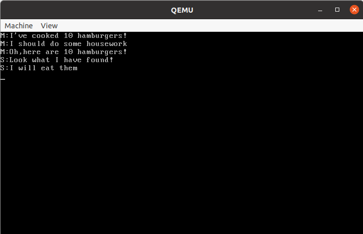
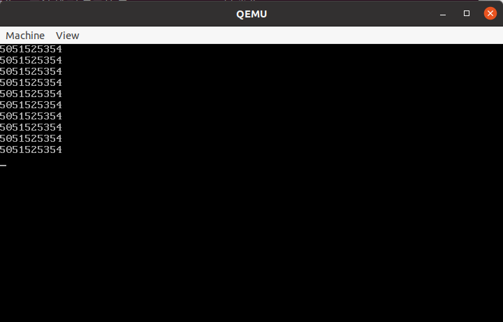
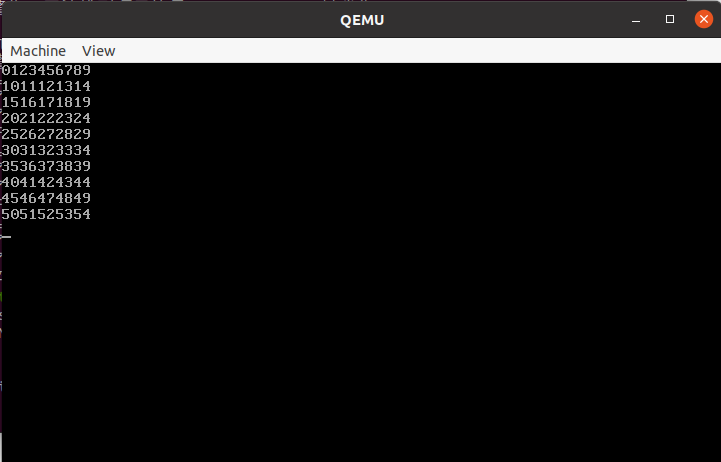
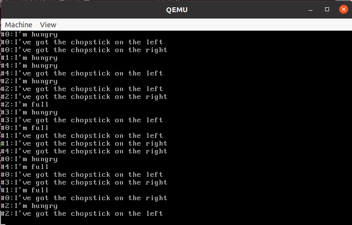
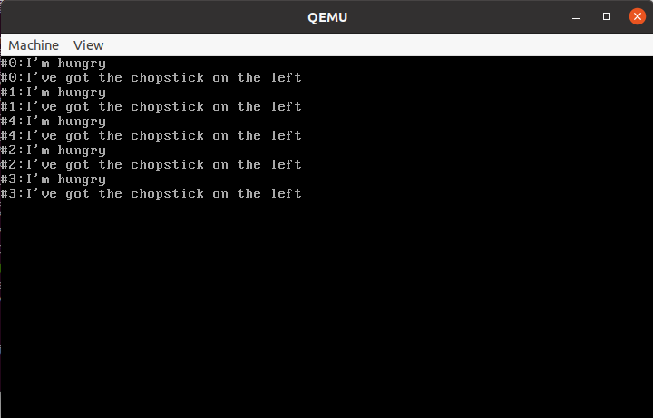
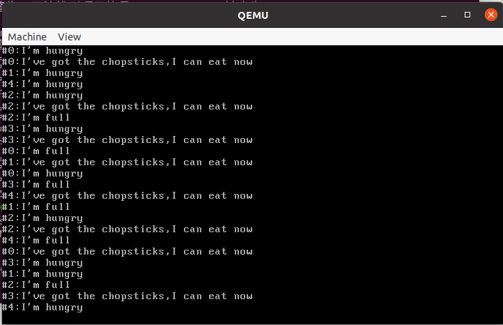

# 实验七：并发与锁

## 一、实验要求

* 分别用锁和信号量的方法解决简单的同步互斥问题

* 用信号量的方法解决生产者——消费者问题中的同步互斥问题
* 用管程的方式解决哲学家就餐问题中的死锁现象

## 二、实验器材

* 笔记本电脑一台，性能足够强大
* VMware Workstation Pro 16
* Ubuntu 20.04安装于虚拟机中

## 三、实验过程

### Assignment 1 复现：芝士汉堡问题

* 我们已经学习了进程和线程有关的知识。我们同时知道线程间会共享一些变量。诸如全局变量啊，堆空间啊。但是在上一个单元的实验作业没有用到这样的变量，而理论作业保证了线程之间一定不会同时访问同样的变量。
* 实际情况可能就没这么美好了。如果A进程运行的时候修改了某个变量，后面还要使用。然后B进程却再次改掉了这个变量！（前提是B进程本不该改它的）然后A进程就有可能读取到错误的变量！
* 本题的例子是这样一个”芝士汉堡“问题。母亲做好了芝士汉堡，然后去洗衣服了。然后儿子回来把汉堡吃了个精光。随后畏罪潜逃。再然后母亲准备把汉堡端上桌，发现这汉堡没了，就很尴尬了，于是端汉堡上桌这件事就没法子继续执行。如何使得儿子在母亲把汉堡端上桌以后才能恰汉堡？这就是我们要解决的问题。

* 这里用两个线程代表两个人：
  * 母亲：做汉堡(增加”汉堡“全局变量)，做别的家务(延时)，端汉堡上桌(输出汉堡数量)
  * 儿子：吃汉堡
* 用时间片调度算法执行两个线程。延时会比较长，而其他操作很简单从而不会超过一个时间片。所以我们可以发现儿子会趁着”母亲“进程被换下来把汉堡吃完。我们有多种方式使得儿子不可以偷吃汉堡

#### （1）自旋锁

* 我们将一个程序分为四个区域：要访问共享变量的”临界区“，不访问共享变量的”剩余区“。从”剩余区“到”临界区“经过”进入区“（上锁），从“临界区”到“剩余区”经过“退出区”（开锁）。
* ”自旋锁“的意思是，对于各个共享变量，与之绑定一个标记`bolt`。当标记为0可以访问。当标记为1时，会反复检测这个变量直至其为0.然后再将其改为1再访问。
  * 这就像一个陀螺在不断地旋转（如下图,）。
    * あたまグルグルグルグル　グルグルグルグル，絡まって脳内をかき乱すノイズ，クラクラクラクラ　クラクラするほど，マイのマインド　高鳴ってアップ＆ダウン
  * 操作通常通过交换数据实现，也即，准备一个初始为1的变量`key`，不断尝试与标记交换，直到检测到换出来的为0.
  * 这个时候也同时实现了将共享变量置1


* 我们当然可以封装一个类来做一个自旋锁。其中lock操作作为进入区，不停自旋等待资源释放。unlock操作作为退出区，释放资源。
* 但是需要注意，这个“自旋”操作必须是原子的，否则可能会出现两个进程都执行上锁操作执行到一半的现象。然后后面就陷入了混乱。
  * 但是”原子“指令这个要求不一定能实现。比如说，我们反复交换两个变量的值，而它们都在内存里面。而`xchg`指令是不支持两个操作数都在内存的(否则会造成指令周期过长的问题).如此就造成必须先把一个操 作数移动到寄存器中进行操作，那么这个操作就不是原子的了。
  * 这个时候我们就需要想办法让其表现类似于原子指令。如果我们把共享的标记`bolt`往寄存器里面送，那么可能刚刚被送进寄存器，时间片就用完了。然后另外一个进程也做了这样的事情，然后又时间片转完了，至此，就已经乱套了.两个进程都将进入临界区。


|      | 线程1                                                        | 线程2                                                        | eax  | bolt | key1 | key2 |
| ---- | ------------------------------------------------------------ | ------------------------------------------------------------ | ---- | ---- | ---- | ---- |
| 0    |                                                              |                                                              | 0    | 0    | 1    | 1    |
| 1    | mov ebx, [ebp + 4 * 2] mov eax, [ebx]                        |                                                              | 0    | 0    | 1    | 1    |
| 2    |                                                              | mov ebx, [ebp + 4 * 2] mov eax, [ebx]                        | 0    | 0    | 1    | 1    |
| 3    | mov ebx, [ebp + 4 * 3] xchg [ebx], eax             mov ebx, [ebp + 4 * 2] mov [ebx], eax |                                                              | 1    | 1    | 0    | 1    |
| 4    |                                                              | mov ebx, [ebp + 4 * 3] xchg [ebx], eax           mov ebx, [ebp + 4 * 2] mov [ebx], eax | 1    | 1    | 0    | 0    |

* 所以这个时候我们需要保证将`key`往寄存器里面放。这就不会出现问题了。
* 这里顺便提一嘴，这里在切线程的时候没有保护eax，有可能造成到这里的时候会发生混乱。要让eax也保护起来这样才能保证执行的正确性。
  * 注意：更改这一步以后，在PCB的初始化也要做相应的修改，比如要在初始化栈的时候多加一个0.与此同时切换进程的参数相对位置也会变化。这个会在代码部分有相应的解释。


#### （2）另一把锁

* 使用`lock`前缀和`bts`指令也可以实现锁机制。
* `lock`指令前缀的作用是当其目的操作数为内存时，保证指令为原子指令。其中，`xchg`指令会默认设置`lock`属性
* `bts`指令是可以将寄存器或内存的某位移动到CF标志位，然后将此位置1.
* 如此我们只需要两行内联汇编就可以搞定了。
* 这里简单介绍一个前几次都没用的东西`gdbinit`,这个东西可以配合`makefile`里面的以下的语句使用(目的是把`gdbinit`里面的数据导入`gdb`)

```makefile
gnome-terminal -e "gdb -q -tui -x $(RUNDIR)/gdbinit"
```

* `gdbinit`写法很简单，直接把想输入的命令写进去就行了，下面是一个例子

```shell
target remote:1234
add-symbol-file ../build/kernel.o
add-symbol-file ../build/sync.o
add-symbol-file ../build/asm_utils.o
add-symbol-file ../build/program.o
add-symbol-file ../build/interrupt.o
set disassembly-flavor intel
```

#### （3）信号量

* 以上的方法，解决了这个问题。但是可能造成以下的隐患：
  * 饥饿：部分线程会长期访问不到数据。
  * 死锁：假如线程1需要先访问A再访问B，线程2需要先访问B再访问A（两者都需要到最后再释放资源）。然后线程1先访问了A，线程2先访问了B，然后就会出现线程1访问不了B，线程2也访问不了A，然后资源也不会释放，这就会导致死锁。最后两个线程将活活饿死。
* 为了避免以上的情况，我们进一步升级了我们的锁机制。可以使用信号量来管理共享资源的使用
* 每个信号量内含一个计数器`count`、一个等待列表`waiting`和一把自旋锁（作用是锁住`count`和`waiting`）。信号量主要有两种操作：`P(wait)`操作和`V(signal)`操作。这两种操作的含义如下：
  * P操作：当一个进程申请使用某资源时，执行该操作。反复执行如下操作：上锁，检查资源是否有余量。若有，则将资源-1，并解锁。否则，将当前进程压入等待列表，并设置为阻塞态。最后解锁并切进程。
  * V操作：当一个进程计划释放某资源时，执行该操作。首先还是上锁并增加资源。然后检查等待列表有没有进程在等待该资源。如果有，则唤醒该资源。否则直接解锁。
  * 唤醒进程有三种方式。我们选择的方式是MESA方法：把要唤醒的进程改为就绪态并放在就绪队列的头部。我们只需要在进程管理器中增加相应的功能即可。还有两种也介绍如下：
    * Hoare方法：直接中断当前线程、换上唤醒的进程
    * Hasen方法：在当前进程运行结束直接换上唤醒进程的方法。
* 本题的资源只能被一个进程使用，所以初始化时，必须将资源的量设置为1.
* 这里简单讲一下P操作的执行细节：
  * 如果进程最终被阻塞了，那么把进程放到等待队列，并进行线程调度。此时堆栈直接换成下一个待执行线程的。
  * 当轮到这个进程执行时，唤醒它，此时再次换栈，直接换到刚刚被阻塞时的状态，然后获得资源的访问权。随后继续访问资源

### Assignment 2 生产者——消费者问题

* 我们曾经写过一个程序可以实现从生产者到消费者的一个数据复制。但是因为上次并无同步机制，所以缓冲区只能一次性使用。我们尝试编写一个程序，利用一个大小有限制的数组（比如说只能存放10字符）作为缓冲区，实现将一个进程里面的较长字符串在另外的一个进程打印。
* 可以先玩火一把，试试不搞同步会是什么结果
  * 注意：为了使得效果更加的明显，可以每复制一个字符就延迟一下。这样会更魔幻。但是不这么做也会有效果。

#### （1）不用锁和信号量的情形（与心路历程）

* 这里单纯使用进程锁就要出问题了：生产者会先获得使用权并且阻塞进程，生产完毕后释放资源。然后这个时候进程可不一定被换下来啊！然后因为这个copy是循环的，然后再次生产，然后消费者就没有机会消费。复制就不能进行。
* 那怎么办？设置一个共享变量state呗！0代表需要生产，1代表需要写。每次生产的时候，要先检查这个量是不是0，如果是，就启动读的流程。生产完毕就将该量改为1.每次消费的时候过程类似。当然这个变量也要上锁。读变量可以不锁，但是写变量必须锁。
* 出现了两把锁，就要检查一下有没有死锁的可能性了。万一给锁死了就寄了。但是经过检查，因为每个进程在同一时刻不会同时锁两个变量，所以无所谓。
* 再看看用信号量的情况。和锁的分析类似，如果坚持使用MESA方式的话，也是需要使用两个信号量的。
* 如此一来就可以编写这么一个程序了。当然本题是要求使用信号量的。
* 再思考一下，既然读前对state进行了判断，读后进行了切换，那么就保证了对buffer访问的合法性。那么buffer就不需要信号量了。这样又只需要一个信号量。
* 还可以再优化。发现state事实上也不需要保护了。这个原因比较有趣。因为这个时候我们已经有了一个while循环。因为这个程序并不符合作业要求，所以我们还是得想办法重写。但是我们可以看一看这个代码
  * 可以发现，这段代码有一个变量state，还有两个“检测是否符合条件，如果不符合就不执行“的while循环。很像一个自旋锁。和自旋锁有区别的是，自旋锁是保证资源同时只能被一个进程占用，但是下面的程序还保证了两个进程只能交替占用。是强于自旋锁的。


```c++
char buf[10];
int state;
void Producer(void *arg) 
{   const  char * str="0123456789101112131415161;718192021222324252627282930313233343536373839404142434445464748495051525354";
    int cnt=0;
    while(cnt<10)
    {   if(state==0)		//如果state不可用就跳
        {   for(int i=0;i<10;i++)
                buf[i]=str[10*cnt+i];
            cnt++;
            state=1;
        }
    }
}
void Consumer(void *arg) 
{   int cnt=0;
    while(cnt<10)
    {   if(state==1)		//类似的
        {   for(int i=0;i<10;i++)
                myprintf("%c",buf[i]);
            myprintf("\n");
            cnt++;
            state=0;
        }
    }
}
```

#### （2）用信号量解决问题

* 但是不行啊，作业要求是用信号量啊。我们还是要想办法用信号量啊。
* 这个时候就要使用两个信号量：读许可read和写许可write。初始化的时候，资源总量都是1.在启动生产者和消费者进程之前，要先read.P。
* 生产者进程运行方式:`write.P()`,然后给数据,然后`read.V()`
* 消费者进程运行方式:`read.P()`,然后给数据,然后`write.V()`
* 这种方法比上面的方法快很多。至少在三到五倍这说明P和V操作之间并不一定是紧邻的。


### Assignment 3 哲学家就餐问题

* 现在有五个哲学家围坐在桌子前面。每两个人之间有一根筷子，如果某个哲学家饿了，就要拿起左右两边的两根筷子，并开始恰饭。（如果两边的筷子不都是空闲的，那么就要等待）恰完了饭，就放下筷子开始思考
  * 不要关注筷子要不要洗这个问题
  * 更不要关注这个问题为什么明明透着一股西洋风但是却出现了筷子这种中国风的物品

* 这里目标有两个层次，需要逐一实现
  * 第一个层次，不要出现哲学家抢筷子
  * 第二个层次，不要发生死锁


#### （1）信号量法

* 五根筷子，每一根筷子一个信号量
* 五个“哲学家”进程，他们会做这样的事情：循环往复地进行：
  * 随机地思考一段时间
  * 想吃饭了，有信息输出
  * 尝试拿起左筷子，拿起来的时候有信息输出
  * 尝试拿起右筷子，拿起来的时候有信息输出
  * 随机吃饭一段时间。
  * 放下左筷子，有信息输出
  * 放下右筷子，有信息输出
* 时间片轮转执行这么五个进程。
* 随机数函数要自己简单写一下。用线性同余法写就行。

#### （2）死锁的产生

* 使用“信号量法”可能造成死锁。也即，如果五个哲学家都拿起了左侧或右侧的筷子，那么这五个哲学家就将面临全部饿死的悲惨命运。
* 我们要演示死锁的场景。如果在自然状态下，这种死锁的场景还是很难碰上的。所以我们多做一个处理：假设这些哲学家很迟钝，拿起左筷子之后再多等一段时间。这样死锁就很容易发生了。
  * 计算机科学家究竟和哲学家有什么仇什么怨啊？


#### （3）管程法

* 当然我们是很善良的，总不能看着哲学家就真的这么饿死对不对？所以我们引入管程。
* 管程类型是一种ADT类型，其封装了数据以及对其的操作。其内部的数据成员是记录了其实例的状态，而操作可以改变其状态。
* 管程保证，同一时刻只有一个线程在执行。所以理论上来说可以做到不用信号量。但是因为管程的机制未必完备，所以有时还需要信号量。
* 考虑到“管程”要根据任务进行个性化定制，我们直接将管程的定义放在setup里面。这个管程有以下的一些限制：
  * 一个哲学家必须在左右两个哲学家都不在吃饭的时候才能开吃
  * 如果哲学家感到饥饿，那么就要等待
  * 如果一个哲学家吃完饭，会检查左右两名哲学家的状态。查看是否需要告诉他们开吃。
* 那么管程有如下一些操作：
  * 对于每个哲学家（而非对于每一根筷子），定义一个信号量。作用是让哲学家在饥饿但是暂时无法就餐时等待一段时间。
  * 检测：如果左右两个人都不在吃饭，且此人饥饿，就开吃。
  * 饥饿：将哲学家的状态改为“饥饿”。然后检测是否可以拿起筷子。如果检测没有过就开始等
  * 吃饱：将哲学家的状态改为“思考“，并检查左右两个人有没有饿着的，通知他们。
* 这里如果用原先的信号量机制肯定会出问题，因为出现了没有P直接V的操作类型。（也即如果一个人一开始很顺利地吃上了饭，最后资源总量就变多了。这显然不应该）。但是我们可以把Semaphore类改一下，搞一个Condition类。
* 分析我们的需求：
  * 进程在进行P操作时，一定会被阻塞
  * 采用V操作时，如果waiting队列中有进程，就调度一个。否则，就不动。
* 那么改变就很简单了
  * 将counter变量的意义改为是否存在调度信号，初始化为0
  * P操作基本不变
  * V操作只在waiting队列有东西的情况下才counter++
* 但是还是有一个问题是我们没解决的，存在微小概率，有哲学家始终吃不上饭，然后饿死
  * 比如0号和2号哲学家轮流吃饭，保证同一时刻至少一个人再吃，1号哲学家就会饿死。
  * 但是这种事情发生概率不大就是了。


## 四、实验代码

* 以前已经出现的代码将不再重复

### Assignment 1 复现：芝士汉堡问题

#### (1)、自旋锁

* `sync.h`

```c++
#ifndef SYNC_H_
#define SYNC_H_
#include "os_type.h"

class SpinLock
{   private:
        uint32 bolt;
    public:
        SpinLock();
        void initialize();
        void lock();
        void unlock();
};
#endif
```

* `sync.cpp`

```c++
#include "sync.h"
#include "asm_utils.h"
#include "os_extern.h"

SpinLock::SpinLock(){initialize();}
void SpinLock::initialize(){bolt = 0;}
void SpinLock::lock()
{   uint32 key = 1;
    do
    {   asm_atomic_exchange(&key, &bolt);
    }   while (key);
}
void SpinLock::unlock(){bolt = 0;}
```

* `asm_utils.asm`中添加的自旋函数

```assembly
asm_atomic_exchange:
        push ebp
        mov ebp, esp
        pusha

        mov ebx, [ebp + 4 * 2] 
        mov eax, [ebx]         
        mov ebx, [ebp + 4 * 3] 
        xchg [ebx], eax        	;有条件原子操作
        mov ebx, [ebp + 4 * 2] 
        mov [ebx], eax          

        popa
        pop ebp
        ret
```

* `setup.cpp`

```c++
#include "asm_utils.h"
#include "interrupt.h"
#include "os_type.h"
#include "screen.h"
#include "program.h"
#include "sync.h"
//各种操作浅显易懂，应该不需要注释吧
InterruptManager irm;
Screen screen;
ProgramManager programManager;
SpinLock lock;
int hamburger;

void son(void *arg) 
{   lock.lock();
    myprintf("S:Look what I have found!\n");
    myprintf("S:I will eat them\n");
    hamburger-=10;
    lock.unlock();
}
void mother(void *arg) 
{   myprintf("M:I've cooked 10 hamburgers!\n");
    lock.lock();
    hamburger+=10;
    myprintf("M:I should do some housework\n");
    for(int i=0;i<0xffffff;i++)
        continue;
    myprintf("M:Oh,here are %d hamburgers!\n",hamburger);
    lock.unlock();
}
void first_thread(void *arg)
{   hamburger = 0;
    lock.initialize();
    screen.clearScreen();
    programManager.executeThread(mother,nullptr,"mother",1);
    programManager.executeThread(son,nullptr,"son",1);
    while(1)
        continue;
}
extern "C" void setup_kernel()
{   asm_hello_world();
    screen.initialize();
    screen.clearScreen();
    irm.initialize();
    irm.enableTimeInterrupt();  
    irm.setTimeInterrupt((void *)asm_time_interrupt_handler); 
    programManager.initialize();    
    int pid=programManager.executeThread(first_thread, nullptr, "first_thread", 1);
    if (pid == -1)
    {   myprintf("can not execute thread\n");
        while(1)
            continue;
    }
    ListItem *item = programManager.readyPrograms.front();
    PCB *firstThread = (PCB *)((int)item-(int)&(((PCB *)0)->tagInGeneralList));
    firstThread->status = 2;
    programManager.readyPrograms.pop_front();
    programManager.running = firstThread;
    asm_switch_thread(0, firstThread);
    while(1)
        continue;
}
```

#### （2）另一把锁

* `asm_utils.asm`中添加的锁函数

```assembly
asm_lock:
        push    ebp
        mov     ebp,esp
        push    ebx

        mov     ebx,[ebp+4*2]
rp4:    lock    bts     dword[ebx],0	;原子操作
        jc      rp4

        pop     ebx
        pop     ebp
        ret
```

* `sync.cpp`中修改的部分

```c++
void SpinLock::lock()
{   asm_lock(&bolt);}
```

#### （3）信号量

* `sync.h`中增加的部分

```c++
#include "list.h"
class Semaphore
{   private:
        uint32 counter;
        List waiting;
        SpinLock semLock;
    public:
        Semaphore();
        void initialize(uint32 counter);
        void P();
        void V();
};
```

* `sync.cpp`中增加部分

```c++
Semaphore::Semaphore(){initialize(0);}
void Semaphore::initialize(uint32 counter)
{   this->counter = counter;
    semLock.initialize();
    waiting.initialize();
}
void Semaphore::P()
{	PCB *cur = nullptr;
	while (true)
    {	semLock.lock();		//保护count和waiting
        if (counter > 0)
        {   --counter;
            semLock.unlock();
            return;
        }
        cur = programManager.running;
        waiting.push_back(&(cur->tagInGeneralList));//压入进程列表
        cur->status = 3;							//阻塞态
        semLock.unlock();
        programManager.schedule();					//调度
    }
}
void Semaphore::V()
{	semLock.lock();
    ++counter;
    if (waiting.size())
    {   PCB *program = (PCB *)((int)waiting.front()-(int)&(((PCB *)0)->tagInGeneralList));
        waiting.pop_front();				//取出一个进程
        semLock.unlock();
        programManager.WakeUp(program);		//唤醒
    }
    else
        semLock.unlock();
}
```

* program.cpp内的`WakeUp`函数

```c++
void ProgramManager::WakeUp(PCB * program)
{   program->status = 1;								//解除阻塞态
    readyPrograms.push_front(&(program->tagInGeneralList));//放置于队列首部
}
```

* setup.cpp中修改的部分

```c++
Semaphore semaphore;
void son(void *arg) 
{   semaphore.P();
    myprintf("S:Look what I have found!\n");
    myprintf("S:I will eat them\n");
    hamburger-=10;
    semaphore.V();
}
void mother(void *arg) 
{   myprintf("M:I've cooked 10 hamburgers!\n");
    semaphore.P();
    hamburger+=10;
    myprintf("M:I should do some housework\n");
    for(int i=0;i<0xffffff;i++)
        continue;
    myprintf("M:Oh,here are %d hamburgers!\n",hamburger);
    semaphore.V();
}
void first_thread(void *arg)
{   hamburger = 0;
    semaphore.initialize(1);
    screen.clearScreen();
    programManager.executeThread(mother,nullptr,"mother",1);
    programManager.executeThread(son,nullptr,"son",1);
    while(1)
        continue;
}
```

### Assignment 2 生产者——消费者问题

* `setup.cpp`中改变的部分

```c++
Semaphore read,write;
char buf[10];
int state;
void Producer(void *arg) 
{   const  char * str="0123456789101112131415161718192021222324252627282930313233343536373839404142434445464748495051525354";
    int cnt=0;							
    while(cnt<10)						//100个字符，10次
    {   write.P();						//等待写权限
        for(int i=0;i<10;i++)			//写字符
            buf[i]=str[10*cnt+i];
        cnt++;
        read.V();						//释放读权限
    }
}
void Consumer(void *arg) 
{   int cnt=0;
    while(cnt<10)
    {   read.P();						//等待读权限
        for(int i=0;i<10;i++)			//打印字符
            myprintf("%c",buf[i]);
        myprintf("\n");
        cnt++;
        write.V();						//释放写权限
    }
}
void first_thread(void *arg)
{   read.initialize(1);
    write.initialize(1);
    screen.clearScreen();
    read.P();						//一开始是不可读的
    programManager.executeThread(Producer,nullptr,"producer",1);
    programManager.executeThread(Consumer,nullptr,"consumer",1);  
    while(1)
        continue;
}
```

* 附：Hoare方法

```c++
void ProgramManager::WakeUp(PCB * program)
{   program->status = 1;
    readyPrograms.push_front(&(program->tagInGeneralList));
    schedule();					//唯一的区别在于要直接调度        
}
```

### Assignment 3 哲学家就餐问题

#### (1)信号量法

* `random.h`

```c++
#ifndef RANDOM_H_
#define RANDOM_H_
#include "os_type.h"
void srand(uint s);				//设置种子
uint rand(void);				//随机数生成
#endif
```

* `random.cpp`

```c++
#include "random.h"
#include "os_extern.h"
void srand(uint s){seed=s;}
uint rand(void)
{   seed=seed*1103515425+12345;		//线性同余法
    return (uint)(seed/65536)%32768;
}
```

* `setup.cpp`

```c++
#include "asm_utils.h"
#include "interrupt.h"
#include "os_type.h"
#include "screen.h"
#include "program.h"
#include "sync.h"
#include "random.h"

InterruptManager irm;
Screen screen;
ProgramManager programManager;
Semaphore chopsticks[5];	//信号量管理筷子
uint seed;					//种子要定义在这里，否则会报错
int argarr[5];

void philosopher(void *arg) 
{   int index=*(int *)arg;
    uint time1,time2;
    uint i;
    while(1)			//这里面应该很容易看懂
    {   time1=100000000+10000*rand();
        time2=100000000+10000*rand();
        for(i=0;i<time1;i++)
            continue;
        myprintf("#%d:I'm hungry\n",index);
        chopsticks[index].P();
        myprintf("#%d:I've got the chopstick on the left\n",index); 
        chopsticks[(index+1)%5].P(); 
        myprintf("#%d:I've got the chopstick on the right\n",index); 
        for(i=0;i<time2;i++)
            continue;
        chopsticks[index].V();
        chopsticks[(index+1)%5].V(); 
        myprintf("#%d:I'm full\n",index);
    }
}
void first_thread(void *arg)
{   srand(12);			//随便设置个seed
    int i;
    for(i=0;i<5;i++)	//初始化信号量和参数数组
    {   chopsticks[i].initialize(1);
        argarr[i]=i;
    }    
    for(i=0;i<5;i++)	//传一个指针作为参数，执行
        programManager.executeThread(philosopher,(void *)(argarr+i),"philosopher",1);    
    while(1)
        continue;
}
extern "C" void setup_kernel()
(略)
```

#### (3)管程法

* `sync.h`中增加的部分

```c++
class Condition
{   private:
        uint32 counter;
        List waiting;
        SpinLock semLock;
    public:
        Condition();
        void initialize();
        void P();
        void V();
};
```

* `sync.cpp`中增加的部分

```c++
Condition::Condition(){initialize();}
void Condition::initialize()	//大多数地方和信号量一样
{   counter = 0;
    semLock.initialize();
    waiting.initialize();
}
void Condition::P()
{   PCB *cur = nullptr; 
    while (true)
    {	semLock.lock();
        if (counter > 0)
        {	--counter;
            semLock.unlock();
            return;
        }
        cur = programManager.running;
        waiting.push_back(&(cur->tagInGeneralList));
        cur->status = 3;
        semLock.unlock();
        programManager.schedule();
    }
}
void Condition::V()
{   semLock.lock();
    if (waiting.size())
    {   counter++;			//注意与Semaphore的区别
        PCB *program = (PCB *)((int)waiting.front()-(int)&(((PCB *)0)->tagInGeneralList));
        waiting.pop_front();
        semLock.unlock();
        programManager.WakeUp(program);
    }
    else
        semLock.unlock();
}
```

* `setup.cpp`中

```c++
class Monitor
{   private:
        Condition philo[5];			//管程管理的是哲学家而不是筷子
        int state[5];
    public:
        void initialize(void)		//初始化
        {   for(int i=0;i<5;i++)
            {   philo[i].initialize();
                state[i]=0;			//0-思考，1-饥饿，2-吃饭
            }
        }
        void test(int i)			//检测函数，检测本人以及左右
        {   if(state[(i+4)%5]!=2&&state[i]==1&&state[(i+1)%5]!=2)
            {   state[i]=2;
                myprintf("#%d:I've got the chopsticks,I can eat now\n",i); 
                philo[i].V();		//释放资源
            }
        }
        void be_hungry(int i)
        {   state[i]=1;
            myprintf("#%d:I'm hungry\n",i);
            test(i);				//检查能不能吃
            if(state[i]==1)			//如果暂时不能吃
                philo[i].P();		//就要等
        }
        void be_full(int i)			//吃饱了
        {   state[i]=0;
            myprintf("#%d:I'm full\n",i);
            test((i+1)%5);			//通知左右的人
            test((i+4)%5);
        }

}monitor;

InterruptManager irm;
Screen screen;
ProgramManager programManager;
uint seed;
int argarr[5];

void philosopher(void *arg) 
{   int index=*(int *)arg;
    uint time1,time2;
    uint i;
    while(1)					//用管程管理进程
    {   time1=100000000+10000*rand();
        time2=100000000+10000*rand();
        for(i=0;i<time1;i++)
            continue;
        monitor.be_hungry(index);
        for(i=0;i<time2;i++)
            continue;
        monitor.be_full(index);    
    }
}
void first_thread(void *arg)
{   srand(12);
    int i;
    for(i=0;i<5;i++)
        argarr[i]=i;
    monitor.initialize();	//初始化管程
    for(i=0;i<5;i++)
        programManager.executeThread(philosopher,(void *)(argarr+i),"philosopher",1);    
    while(1)
        continue;
}
```

## 五、实验结果

* 用三种机制都实现了对共享变量的保护



* 不使用同步机制导致一开始反复写，然后反复读.最终输出很多次最后一次写的内容



* 使用同步以后成功传输数据



* 哲学家自动就餐程序运行良好，我们看一下第一页
  * 前面已经约定哲学家先拿左边筷子后拿右边筷子
  * 0号哲学家最先饥饿，于是拿起左边的筷子和右边的筷子开恰
  * 1号哲学家饿了，但是左边筷子被0号哲学家拿走了，于是被迫等待
  * 4号哲学家饿了，左边筷子还在，于是拿起来，但是右边的筷子被0号哲学家拿走了。于是被迫等待
  * 2号哲学家饿了，两根筷子都在，于是拿起筷子开吃
  * 2号哲学家吃饱了，放下筷子
  * 3号哲学家饿了，左边筷子还在，所以可以拿起来。右边筷子被4号哲学家拿走了，所以得等会
  * 0号哲学家吃饱了，放下筷子。
  * 1号哲学家早就饿了，发现左边筷子可以用了，立即把筷子拿起来。右边筷子也能用，于是也拿起来。开吃。
  * 4号哲学家发现右边筷子好了，也拿起来。可以开吃了
  * 0号哲学家又饿了（咋这么能吃呢？？？）这个时候左边筷子被4号哲学家拿走了，只能等。
  * 4号哲学家吃饱了，放下筷子
  * 0号哲学家发现了这件事情，拿起左筷子。但是右筷子还在1号手上，还得等
  * 3号哲学家发现右边筷子也能用了，赶紧拿起来开吃。（他表示可算吃上了，快饿死了）
  * 1号哲学家吃饱了，放下筷子
  * 0号哲学家发现右边筷子能用，立即拿起来开吃
  * 2号哲学家饿了。左边筷子能用，于是拿起来……



* 如果哲学家拿筷子很迟钝，那么他们很可能全部饿死……
  * 这些哲学家比较傻，就不能商量着吃饭吗？先02吃，然后13吃，然后24吃，这样转一下不就好了？
  * 这就是人比AI优越的地方。大家平时千万不要太宅太自闭了，注意多沟通多交流。




* 使用管程成功解决了哲学家就餐问题,我们看一下第一页，并解说
  * 0号哲学家饿了，于是拿起筷子开吃
  * 1号哲学家饿了，但是左边的0号哲学家在吃着。只能等了。
  * 4号哲学家饿了，但是右边的0号哲学家在吃着，只能等了。
  * 2号哲学家饿了，于是拿起筷子开吃
  * 2号哲学家吃饱了，通知1号哲学家和3号哲学家。但是1号哲学家还是没法吃，3号哲学家不饿，无事发生
  * 3号哲学家饿了，于是拿起筷子开吃
  * 0号哲学家吃饱了，通知1号哲学家和4号哲学家。1号哲学家于是开吃，但是4号哲学家还是不能吃
  * 0号哲学家又饿了（这也太能吃了），但是暂时1号哲学家还在吃，他没法吃
  * 3号哲学家吃饱了，通知2号和4号哲学家。2号哲学家并不饿，4号哲学家开吃
  * 1号哲学家吃饱了，通知0号和2号哲学家。0号哲学家还是没法吃，2号哲学家还是不饿
  * 2号哲学家饿了，可以直接开吃
  * 4号哲学家吃饱了，通知3号和0号哲学家。3号不饿，0号开吃
  * 3号哲学家饿了但是因为2号还在吃，所以只能先饿着
  * 1号哲学家也饿了，但是0号和2号都在吃，所以只能等着
  * 2号哲学家吃饱了，通知1号和3号。1号还是没法吃，3号开吃了
  * 4号哲学家饿了……



## 六、总结和启发

* 这次的实验更加简单了。 很快就可以做完

* 进程之间的同步确实是在编写程序时经常需要考虑的问题。实现同步的机制也是丰富多彩的。包括了自旋锁、信号量和管程。功能是逐渐增强的，而且后者的实现一般也离不开前者。“条件量”在这里作为“信号量”的一个变种，在管程中也很好的应用。

* 操作的原子特性也是要考虑的。

  * lock前缀其实使得指令变长了
  * x86指令经常有各种前缀。然后指令就巨长。什么rep，lock啥的。比如我们看看下面又臭又长的指令。

  ```asm
  lock add qword cs:[eax + 4 * eax + 07e06df23h]，0efcdab89h
  2e 67 f0 48 818480 23df067e 89abcdef(15 bytes)
  ```

  * 这个属于一个比较复杂的指令。译码就不译码了。

* 不说了不说了，交作业交作业。
