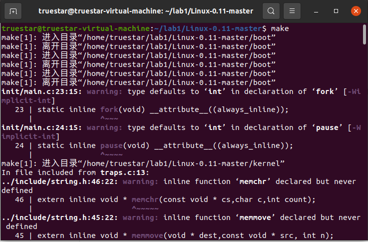

# 实验一：编译已有的操作系统内核

## 一、实验要求

* 安装Ubuntu系统，并在其中配置适用于操作系统实验的环境
* 下载新版Linux内核并编译，且使用Qemu启动内核、使用GDB进行调试
* 制作Initramfs、编译并启动Busybox
* 下载最原始的Linux内核（0.11）并编译、远程调试。
* 挂载虚拟磁盘，并进行文件交换。由于注入文件时使用的是Terminal，需要使用vim编辑

## 二、实验器材

* 笔记本电脑一台，性能足够强大
* VMware Workstation Pro 16
* Ubuntu 20.04安装于虚拟机中

## 三、实验过程

### 1、环境配置

* 这个过程比较无聊，就不细说了。
* 有些环境都是老早以前都有的，毕竟也不能卸了重装，数据无价啊
* 前面的步骤都基本上就是教程里面都有的，因为教程的前面部分十分详细。后面的步骤就需要自己找了。

## 2、编译Linux 5.16.11内核

* 去官网把最新的Linux 5.16.11内核扒拉下来，放在文件夹`~/lab1`里面
* 依次执行以下操作进行解压与编译

```shell
xz -d linux-5.16.11.tar.xz
tar -xvf linux-5.16.11.tar
cd linux-5.16.11
make i386_defconfig
make menuconfig
```

* 在打开的图像界面中依次选择`Kernel hacking`、`Compile-time checks and compiler options`，最后在`[ ] Compile the kernel with debug info`输入`Y`勾选，保存退出。


* 然后直接编译即可。这一步时间比较长，完全可以先出去买点吃的什么的

```shell
make -j8
```

* 编译完成以后发现，Linux压缩镜像`linux-5.16.11/arch/x86/boot/bzImage`和符号表`linux-5.16.11/vmlinux`都已经生成（红圈位置）.说明我们的工作是成功的。


### 3、启动并调试Linux 5.16.11

* 在文件夹`~/lab1`执行如下命令，启动Qemu.

```shell
qemu-system-i386 -kernel linux-5.10.19/arch/x86/boot/bzImage -s -S -append "console=ttyS0" -nographic
```

* 由于我们采用gdb调试，所以Qemu并不会有任何动作。需要在gdb里面进行活动。

* 除此之外，这次连Qemu的对话框都没出现

* 虚拟机套虚拟机的游戏开始了。

  * 上次看网上有人虚拟机套虚拟机套虚拟机。不过最里面那一层已经快要卡爆掉了。

* 不要去动这个对话框，再开一个terminal，依次执行如下命令。

  

* 加载符号表

```shell
(gdb) file linux-5.16.11/vmlinux
Reading symbols from linux-5.16.11/vmlinux...
```

* 连接已经启动的Qemu进行调试。

```shell
(gdb) target remote:1234
Remote debugging using :1234
0x0000fff0 in ?? ()
```

* 为start_kernel函数设置断点。

```shell
(gdb) break start_kernel
Breakpoint 1 at 0xc2192817: file init/main.c, line 925.
```

* 输入`c`运行。

```shell
(gdb) c
Continuing.
```

* 然后耐心等待，就会出现如下图所示的结果

  * 最后的结果是`Kernel panic`，也即内核崩掉了。是为什么呢？
  * 实验指导书中说：启动系统的时候只指定了bzImage，没有指定initrd文件，系统无法mount上initrd (init ram disk) 及其initramfs文件系统。所以call trace打出来的是在initrd_load的时候出错。


  * 既然如此我们就来制作一个Initramfs

### 4、制作简单的Initramfs 

* 我们的实验继续在文件夹`~/lab1`下进行。
* 我们可以制作一个简单的Hello World Initramfs 。
* 先写一个Hello World程序`helloworld.c`如下图所示

```c
#include <stdio.h>
void main()
{   printf("lab1: Hello World\n");
    fflush(stdout);
    while(1);
}
```

* 执行如下语句，将该代码编译成32位可执行文件（注意：需要添加 -m32 来保证编译出来的是32位）

```shell
gcc -o helloworld -m32 -static helloworld.c
```

* 用cpio打包initramfs。

```shell
echo helloworld | cpio -o --format=newc > hwinitramfs
```

* 启动内核，并加载initramfs。可以发现和上一次的命令存在明显不同

```shell
qemu-system-i386 -kernel linux-5.16.11/arch/x86/boot/bzImage -initrd hwinitramfs -s -S -append "console=ttyS0 rdinit=helloworld" -nographic
```

* 重复上面的gdb的调试过程，可以看到运行成功并输出了`lab1: Hello World\n`


### 5、Busybox的使用

* 从课程网站下载Busybox并解压

```shell
tar -xf Busybox_1_33_0.tar.gz
```

* 输入以下命令设置

```shell
make defconfig
make menuconfig
```

* 进入`settings`，然后在`Build BusyBox as a static binary(no shared libs)`处输入`Y`勾选，然后在`() Additional CFLAGS`的括号内输入`-m32 -march=i386，`在`() Additional LDFLAGS`的括号内输入`-m32`。


* 保存退出，然后编译。

```shell
make -j8
make install
```

* 结果如图所示


* 将安装在_install目录下的文件和目录取出放在`~/lab1/mybusybox`处。结果如下图。

```shell
cd ~/lab1
mkdir mybusybox
mkdir -pv mybusybox/{bin,sbin,etc,proc,sys,usr/{bin,sbin}}
cp -av busybox-1_33_0/_install/* mybusybox/
cd mybusybox
```


* initramfs需要一个init程序，可以写一个简单的shell脚本作为init。用gedit打开文件`init`，复制入如下内容，保存退出。

```shell
#!/bin/sh
mount -t proc none /proc
mount -t sysfs none /sys
echo -e "\nBoot took $(cut -d' ' -f1 /proc/uptime) seconds\n"
exec /bin/sh
```

* 设置执行权限。

```shell
chmod u+x init
```

* 将x86-busybox下面的内容打包归档成cpio文件，以供Linux内核做initramfs启动执行。

```shell
find . -print0 | cpio --null -ov --format=newc | gzip -9 > ~/lab1/initramfs-busybox-x86.cpio.gz
```

* 加载busybox。

```shell
cd ~/lab1
qemu-system-i386 -kernel linux-5.16.11/arch/x86/boot/bzImage -initrd initramfs-busybox-x86.cpio.gz -s -S -append nokaslr
```

* 然后再次使用gdb调试

* 前面几步和上次是一样的，但是成功在`start_kernal`函数停了下来

```shell
(gdb) file linux-5.16.11/vmlinux
Reading symbols from linux-5.16.11/vmlinux...
(gdb) target remote:1234
Remote debugging using :1234
0x0000fff0 in ?? ()
(gdb) break start_kernel
Breakpoint 1 at 0xc2192817: file init/main.c, line 925.
(gdb) c
Continuing.

Breakpoint 1, start_kernel () at init/main.c:925
925	{
```

* Qemu界面如下，可以发现显示了一些信息


* 执行以下命令，可以看到断点附近的源码

```shell
（gdb）layout src
```

* 效果是这样的。在后续单步执行的时候可以生动形象地看到代码在各个函数之间跳


* 单步执行玩玩呗

```shell
(gdb) s
(gdb) s
set_task_stack_end_magic (tsk=0xc1f9a680 <init_task>) at kernel/fork.c:869
(gdb) s
(gdb) s
start_kernel () at init/main.c:930
(gdb) s
smp_setup_processor_id () at init/main.c:772
(gdb) s
start_kernel () at init/main.c:932
(gdb) s
init_vmlinux_build_id () at lib/buildid.c:189
```

* 到这里Qemu的窗口都没什么变化
* 再输入一次s，操作系统就开始运行
* 最后成功启动，用时3.77秒
  * 笔记本的话，插电一般两秒多，用电池一般三秒多


* 使用`ls`命令即可看到当前文件夹。


### 6、Linux 0.11的编译和远程调试

* 先从课程网站把Linux 0.11的源码下载了
* 在编译之前，需要稍微更改一下Makefile的内容，保证后面可以运行成功。也就加两个指令的事情，分别为了生成符号表便于调试和设置编译为32位


* 改好以后使用make编译之，结果如下
  * 没有别的意思，就是觉得Warning有亿点点多



* 使⽤qemu-system-i386加载、启动内核

  ```shell
  qemu-system-i386 -m 16 -boot a -fda Image -hda hdc-0.11.img -s -S
  ```

* 此时，成功启动


* Qemu的窗口出现了。我们令它启动，并运行一些简单的命令

  * vim是不可能有的啦,这么老的系统怎么可能有vim的啦


  * 然后开始调试。重新载入系统，但是不在Qemu窗口上进行启动，而是通过gdb进行启动，调试。
  * 进入gdb以后，依次执行如下命令。
  * 加载Linux 0.11的符号表

```shell
(gdb) file tools/system
Reading symbols from tools/system...
```

* 远程连接到Qemu调试

```shell
(gdb) target remote:1234
Remote debugging using :1234
0x0000fff0 in copy_strings (argc=0, argv=0x0 <startup_32>, 
    page=0x0 <startup_32>, p=0, from_kmem=0) at exec.c:134
134				if (--offset < 0) {
```

* 设置源代码目录，并设置汇编代码的格式

```shell
(gdb) directory ~/lab1/Linux-0.11-master
Source directories searched: /home/truestar/lab1/Linux-0.11-master:$cdir:$cwd
(gdb) set disassembly-flavor intel
```

* 为了找到在何处设置断点比较合适，我们打开`~/lab1/Linux-0.11-master/boot/bootsect.s`,找到了如下一些内容

```assembly
.equ BOOTSEG, 0x07c0		# original address of boot-sector
.equ INITSEG, 0x9000		# we move boot here - out of the way
.equ SETUPSEG, 0x9020		# setup starts here
.equ SYSSEG, 0x1000  		# system loaded at 0x10000 (65536).
```

* 这里的数字都是段值。我们知道物理地址=(段值<<4)+偏移量。于是我们设置断点0x7c00和0x10000,并在main函数处设置断点。

```shell
(gdb) break main
Breakpoint 1 at 0x6775: file init/main.c, line 107.
(gdb) break *0x7c00
Breakpoint 2 at 0x7c00: file traps.c, line 72.
(gdb) break *0x10000
Breakpoint 3 at 0x10000: file exec.c, line 135.
```

* 开始运行并在0x7c00处暂停。用x命令查看0x7DFE和0x7DFF的内容

```shell
(gdb) c
Continuing.

Breakpoint 2, 0x00007c00 in die (str=0x6f5e <sleep_on+2> "", esp_ptr=31639, 
    nr=0) at traps.c:72
72		printk("base: %p, limit: %p\n",get_base(current->ldt[1]),get_limit(0x17));
(gdb) x/1xb 0x7DFE
0x7dfe <do_divide_error+45>:	0x55
(gdb) x/1xb 0x7DFF
0x7dff <do_divide_error+46>:	0xaa
```

* 此时Qemu界面如下图所示。
* Booting from Floopy意味着软盘启动。早期硬盘是很昂贵的。所以软盘就可以开机了当时。
  * 当时Windows 1.0的配置要求是128KB内存和两个软驱


* 继续运行并在main函数处暂停。同样用x命令查看相应内存单元的内容

```shell
(gdb) c
Continuing.

Breakpoint 1, main () at init/main.c:107
107	{			/* The startup routine assumes (well, ...) this */
(gdb) x/1xb 0x7DFE
0x7dfe <do_divide_error+45>:	0xc4
(gdb) x/1xb 0x7DFF
0x7dff <do_divide_error+46>:	0x0c
```

* 此时Qemu界面如下图所示

* 正在载入”冰城“操作系统……绝了这是


* 继续运行

```shell
(gdb) c
Continuing.
```

* 界面如下图，我猜测只有256色
* 如果解除Pause的状态就会回到上次非调试模式的状态。


* 这里出现了比较有意思的点

  * 0x10000这个断点没用上。不知道为什么
  * 如果设置了0x90000和0x90200两个断点，那么系统就无法正常启动，且 gdb出现以下的语句

 ```shell
 Program received signal SIGTRAP, Trace/breakpoint trap.
 0x00000000 in startup_32 ()                                           
 ```

### 7、主机与Linux 0.11 的文件交换

* 接下来尝试在Linux 0.11里面注入文件
* Linux 0.11使用的磁盘镜像叫做` hdc-0.11.img`,虽然现在真的很少见到img扩展名的磁盘镜像了
* 关掉Qemu，并且在`~/lab1/Linux-0.11-master`目录开始依次执行如下操作
* 先创个文件夹以备一会儿挂载使用

```shell
truestar@truestar-virtual-machine:~/lab1/Linux-0.11-master$ mkdir hdc
```

* 先看看已经有的盘

```she
truestar@truestar-virtual-machine:~/lab1/Linux-0.11-master$ df -h
文件系统        容量  已用  可用 已用% 挂载点
（此处省略一万字）
```

* 挂载磁盘镜像。

```sh
truestar@truestar-virtual-machine:~/lab1/Linux-0.11-master$ sudo mount -t minix -o loop,offset=512 hdc-0.11.img ~/lab1/Linux-0.11-master/hdc
```

* 可以发现已经挂上了，如下图。
  * 左边任务栏多了一个图标，点进去以后可以看到里面的文件


* 当然也可以用`df`命令来查看

```shell
truestar@truestar-virtual-machine:~/lab1/Linux-0.11-master$ df -h
文件系统        容量  已用  可用 已用% 挂载点
（此处仍然省略一万字，但是多了下面一行）
/dev/loop3       58M   13M   46M   23% /home/truestar/lab1/Linux-0.11-master/hdc
```

* 用ll命令看一下文件夹里面有什么。可以看到和上图的结果是一样的。
  * 前面两项是当前文件夹和父文件夹的信息。
  * Linux系统使用ext文件系统。这些数据都是读取了“目录表”。目录本身也是一个文件，由inode指示。其内容就是“目录表”

```shell
truestar@truestar-virtual-machine:~/lab1/Linux-0.11-master$ ll hdc
总用量 13
drwxr-xr-x 10 root     root      176 3月  22  2004 ./
drwxrwxrwx 11 truestar truestar 4096 2月  25 19:15 ../
drwxr-xr-x  2 root     root      912 3月  22  2004 bin/
drwxr-xr-x  2 root     root      336 3月  22  2004 dev/
drwxr-xr-x  2 root     root      224 3月  22  2004 etc/
drwxr-xr-x  8 root     root      128 3月  22  2004 image/
drwxr-xr-x  2 root     root       32 3月  22  2004 mnt/
drwxr-xr-x  2 root     root       80 12月  5  2016 tmp/
drwxr-xr-x 10 root     root      192 3月  30  2004 usr/
drwxr-xr-x  2 root     root       32 3月  22  2004 var/
```

* 进入`~/lab1/Linux-0.11-master/hdc/usr `,创建一个`hello.txt`.并赋予我自己至高无上的777权限
  * 发现我竟然没装Vim，赶紧顺手装一个


```shell
truestar@truestar-virtual-machine:~/lab1/Linux-0.11-master$ cd hdc/usr
truestar@truestar-virtual-machine:~/lab1/Linux-0.11-master/hdc/usr$ sudo touch hello.txt

truestar@truestar-virtual-machine:~/lab1/Linux-0.11-master/hdc/usr$ sudo apt install vim
(此处省略一万字软件安装log)

truestar@truestar-virtual-machine:~/lab1/Linux-0.11-master/hdc/usr$ sudo chmod 777 hello.txt
truestar@truestar-virtual-machine:~/lab1/Linux-0.11-master/hdc/usr$ sudo vim hello.txt
```

* 用vim打开文件并修改如下图
  * 一开始忘了给777权限了。然后就是这样。后来给了权限就没有这个报错了。


* 回到原来的文件夹并卸载虚拟磁盘。最后用df检查

```shell
truestar@truestar-virtual-machine:~/lab1/Linux-0.11-master/hdc/usr$ cd ../
truestar@truestar-virtual-machine:~/lab1/Linux-0.11-master/hdc$ cd ../
truestar@truestar-virtual-machine:~/lab1/Linux-0.11-master$ sudo umount ~/lab1/Linux-0.11-master/hdc
truestar@truestar-virtual-machine:~/lab1/Linux-0.11-master$ df -h
文件系统        容量  已用  可用 已用% 挂载点
（还是省略一万字，但是原来多出来的那一行没了）
```

* 再次启动Qemu，并打开hello.txt`,如下图
  * 可以发现，已经成功注入了文件，且已经成功编辑了文件内容。该次实验已经全部完成


## 四、实验代码

* 本实验没有任何大段的代码，仅在步骤中有一些命令。

## 五、实验结果

* 成功编译了Linux 5.16.11内核（第2步有图）
* 成功用gdb调试Linux5.16.11（第3步有图）
* 成功制作了Initramfs并使用（第4步有图）
* 成功用Busybox制作了Initramfs并运行调试（第5步有图）
* 成功编译、调试了Linux 0.11的内核（第6步有图）
* 成功完成了虚拟磁盘挂载和文件注入（第7步有图）

### 六、总结和启发

* 第1~5步都非常简单，因为实验步骤已经十分具体了，直接就是照着做就行了。但是要对前面5个步骤的一些关键操作有一定的理解和总结，要不然做6、7步的时候容易麻爪。
* 基础的Linux命令和vim的一些基础用法一定要清楚（因为当没有GUI的时候vim就是唯一的选择了）。vim有个官方的Tutorial，不会的可以通过那个Tutorial学一下
* gdb的用法也是一个重点。本次涉及到添加内存断点和查看指定内存等操作.这个还是搞得我很头大。
* 挂虚拟盘的时候一定要找一个空文件夹挂，不然能给你把原有的文件全都扬了。我一开始就是这种情况，还好回收站里找到了原来消失了的文件。不然就只有哭一条路了。
* Linux里面的sudo命令很NB但也很危险（上面的误操作就是因为sudo。当然还有赫赫有名的`sudo rm -rf /*`从删库到跑路的一站式服务)。在执行sudo类的命令时务必认真检查这个命令是不是输入正确了。不然就只能赶紧提桶跑路了。不过Linux的权限管理还是比较细的，这点是一个值得注意的地方。
* 我一开始把init文件放到mybusybox文件夹外面了，结果最后还是Kernel Panic，我是什么臭鱼烂虾我自己爬……
