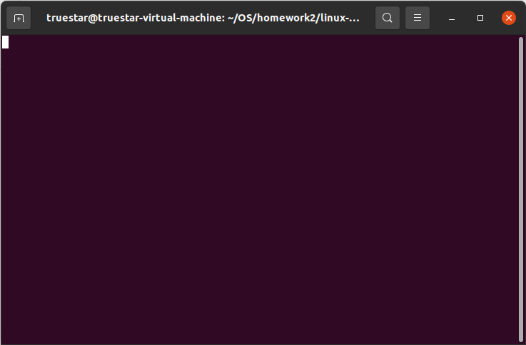
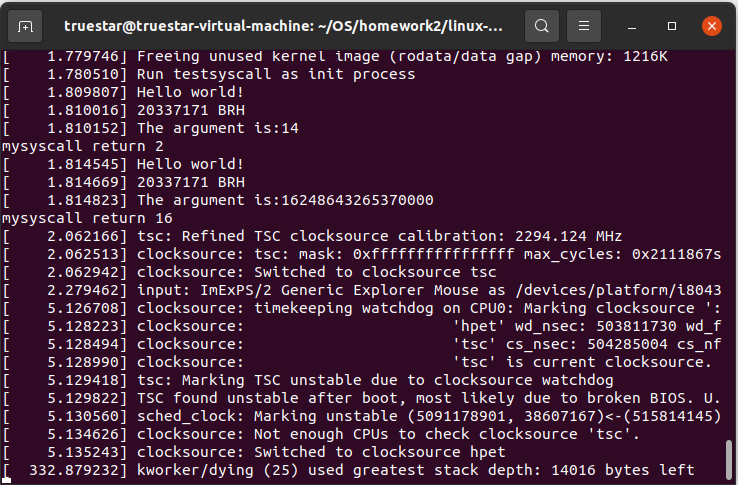

# 操作系统作业2

## 一、实验要求

* 阅读教材，对操作系统的结构有一定的了解
* 尝试为Linux系统添加自己喜欢的中断

## 二、实验器材

* 笔记本电脑一台，性能足够强大
* VMware Workstation Pro 16
* Ubuntu 20.04安装于虚拟机中

## 三、实验过程

### Assignment 1 理论作业

#### 题目2-1 

* 操作系统提供的服务和功能分为提供用户功能的部分和确保系统安全高效运行的部分。
* 第一类是直接提供给用户的，比如用户界面，执行程序，管理文件（也即文件系统）、I/O操作等。
* 第二类这是为了保证系统本身运行安全高效的。比如资源使用记录、资源分配、资源的保护（防止程序访问不应该访问的资源）、维护操作系统的安全等
* 第一类和第二类服务的主要区别在于其主要服务的对象是用户还是操作系统本身

#### 题目2-5 

* 好处有可以节约系统调用的数量。一般来说一个操作系统的系统调用的数量是有限的（比如说8086的中断向量表就只有256个容量）而且可以增强系统调用的适用性。可以比较轻易地增加或删除设备
* 坏处是毕竟文件操作和设备操作有所不同。要么就要把系统调用设计得更复杂（也即增加传参个数），要么就会损失一些设备或者文件特有的功能。

#### 题目2-7 

* 两个模型分别是消息传递模型和共享内存模型
* 消息传递模型的优点是更加安全，不容易发生程序修改了不该修改的内存这一类情况。实现起来也不困难。缺点在于效率较为低下，涉及大量系统调用。
* 共享内存模型的优点在于速度非常快，可以达到访存速度，适合大量的数据交换。缺点就是在安全性方面需要慎重考虑，因为它打破了“一个进程只能访问分配给自己的内存”这一原则，容易造成内存错误。

#### 题目2-10 

* 微内核的优点在于可扩展性和可移植性、安全性很优越。因为内核本身很小，所以加功能基本上都是在用户空间增加，所以扩展很容易。要移植到新平台也大多在用户空间做修改。而且由于大多服务在用户空间进行，安全性也更好
* 用户程序和系统服务通过进程间通信的方法来进行交互
* 缺点主要在于进程间通信的开销过高，影响了系统的性能

### Assignment 2 添加系统调用

#### Step 1:系统中断的添加和内核的编译

* 首先还是要去官网把最新版内核扒拉下来
  * 不是吧，刚过两个星期内核又更新了？上次还是5.16.11，这次变成5.16.14了
* 和往常一样对内核进行解压缩
  * 因为这些步骤在Lab1中已经提到过，就不再赘述了
* 进入文件夹`~/OS/homework2/linux-5.16.14/kernel`开搞
* 打开其中的`sys.c`来写我们想要的系统调用
  * 2700多行是要搞事情吗？
* 翻到最下方#endif上面一行，添加如下代码
  * 注意：这里输出需要用`printk`而非`printf`,它们二者的区别在于，`printf`是用户态的输出函数，`printk`是内核态的输出函数。在系统调用过程中，当然要用内核态的。
  * 这个函数的返回值其实是`lowbit`
  * 特别注意，这里的名称就叫`myfunc`，而不是`sys_my_func`
    * 如果稍微关注一下源码就知道，这里是一个宏，里面会用预处理器粘合剂`##`完成在前面加`sys_`甚至`__x64_`这一类东西。


```c
SYSCALL_DEFINE1(myfunc,long,k)
{	printk("Hello world!\n");
	printk("20337171 BRH\n");
	printk("The argument is:%ld\n",k);
	return k&(-k);
}
```

* 接下来我们进入文件夹`~/OS/homework2/linux-5.16.14/include/linux`,打开`syscalls.h`，在#endif上方添加如下语句
  * 这里前面就必须要有`sys_`了


```c
asmlinkage long sys_myfunc(long k);
```

* 继续到`~/OS/homework2/linux-5.16.14/arch/x86/entry/syscalls`，打开`syscall_64.tbl`给系统调用一个编号
  * 在合适的位置加入如下内容

```c
335 common	myfunc			sys_myfunc
```

* 开始编译，这一步和以前差不多，但是我们需要安装一些东西。
  * 如果不安装，会提示缺少头文件`gelf.h`从而编译失败

```shell
sudo apt-get install libelf-dev
sudo apt-get install libncurses5-dev libssl-dev
sudo apt-get install build-essential openssl
sudo apt-get install libidn11-dev libidn11
sudo apt-get install zlibc minizip
```

* 这里插播一条，要是编译失败了，可以执行如下命令来清除上一次编译产生的内容
  * 编译失败好几次，人麻了啊。


```shell
sudo make mrproper
sudo make clean
```

#### Step 2：Initfram的制作和系统调用的测试

* 编译完成以后，为了测试操作系统，我们要编写Initframs来启动并测试操作系统
* 我们在作业文件夹创建并编写`testsyscall.c`做好准备工作
* 执行以下命令编译并打包Initframs

```shell
gcc -o testsyscall -static testsyscall.c
echo testsyscall |  cpio -o --format=newc >  testsyscall-initramfs
```

* 随后我们用qemu启动虚拟机在`start_kernel`处设置断点，把程序跑起来，就能看到结果。
  * 本过程在`Lab1`中有详细介绍，此处不再赘述。
  * 但是注意启动代码是这样的。要把前面的`linux-5.16.14/`去掉。gdb加载符号表同理。


```shell
truestar@truestar-virtual-machine:~/OS/homework2/linux-5.16.14$ qemu-system-x86_64 -kernel arch/x86_64/boot/bzImage -initrd testsyscall-initramfs -s -S -append "console=ttyS0 nokaslr rdinit=testsyscall" -nographic 
```

* gdb执行到断点如图所示。因为刚刚进内核，屏幕是空的.继续运行会开始有信息。



## 四、实验代码

* initfram文件`testsyscall.c`

```c
#include <linux/kernel.h>
#include <sys/syscall.h>
#include <unistd.h>
#include <stdio.h>
void main()
{	//335:long sys_myfunc(long)
        long temp;
        temp = syscall(335,14);
        printf("mysyscall return %ld\n",temp);
        temp = syscall(335,16248643265370000);
        printf("mysyscall return %ld\n",temp);
        fflush(stdout);
        while(1);
}
```

## 五、实验结果

* 系统调用成功实现了其功能，如下图.
  * 可以验证结果都是正确的。成功实现了我们希望实现的功能
  * 这里可以看出来`printk`和`printf`输出的区别了。内核态的输出在启动log里面，用户态的输出独立于系统log。
  * 关于为什么5多秒还有东西，我也是很惊讶的。
  * 关于为什么五分半钟以后还能有信息输出，我就更惊讶了。kworker(工作者)进程要寄了，这可不是一个好消息。




## 六、总结和启发

* 理论作业简单回顾了操作系统的结构的基本知识。
* 实验小坑略多，编译较慢，需要记得给虚拟机分配较多的内核。
  * 建议笔记本电脑插电+四核心至少（反正我有八个核），要是不插电你会体验到蜗牛般的速度。二十分钟都编译不完那种。 
* 系统版本越新，系统调用越多了。在指导里面的5.10版本还有441号调用没有使用，现在的5.16这个位置已经无了，只能再找一个335位置。但是目前还有若干个空位没有使用，看来一时半会是足以满足需求的。
* 可以用C写系统调用还是很友好的。
  * 以前往8086里面写中断向量表还要用纯汇编写，那就要命了。听说下次就要写了，有亿点慌。                                                                                                                                                                                                                                                                                                                                                                                                                                            
